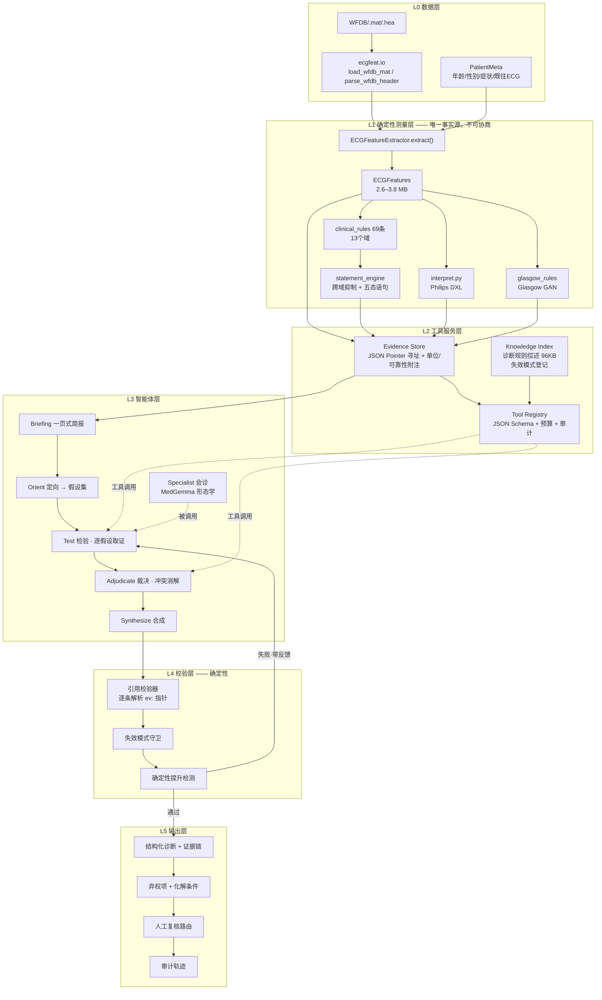

<!-- i18n-nav -->
[中文](ecg_agent_architecture.md) | [English](ecg_agent_architecture.en.md) | [日本語](ecg_agent_architecture.ja.md)
<!-- /i18n-nav -->

> Translation note: This English version is provided for convenience. If it differs from the source document, the source document prevails.

<a id="ecg-推理智能体系统架构设计"></a>
# ECG Reasoning agent system architecture design

> Goal: Use `feature_extraction/ecgfeat` as a deterministic toolkit to build a **reasonable, auditable, and abstainable** toolkit on top of it
> LLM agent system for 12-lead ECG diagnosis.
>
> Status: v27 implementation architecture (2026-08-01). The first part of the article describes the current implementation; the second half retains the historical design for tracking.
> This system is still a research and auxiliary interpretation tool, not a medical device that has undergone regulatory verification.

<a id="2026-08-01-当前实现诊断优先-v27"></a>
## 2026-08-01 Current implementation: Diagnosis first v27

This article retains the original "rule ruling" design for historical tracking; the current implementation is subject to this section.

- **LLM is the ECG diagnostic reasoning subject. ** Given a ECG feature data, the Agent independently completes the quality,
  Rhythm, heart rate, P/AV relationship, intervals, axis, conduction, ectopic beats, chambers/voltage, Q/ST-T/U
  Systematic interpretation of waves and pacing.
- **ecgfeat is a measurement tool, not a diagnostic referee. ** It only provides global, lead-by-lead,
  Beat-to-beat measurement, reliability caveat and verifiable `ev:/...` pointer.
- **Diagnostic mode does not expose rule conclusions to the model. ** Neutral briefing does not include matched rules, rule waivers,
  Refer to the engine conclusion or PTB-XL tag; Survey, Investigate, and Challenge are only open to measurement
  tools. Hypothesize after Survey does not open tools and only receives controlled general knowledge fragments to formulate tentative diagnoses.
  and targeted examination plans; these clips are not patient evidence.
- **The output has no baseline disposition. ** `diagnoses` is the positive conclusion of the model,
  `differential_diagnoses` is an unresolved alternative explanation; no longer used
  `unchanged / added / withdrawn / downgraded`.
- **Rule baseline and data set labels are only used for blind evaluation after inference. ** They can measure the Agent's gain,
  But it cannot become the input of Agent.
- **High impact modalities must be falsifiable. ** Paced spike detection, QRS alignment and paced-beat flags belong to the same
  Algorithm chains cannot serve as independent evidence for each other; when evidence conflicts, only candidate observations are retained and are not allowed to change the measurement route.
  Or block native ST/T.
- **Represents evidence of compact, repetitive native beats retained outside of beats. ** `qrs_infarct` panel is used to check Q waves beat by beat
  With R-wave progression, the `repolarization` panel is used to continue viewing non-paced ST/T/QT when pacing is suspected;
  Low reliability measurements are downgraded but not deleted.
- **Diagnostic inputs are versioned physical whitelist DTOs. ** `diagnosis-evidence.v2` only copies explicitly registered
  Measurement, quality, acquisition and diagnostic neutral modal fields; unknown top-level or high-risk fields do not enter the diagnostic Store by default.
  Dropped/unclassified fields are written to the audit, and new fields must be updated first.
- **Tool reach does not mean that the model is visible. ** The tool layer registers touched citations and visible respectively
  citations; only `ev:/...` tags carrying values after tool truncation, backend alias replacement and context compression
  It will only enter the verification whitelist if it still appears in the next model request. A list of pointers alone cannot authorize references.
- **The main result only saves valid evidence and does not save the bare path list repeatedly. ** Each tool call only writes in the main JSON
  touched/visible count and content-addressed hash; full pointer and raw returned into separate trace. final verdict
  The actual reference taken is materialized by the code from the immutable Evidence Store to the real value, unit, reliability caveat,
  Source and supporting/opposing roles, saved to `audit.tools.effective_evidence`. given by the model
  The single direct numerical reference is also backfilled by the code to the unified clinical display precision to avoid transcription errors; the original full precision value is only left in
  Effective evidence audit. Validation uses units and tolerances to determine whether a clinically rounded value is equivalent to the original value, rather than comparing numerical values
  String; pointers that do not enter the model context do not therefore become numeric or reference-eligible.
- **Survey is a single compact entry. ** Only `get_diagnostic_overview` is open in the first phase, budget 1;
  Lead-by-lead, beat-by-beat, and morphology tables must be read on demand after tentative hypotheses are formed. Investigate Budget 6–8,
  Challenge Budget 3–4.
- **Forensic plans are structured enumerations and do not parse clinical prose. ** Hypothesize output enum diagnostic domain, enum
  Tool name and orientation issues; orchestrator deterministic domain → tool mapping to complete unevaluated domains, open to up to 8 tools,
  And always keep `get_measurement` and `search_measurements` safe.
- **Backend capabilities are explicitly declared. ** native tool calling, structured output levels, context compression, reference aliases,
  Phase memory, prefetching and parallel width are provided uniformly by `BackendCapabilities`, and the orchestrator no longer leaves guesswork
  Whether a certain backend supports these capabilities.
- **Clinical Hard Door is a versioned minimal security strategy. **Thresholds centered at `clinical-safety.v1` can only block or
  Positive conclusions that contradict the downgrade and definition-level measurements cannot add new diagnoses; the specific parameters and policy versions are written into the running audit.
- **Release subject to persistent product acceptance. ** `ecgagent.acceptance` Inspection success rate, verified rate, P90
  Latency, number of revisions, stage guard, visible citation coverage and independent clinical reports;
  `ecgagent.evaluation_protocol` Press `patient_id` for rules, single-turn, and Agent three-arm
  Do ablation summary. Three Arms uses the evaluation administrator's private key to generate stable opaque aliases; unblinding reports must be bound
  The hash of the blind review product that has been actually reviewed by clinical personnel cannot be directly sent to the release door after another random mapping.

The current main path is:

```text
ECG → ecgfeat 测量/质量 artifact → 中性简报
    → Survey（全局患者测量盘点）
    → 受控知识导航 → Hypothesize（暂定诊断/鉴别诊断/检查计划）
    → 移除知识原文 → Investigate（针对性 ecgfeat 检查）
    → Challenge → Synthesize
    → 确定性引用/数值/caveat 校验 → 独立诊断
    →（可选）隔离的诊断后知识挑战 → ecgfeat 重新取证后方可修订
    →（推理结束后）PTB-XL 与规则基线评估
```

Patient level knowledge navigation and challenges are only allowed for `diagnostic_reference`, `morphology_reference`,
`measurement_reliability_reference`, `failure_modes`. clinical rules,Philips
DXL, Glasgow and capability blueprints continue to be used for offline development auditing only. Ultimately the patient asserts that he must return to
The `ev:/...` measurement read for this session; the knowledge fragment does not prove that the patient meets any criteria.

The implementation entry is `ecgagent.agent.diagnostic.ECGDiagnosticAgent`; CLI and batch processing are used by default
The entrance. The old `ECGAgent` is retained only as a compatible path to explicit `--mode adjudicate`.

---

<a id="目录"></a>
## Directory

- [1. Design starting point: what the agent should do and what it should not do](#1-设计出发点智能体该做什么不该做什么)
- [2. Current status inventory: Capabilities and ceilings of v1 layered CoT](#2-现状盘点v1-分层-cot-的能力与天花板)
- [3. Target architecture overview](#3-目标架构总览)
- [4. Core component design](#4-核心组件设计)
  - [4.1 Evidence Store](#41-证据存储-evidence-store)
  - [4.2 Tool Registry](#42-工具集-tool-registry)
  - [4.3 Agent layer: bounded hypothesis-test cycle](#43-智能体层有界假设-检验循环)
  - [4.4 Failure Mode Registry](#44-失效模式注册表)
  - [4.5 Verification Layer: Reference Verifier](#45-校验层引用校验器)
  - [4.6 Output Contract](#46-输出契约)
- [5. Model and runtime selection](#5-模型与运行时选型)
- [6. Key constraints and risks](#6-关键约束与风险)
- [7. Evaluation plan](#7-评测方案)
- [8. Phased implementation route](#8-分阶段落地路线)
- [9. Recommended module placement](#9-建议的模块落点)

---

<a id="1-设计出发点智能体该做什么不该做什么"></a>
## 1. Design starting point: what the agent should do and what it should not do

This is the most important section of the entire architecture. **If the positioning of the agent is wrong, all subsequent projects will amplify the error. **

`ecgfeat` has completed the three most difficult things: signal level measurement (cross-validation of LUDB/QTDB),
Threshold determination of 69 CLIN rules (AHA/ACCF/HRS 2009 + UDMI 2018 baseline), and
`matched / not_matched / indeterminate / unavailable / suppressed` Five-state statement analysis.
Asking LLM to redo these three things simply replaces a reproducible exact value with an unreproducible approximation.

<a id="智能体的四项真实增量"></a>
### Four real increments of the agent

| # | Responsibility | Why the rule engine can't do it |
|---|---|---|
| **A** | **Multi-source conflict adjudication** | There are three sets of **mutual non-arbitration** engines in the warehouse (`clinical_rules` / `interpret.py` Philips DXL / `glasgow_rules`), plus the pair of "consensus measurement vs lead-by-lead raw measurement". `sources.py` clearly states that they do not cover each other. Who is right needs to be judged based on specific evidence and cannot be solved by fixed priorities |
| **B** | **Hypothesis testing of known failure chains** | `docs/诊断层待修改清单.md` The most dangerous error recorded is not "missing a diagnosis", but **upstream misdetection triggering downstream cascade of false positives**: F wave is regarded as P wave → PR is measured → first degree AVB + left atrial abnormality (FP is triggered 5 times in 5 atrial flutter records). The rule engine is right within its own domain, but wrong in its cross-domain premise |
| **C** | **Secondary Mining of Waivers** | The rules engine correctly gives `indeterminate` / `unavailable` when there is insufficient input (e.g. 2:1 AV block, trifascicular block). There are often **other evidence paths** that can be taken at these locations, or at least it can be said clearly "what is missing to make a determination". This is a bounded search problem, suitable for an agent |
| **D** | **Contextual integration and readable explanation** | Age/gender/symptoms/past ECG/clinical issues, and putting the chain of evidence into words that can be reviewed by adults |

<a id="三条硬红线"></a>
### Three hard red lines

1. **The agent must not produce any value that is not returned by the tool. ** Each number must carry an evidence reference pointing to `features.json`,
   It is parsed and checked item by item by the deterministic verifier (see [4.5](#45-校验层引用校验器)).
2. **The agent must not promote certainty. ** The rule engine determines the item `indeterminate`, and the agent can only introduce new evidence when **
   (new tool return), and must clearly record which piece of evidence supports it. "Comprehensive judgment believes that it should be X" is not allowed.
3. **Suppress relationships to maintain certainty. ** Cross-domain suppression of `statement_engine` (such as sustained ventricular pacing suppression morphology statement,
   AF suppression P wave dependent statement) is executed by the code and is not handed over to the LLM. Agents can **question the premises** of inhibition,
   But you cannot decide to suppress the results yourself.

---

<a id="2-现状盘点v1-分层-cot-的能力与天花板"></a>
## 2. Current status inventory: Capabilities and ceilings of v1 layered CoT

The existing `run_layered_diagnosis()` of `medgemma_ecg_core.py` is already a fairly complete hierarchical inference pipeline:

```
features.json ──► summarize_layered_evidence()  ──► L0..L4 五份固定证据包
                  build_validated_measurement_facts() ──► 确定性算术约束
                  sanitize_report_text() ──► 去诊断化的报告摘录
                       │
                       ▼
      L0(质量) → L1(节律) → L2(传导/间期) → L3(电轴/心腔) → L4(Q波/ST-T)
        每层一次独立 generate，只带 L0 结论下传
                       │
                       ▼
      run_feature_guardrails() + run_stage_claim_guardrails()
        → 命中则 build_layer_revision_prompt() 重做该层（≤1 轮）
                       │
                       ▼
      L5 synthesis → parse → run_synthesis_guardrails() → 修订 → 输出
```

**What’s right (must be inherited, not overturned):**

- **Domain decomposition L0–L4 is clinically correct** and consistent with the inhibition topology of `statement_engine`.
- **All `interpretation` fields are stripped from the evidence package** to prevent the model from copying conclusion labels such as `probable_af`. This is the key leak-proof design.
- **`build_validated_measurement_facts()` Put the arithmetic constraints in front**, and the model can only obey them but not refute them.
- **Guard → Directional revision → Recheck** The closed loop shape itself is correct.

**Where is the ceiling:**

| Crux | Specific manifestations |
|---|---|
| **The evidence is pushed, not pulled** | `summarize_layered_evidence()` is a handwritten fixed slice. When encountering situations where slices are not covered (for example, beat-to-beat PR sequence is needed to determine Venturi, or the original waveform of a certain lead needs to be seen), the model has no choice but to answer hard questions based on incomplete evidence |
| **Unable to do counterfactuals** | The model cannot ask "if T wave refinement is turned off, will this QT still have this value?" or "will the Q wave be judged to be 40 ms still true?" And this is precisely the most effective way to judge the reliability of measurement |
| **Guards are hard-coded exhaustive** | `check_q_wave_lvh_false_positive` / `check_qrs_consensus_bbb_gap` / `check_rr_outlier_driven_irregularity` The three functions are patches for three known pitfalls. When the fourth pit appears, the code needs to be changed, and the model cannot find it by itself |
| **Only L0 conclusion is transmitted between layers** | The upstream false detection chain (F wave → P wave) happens to span L1 and L2, and L2 cannot get the suspicion of L1 |
| **No budget control and audit trail** | The number of calls is fixed, and there is no reviewable record of "what evidence was viewed during this inference" |
| **`DEFAULT_MODEL_MAX_LEN = 8192`** | And `max_position_embeddings` for `medgemma-27b/config.json` is **131072**. The current self-imposed cap only uses 6% of the model’s capacity |

> **Conclusion: v2 is not a rewrite, but replaces "push fixed evidence package" with "pull tool call", replaces "hard-coded guard" with "declarative failure mode + hypothesis testing", and adds verification and auditing. Domain decomposition and leak-proof design are retained as is. **

---

<a id="3-目标架构总览"></a>
## 3. Overview of target architecture



**A one-sentence summary of the data flow**: The deterministic layer calculates all the facts and drops them into the evidence storage → the agent makes its own decision** after getting a one-page briefing
What to look at** → Every step of evidence collection is recorded → Every number output must be able to recover a specific path in the evidence storage → If it cannot be recovered, it will be redone.

---

<a id="4-核心组件设计"></a>
## 4. Core component design

<a id="41-证据存储-evidence-store"></a>
### 4.1 Evidence Store Evidence Store

**Problem to be solved**: `features.json` 2.6–3.8 MB, and is a deeply nested structure
(`representative_leads.V3.measurements.st_j_mv` this kind). LLM neither fits nor is good at navigating nested JSON.

**design**:

```python
class EvidenceStore:
    """features.json 的只读寻址层。所有工具的取值都经过它，因此所有取值都可被引用和复核。"""

    def resolve(self, pointer: str) -> EvidenceValue: ...
    def resolve_many(self, pointers: list[str]) -> list[EvidenceValue]: ...
    def search(self, name_fragment: str, limit: int = 20) -> list[str]: ...
```

```python
@dataclass(frozen=True)
class EvidenceValue:
    pointer: str            # "/representative_leads/V3/measurements/st_j_mv"
    value: Any
    unit: str | None        # "mV" / "ms" / "deg"
    reliability: str | None # 来自 quality[lead].reliable_for_* 与 *_reliability 字段
    provenance: str | None  # 来自 qt_path / p_duration_source / measurement_paths 的口径标记
    caveats: list[str]      # 如 "该导联 T 波不可靠"、"共识值与逐导联原始值差 18 ms"
```

Three key design points:

1. **`caveats` is automatically injected. ** When taking `/global_features/qt_ms`, the storage layer is automatically attached
   `qt_reliability`, `qt_unreliable_reasons`, `qt_path`, `qt_excluded_leads`.
   It is impossible for the model to get a bare number without the reliability context - this structurally eliminates errors such as "the model forgot to check reliability".
2. **Friendly alias table. ** Maintain the bidirectional mapping of `"QTc(Bazett)" → "/global_features/qtc_bazett_ms"`,
   Allowing the model to ask questions by clinical name while the output still falls on the normative pointer.
3. **Read-only + content-addressed. ** Stored immutable within the entire session, the pointer is the reference ID, `ev:/global_features/qrs_ms`
   This string is both "evidence address" and "verifiable credential".

**One-page briefing `build_chart_briefing()`** (about 1.5–2.5k tokens, pushed as the first message, does not account for the tool call budget):

```
[记录]      JS00956 | 男 | 58岁 | fs=500Hz | 10.0s | 采集 2026-03-11
[门控]      gate=partial | 允许域: rhythm, intervals, conduction, voltage
                        | 受限域: ischemia_infarction (原因: V2/V3 T 波不可靠)
[质量]      record_grade=Q2 | 不可靠导联: V2(baseline_wander), V3(emg)
            P不可靠: — | QRS不可靠: — | T不可靠: V2,V3 | QT不可靠: V2,V3
[整体]      HR 78 | 心房率 —(退化) | PR 214ms | QRS 96ms
            QTcB 431ms(可靠性=moderate, 口径=normal_qt, 用了7导联)
            电轴 P 62° / QRS 18° / T —(不可靠)
[已触发]    CLIN-INTERVAL-PR-01        matched      一度房室传导延迟   MEDIUM P3
            CLIN-HYPERTROPHY-LAE-01    matched      左房异常           MEDIUM P4
[已弃权]    CLIN-RHYTHM-AFL-01         indeterminate  缺: 独立心房事件序列验证
            CLIN-INTERVAL-QT-01        partial        缺: V2/V3 T 波终点
[跨引擎分歧] Philips DXL: sinus rhythm | Glasgow: possible atrial flutter  ← 分歧
[失效模式预警] FM-AFL-P-CASCADE 前提命中: PR>200 且 LAE 阳性 且 房扑判定不可用
```

The last two lines are **active**: calculated by the deterministic code, directly putting the most suspicious things in front of the agent.
This is to solidify the real lesson of `docs/诊断层待修改清单.md` A.0 into system capabilities.

---

<a id="42-工具集-tool-registry"></a>
### 4.2 Tool Registry

Tool granularity is the key to the success or failure of the entire design. **Too thin → the number of calls will explode; too thick → degenerate into push style. **
The principle is: **One call should answer a clinical question, and the return shape should be easy to read for the model (Table > Nested JSON). **

The 6 marked ⭐ are the Minimum Available Set (MVP).

<a id="a-族-定向"></a>
#### Family A · Orientation

| Tools | Signature | Instructions |
|---|---|---|
| ⭐ `list_findings` | `(status?, domain?, min_priority?) -> Row[]` | List rule evaluations. The default returns `matched` + `indeterminate`. **This is the entrance for the agent to understand "what the engine said/didn't say"** |
| ⭐ `get_rule_detail` | `(rule_id) -> RuleEvaluation` | Single rule for `evidence` / `thresholds` / `missing_inputs` / `suppressed_by` / `source`. Answer "Why does it make such a judgment?" |

<a id="b-族-取值"></a>
#### Family B · Value

| Tools | Signature | Instructions |
|---|---|---|
| ⭐ `get_measurement` | `(pointer \| alias) -> EvidenceValue` | Accurate single value retrieval, built-in unit / reliability / caveats |
| ⭐ `get_lead_table` | `(fields[], leads?) -> Markdown 表` | **Highest frequency tool**. A matrix of 12 rows × N columns is an order of magnitude easier to read than the nested JSON. Example: `fields=["q_dur_ms","q_amp_mv","r_amp_mv","st_j_mv","t_amp_mv"]` Get all the required Q-wave interpretation |
| `get_beat_table` | `(fields[], beat_range?) -> Markdown 表` | Beat-to-beat sequence. Sentence, presystole, alternans, 2:1 conduction necessary |

<a id="c-族-探查相对固定流水线的真正增量"></a>
#### Family C · Probing (real increment relative to fixed pipeline)

| Tools | Signature | Instructions |
|---|---|---|
| ⭐ `remeasure` | `(overrides, fields_of_interest[]) -> Diff` | Rerun with different extractor parameters and return **difference**. `ECGFeatureExtractor.__init__` has exposed switches such as `enable_t_wave_refinement` / `enable_hybrid_st_measurement` / `fs_internal` / `lp_hz` / `enable_pacing` - directly off-the-shelf counterfactual probes. **Answer "Is this measurement stable?"** |
| `recompute_rule` | `(rule_id, threshold_overrides) -> RuleEvaluation` | Threshold sensitivity. Example: The Q wave time limit is judged according to UDMI 30 ms and textbook 40 ms (`sources.py: BASELINE_DIVERGENCES` has registered this set of differences) |
| `get_signal_window` | `(lead, t0_ms, t1_ms, decimate) -> 数值序列 + 基准标注` | Take a small segment of waveform value and attach J point/P start/end/T end mark. Let the model look at the shape directly instead of looking at other people's shape descriptions |

> **Note on the cost of `remeasure`**: A full rerun takes seconds. Must do **caching + upper limit of calls per session (recommended ≤3)**,
> And only the difference of `fields_of_interest` is returned instead of the complete new features.

<a id="d-族-知识"></a>
#### D Family · Knowledge

| Tools | Signature | Instructions |
|---|---|---|
| ⭐ `lookup_criteria` | `(topic) -> 章节片段` | Retrieve `docs/心电图诊断规则系统综述.md` (1923 lines / 21 chapters / Appendix A normal value quick check + Appendix B identification process). **Build an index based on chapter slices, do not cut based on fixed token windows** - The document's "Abnormal Performance → Differential Diagnosis → Diagnostic Criteria" structure itself is the best retrieval unit |
| `lookup_failure_mode` | `(measurement \| pattern) -> FailureMode[]` | Retrieve the failure mode registry + `docs/诊断特征缺口登记.md` + each cross-validation report. Answer to "In what circumstances would this measurement lie to me?" |

<a id="e-族-会诊"></a>
#### E Family · Consultation

| Tools | Signature | Instructions |
|---|---|---|
| `ask_specialist` | `(question, evidence_bundle) -> 意见` | When the orchestration model is not MedGemma, leave the morphology problem to MedGemma-27B. The return value is clearly marked as "another model's opinion" rather than a fact and cannot be used as a citation source |

<a id="工具层的横切约定"></a>
#### Cross-cutting convention of tool layer

```python
@dataclass
class ToolResult:
    ok: bool
    payload: Any
    citations: list[str]      # 工具触达的候选指针；不是自动授权的引用白名单
    cost_hint: str            # "cheap" | "moderate" | "expensive(remeasure)"
    truncated: bool
    note: str | None          # 如 "请求的 18 个字段中 3 个不可用，原因见 caveats"
```

- **Every time the tool returns, first register touched `citations`**; after the final back-end rendering/compression, it will be sent from the real
  Extract visible citations from the model’s messages. Only the latter accumulates the legal reference whitelist for this session.
  The agent refers to a pointer outside the whitelist → the validator directly determines it as an illusion.
- **Budget**: Each stage has a hard upper limit (see 4.3). When the limit is exceeded, the tool layer returns `ok=False` and prompts the remaining budget.
  Force the agent to converge.
- **Audit**: All calls (parameters, return summary, time consumption, stage) are written to `audit.tool_calls`.

---

<a id="43-智能体层有界假设-检验循环"></a>
### 4.3 Agent layer: bounded hypothesis-test loop

> The following boxes in this section document the original rule-based v1 design. The current five-stage process for diagnosis priority implementation begins with
> "2026-08-01 current implementation" and `ecgagent/README.md` shall prevail.

No need for free ReAct (not budgetable, not auditable, will crash in 8k context), nor does it follow the completely fixed pipeline of v1.
The compromise solution is **staged, each stage has a tool budget, and free evidence collection within the stage**:

```
┌─ Phase 1 · Orient 定向 ─────────────────── 预算 0 次工具调用 ─┐
│ 输入：一页式简报                                              │
│ 输出：假设集 Hypothesis[]（结构化，不含结论）                  │
│ 三个强制来源（缺一不可）：                                     │
│   (a) 每条 matched 规则 → 一个"待证实"假设                     │
│   (b) 每条 indeterminate/unavailable → 一个"可否化解"假设      │
│   (c) 简报里命中的每个失效模式前提 → 一个"上游误检"假设         │
│   (d) 跨引擎分歧 → 一个"裁决"假设                              │
└──────────────────────────────────────────────────────────────┘
                              ▼
┌─ Phase 2 · Test 检验 ────────────── 预算 8–12 次（可并行）─┐
│ 对每个假设，智能体必须先声明"我要用什么证据支持/推翻它"，       │
│ 再发起工具调用。每个假设结算为：                               │
│   supported / refuted / unresolved(+缺什么)                   │
│ 允许在本阶段内派生新假设，但派生深度 ≤2                        │
└──────────────────────────────────────────────────────────────┘
                              ▼
┌─ Phase 3 · Adjudicate 裁决 ──────────────── 预算 3–5 次 ─┐
│ 只处理冲突：                                                  │
│   · 三引擎分歧                                                │
│   · 共识测量 vs 逐导联原始测量分歧                             │
│     （已知：QRS 在 100–120 ms 区间共识值会低估，见记忆与文档）  │
│   · 上游误检链：若"这个 P 不是 P"成立，下游哪些结论要撤         │
│ 裁决必须给出依据，不能给偏好                                   │
└──────────────────────────────────────────────────────────────┘
                              ▼
┌─ Phase 4 · Synthesize 合成 ────────────────── 预算 0 次 ─┐
│ 产出 4.6 的结构化输出。每条诊断带证据链与反证                  │
└──────────────────────────────────────────────────────────────┘
                              ▼
┌─ Phase 5 · Verify 校验（确定性代码，无 LLM）────────────┐
│ 引用校验 → 失效模式守卫 → 确定性提升检测                       │
│ 失败：带**具体反馈**回 Phase 2 或 4，最多 2 轮                 │
└──────────────────────────────────────────────────────────────┘
```

**Why this shape:**

- **Phase 1 does not allow tool adjustment**, forcing the model to think clearly "what to check" in the briefing first. This one can significantly reduce the total number of calls.
- **It is assumed that the evidence collection plan must be stated first and then the evidence is collected**, blocking the road of "conclude first and then looking for evidence", and at the same time make the audit trail readable.
- **Phase 3 is independent**, because conflict resolution needs to look at multiple domains at the same time, and the inter-layer isolation of v1 cannot do this.
  (This chain of F wave→P wave spans L1/L2).
- **Phase 5 is all deterministic code**, LLM does not participate in self-verification - self-verification is meaningless.

**Assumed structure:**

```python
@dataclass
class Hypothesis:
    id: str                    # "H3"
    kind: str                  # confirm_rule | resolve_abstention | upstream_artifact | adjudicate_conflict
    statement: str             # "PR 214ms 的一度房室延迟成立"
    origin: str                # "CLIN-INTERVAL-PR-01 (matched)"
    supporting_plan: list[str] # 计划取哪些证据来支持
    refuting_plan: list[str]   # 计划取哪些证据来推翻 ← 强制字段，防单向验证
    outcome: str | None        # supported | refuted | unresolved
    citations: list[str]
    blocked_by: str | None     # 缺什么才能定
```

`refuting_plan` is a **mandatory field**. This constraint alone can block a considerable amount of confirmation bias - the model must be written
"How do I overthrow myself", not just "how do I prove myself".

**Domain Parallel**: In Phase 2, if the four domains L1-L4 are not dependent on each other, they can be parallelized into four workers, each with a budget.
Share the same EvidenceStore. But Phase 3 must serialize single points because adjudication requires a global view.

---

<a id="44-失效模式注册表"></a>
### 4.4 Failure Mode Registry

**Convert the now hard-coded `check_*` function into declarative data. ** A piece of data drives three things at the same time:
Briefing alerts, hypothesis generation, Phase 5 guards.

```python
@dataclass(frozen=True)
class FailureMode:
    id: str                          # "FM-AFL-P-CASCADE"
    title: str
    trigger: Callable[[EvidenceStore], bool]   # 前提检测，纯确定性
    affected_statements: list[str]   # 会被污染的下游规则 ID
    hypothesis_template: str         # 注入 Phase 1 的假设文本
    discriminating_evidence: list[str]  # 能区分真伪的证据指针/工具调用
    verification: Callable[[Output, EvidenceStore], list[str]]  # Phase 5 守卫
    source_doc: str                  # 出处，便于追溯
```

The first batch of entries (all from real lessons recorded in this repository, not conjecture):

| ID | Failure Mode | Identification Evidence | Provenance |
|---|---|---|---|
| `FM-AFL-P-CASCADE` | F wave measured as P wave → PR false prolongation + V1 terminal negative false widening → first degree AVB + LAE false positive | `v1_terminal_p_duration_ms` (>90 ms physiologically impossible, normal P total time <120 ms); atrial event/RR ratio; atrial flutter determination availability | `诊断层待修改清单.md` A |
| `FM-QWAVE-LVH-FP` | High amplitude QRS Elevated Q/R ratio → pathological Q / old MI false positive | `q_wave_mi_ratio`; Q wave **absolute duration**; continuous regional lead support; LVH voltage criterion | `check_q_wave_lvh_false_positive` + memory |
| `FM-QRS-CONSENSUS-NARROW` | 100–120 ms interval consensus QRS underestimate → leak LBBB/IVCD | `consensus_vs_independent_per_lead`; lead-by-lead raw QRS distribution | `check_qrs_consensus_bbb_gap` + memory |
| `FM-RR-OUTLIER-AF` | Few asystole/external value elevation full segment RR CV → False positive atrial fibrillation | CV of central RR; RMSSD; pNN50; Poincaré SD1/SD2; organized atrial activity | `check_rr_outlier_driven_irregularity` |
| `FM-T-OFFSET-FUSION` | T endpoint fusion confidence is inconsistent with consensus → QT distortion | `t_fusion_*` full family; `qt_path`; `qt_excluded_leads`; `t_derived_disagreement_ms` | `qtdb_cross_dataset_validation.md` + memory |
| `FM-P-SENSITIVITY` | P-wave detection sensitivity is low (LUDB 0.872 vs NeuroKit 0.958) → atrial activity is misjudged as missing | Lead-by-lead P detection consistency; `p_duration_support`; non-QRST interval residuals | `ludb_benchmark` + `qtdb` Cross Validation |
| `FM-CALIBRATION` | Paper feed speed/gain not confirmed → Voltage type diagnosis overall offset | `input_contract` units and gains; scaling information | `心电图诊断规则系统综述.md` §0.2 |

**Benefits**: A new pit was discovered. By writing a piece of data, you can get early warning, hypothesis and guard at the same time; now you need to change three codes,
And the model cannot find it by itself.

---

<a id="45-校验层引用校验器"></a>
### 4.5 Verification layer: reference validator

The first and most important step in Phase 5. **Pure determinism, zero LLM involvement. **

```python
def verify_citations(output: AgentOutput, store: EvidenceStore,
                     whitelist: set[str]) -> VerifierReport:
    """
    逐条检查：
      1. 语法      —— 每个 ev: 指针在 EvidenceStore 中可解析
      2. 白名单    —— 该指针的值与引用标记曾真正进入模型上下文（防止猜路径或引用被截断的行）
      3. 数值一致  —— 文本中出现的数字与指针解析值一致（容差按单位定：ms±1, mV±0.01, deg±1）
      4. 无孤儿数字 —— 输出中每个临床数字都至少被一个引用覆盖
      5. 可靠性一致 —— 引用了 reliability=low/unavailable 的值时，
                       文本必须包含相应限定，否则判失败
    """
```

Item 5 is the most valuable one in this set of designs: it explains "the model uses unreliable measurements but is conclusive"
From a problem that needs to be solved to a compile-time error.

The other two guards:

- **Failure Mode Guard**: Run every entry `verification` in the registry and migrate the existing `run_stage_claim_guardrails`
  The initial set can be obtained by using the three functions.
- **Deterministic Boost Detection**: Compare the rules engine's `status/confidence` with the agent output.
  If the agent refers `indeterminate` to `matched`, check whether it refers to evidence that the rules engine does not have at the time.
  (i.e. references generated by new tool calls in Phase 2/3). None → Refuse.

**Failure feedback must be specific. ** It is not "There is a problem with the output, please modify it", but
`"H3 claims QTc 431ms is OK, but the referenced /global_features/qt_ms carries reliability=low,
Reason t_fusion_reliable=false. Please add restrictions or change the judgment to indeterminate. "`
The existing `build_layer_revision_prompt` targeted revision mechanism in v1 can be directly reused.

---

<a id="46-输出契约"></a>
### 4.6 Output Contract

```jsonc
{
  "schema_version": "ecg_agent.v1",
  "record_id": "JS00956",
  "gate": { "status": "partial", "allowed_domains": [...], "reasons": [...] },

  "diagnoses": [
    {
      "code": "first_degree_av_delay",
      "statement": "一度房室传导延迟",
      "status": "withdrawn",              // matched | withdrawn | downgraded | added | unchanged
      "confidence": "unavailable",
      "priority": "P3",
      "source": "rule+agent",
      "rule_ids": ["CLIN-INTERVAL-PR-01"],
      "evidence": [
        { "claim": "PR 测量值 214 ms", "value": 214, "unit": "ms",
          "citations": ["ev:/global_features/pr_ms"] }
      ],
      "counterevidence": [
        { "claim": "V1 终末 P 时限 94 ms，超过正常 P 波总时限的生理上限",
          "value": 94, "unit": "ms",
          "citations": ["ev:/representative_leads/V1/measurements/v1_terminal_p_duration_ms"] }
      ],
      "adjudication": "FM-AFL-P-CASCADE 成立：被测为 P 的成分更可能是房扑 F 波，PR 测量前提不成立，撤回本诊断",
      "differential": ["atrial_flutter_2to1"]
    }
  ],

  "abstentions": [
    { "topic": "房扑确诊", "reason": "缺独立于 QRS 的心房事件序列验证",
      "what_would_resolve_it": "多导联独立心房率验证；每个心房事件的检出置信度（当前只有计数）",
      "blocking_rule": "CLIN-RHYTHM-AFL-01" }
  ],

  "conflicts_resolved": [
    { "topic": "节律", "sources": { "philips_dxl": "sinus", "glasgow": "possible_flutter" },
      "resolution": "glasgow", "basis": "见 FM-AFL-P-CASCADE 判别证据" }
  ],

  "human_review": {
    "required": true,
    "reasons": ["撤回了规则引擎的 matched 诊断", "gate=partial", "命中高危失效模式"]
  },

  "audit": {
    "tool_calls": [ { "phase": "test", "tool": "get_lead_table", "args": {...},
                      "citations": [...], "ms": 12 } ],
    "hypotheses": [ ... ],
    "verifier_report": { "passed": true, "rounds": 1, "findings": [] },
    "model": { "orchestrator": "...", "specialist": "medgemma-27b" },
    "token_cost": { "prompt": 18432, "completion": 3106 }
  }
}
```

Three design points:

- **`status` records relative rule engine actions** (withdraw/downgrade/add/maintain), not absolute conclusions.
  This allows "what exactly has been changed by the agent" to be seen at a glance, and also allows the evaluation to be done only on diff.
- **`what_would_resolve_it` is executable**. It directly corresponds to the entry of `docs/诊断特征缺口登记.md`,
  Running it in batches will result in an automatically generated list of feature requirements sorted by frequency.
- The triggering of **`human_review.required` is deterministic** and is not determined by the model itself.

---

<a id="5-模型与运行时选型"></a>
## 5. Model and runtime selection

<a id="51-一个硬约束medgemma-没有原生-function-calling"></a>
### 5.1 A hard constraint: MedGemma has no native function calling

`medgemma-27b/config.json`: `model_type = gemma3_text`, `architectures = ["Gemma3ForCausalLM"]`,
**`vision_config` does not exist**. Two direct consequences:

1. **No visual ability** - "Rendering the ECG picture to the model" is not feasible at the current checkpoint.
   The waveform shape can only be passed through the numerical sequence of `get_signal_window`. If you want to take the visual route,
   Need to be replaced with MedGemma multimodal checkpoint with vision tower.
2. **No native tool call** - must use **constraint decoding** to find out. vLLM of `guided_json`
   (xgrammar / outlines backend) can force the output of JSON that conforms to the tool call schema, and the actual measurement is reliable.

Also note `max_position_embeddings = 131072`, and `medgemma_ecg_core.py:15`
`DEFAULT_MODEL_MAX_LEN = 8192`. **The first thing before making an intelligent agent is to raise this upper limit**——
8k doesn't fit "briefing + multi-wheel tool return + hypothesis set". It is recommended to start with 32k (the KV cache memory will increase accordingly and needs to be measured).

<a id="52-推荐编排与专科分离"></a>
### 5.2 Recommendation: Separation of choreography and specialties

| Role | Requirements | Suggestions |
|---|---|---|
| **Orchestrator orchestration** | Strong command compliance, reliable tool calling, long context, stable structured output | Priority is given to Claude (`requirements.txt` already has `anthropic>=0.86.0`), and offline scenarios will be returned to MedGemma + `guided_json` |
| **Specialist** | ECG morphology prior | MedGemma-27B, called as `ask_specialist` tool |

Reason: The arrangement task tests **process discipline** (keeping to budget, filling in required fields, and not exceeding authority), not medical knowledge;
Medical knowledge is already explicit in `clinical_rules`'s 69 rules and 96 KB summary.
Conversely, if MedGemma is allowed to carry discipline and knowledge at the same time, the discipline part will collapse first.

**But the architecture must support both paths** - This is a research project, and "to what extent pure local MedGemma can achieve" is a conclusion in itself.
So one level of abstraction:

```python
class LLMBackend(Protocol):
    def complete(self, messages, tools: list[ToolSpec] | None,
                 max_tokens: int) -> LLMResponse: ...

class VLLMGemmaBackend:   # guided_json 模拟工具调用；复用 medgemma_runtime.build_generate_text_fn
class AnthropicBackend:   # 原生 tool use
```

`medgemma_runtime.py` now returns `Callable[[str], str]` (plain text in and out).
A variant with `guided_json` needs to be extended and the signature remains compatible.

<a id="53-成本与延迟"></a>
### 5.3 Cost and Delay

Rough estimate for a single record: briefing 2k + average 15 tool calls × average 600 tokens returned ≈ 11k prompt tokens,
5 round trips to LLM. 27B ~20–60 s/bar on single card fp8.

- **Batch** (`batch_medgemma_diagnostics.py` scenario): Acceptable.
- **Interactive** (`app.py` Gradio): Requires streaming output of stage progress so users can see "Testing hypothesis H3".
- **Optimization bits**: Phase 2 domain parallelism; `remeasure` result cache; briefing template reuse as prefix cache.

---

<a id="6-关键约束与风险"></a>
## 6. Key constraints and risks

| Risks | Consequences | Mitigation |
|---|---|---|
| **Model fabricated values** | The most serious, directly leading to error diagnosis | Reference validator (4.5) + whitelist mechanism. This is a **structural** mitigation that does not rely on model behavior |
| **Certainty Improvement** | Turn the rule engine's correct abstention into a wrong diagnosis | Improve the certainty of detection; no change of verdict is allowed without new evidence |
| **Context Overflow** | The tool returns a cumulative total of 8k/32k | **Evidence compression** is done at the end of each stage: collapse the settled hypothesis into one line of conclusion + reference list, discard the original tool return |
| **Confirmation bias** | Only look for supporting evidence | `refuting_plan` mandatory field; `counterevidence` mandatory non-empty or explicit statement "retrieved without counter-evidence" |
| **Not reproducible** | Unacceptable for medical audit | `temperature=0`; Complete record `audit`; Output `clinical_fingerprint` (`export.py` already exists); Same input and same seed must be the same output, written into regression test |
| **Tool call out of control** | Cost explosion/infinite loop | Hard cap on stage budget; derivation depth ≤2; total rounds ≤2 revisions |
| **The rules engine itself is wrong** | The agent is reasoning on false premises | This is exactly what the failure mode registry is meant to cover. **But the registry can only cover known pitfalls** - Unknown pitfalls still require external verification of [7](#7-评测方案) to be discovered |
| **Excessive trust in the judgment of the agent** | Using research tools as clinical tools | `human_review` deterministic triggering; all outputs retain auxiliary interpretation statements; any "withdraw rule engine matched diagnosis" operation forces manual review |

---

<a id="7-评测方案"></a>
## 7. Evaluation plan

**Ablation comparison must be done, not just whether the new system is good or not. **Three baselines are run on the same batch of records:

1. `ecgfeat` rule engine output alone (statements of `clinical_rules`)
2. v1 layered CoT (`run_layered_diagnosis`)
3. v2 agent

<a id="71-诊断质量指标"></a>
### 7.1 Diagnostic quality indicators

Following the existing caliber `evaluate_target_ecgfeat_diagnosis.py` / `evaluate_ludb_diagnosis.py`,
But **Look at the layers according to `status`**:

- **Net income** relative to baseline 1: Number of TPs in `added` − Number of TPs in `withdrawn` (bonus points for correct withdrawals, heavy penalties for wrong withdrawals)
- Split by domain (rhythm / conduction / ischemia / hypertrophy), because the signal-to-noise ratio of each domain varies greatly
- Appropriateness of abstention: the proportion of `indeterminate` that is actually negative

<a id="72-智能体专属指标"></a>
### 7.2 Agent-specific indicators

| Metrics | Goals | Description |
|---|---|---|
| Quote Efficiency | 100% | Validator Items 1–2. Less than 100% is a blocking level defect |
| Illusion numerical rate | 0 | Validator items 3–4 |
| Reliability Limits Compliance | 100% | Validator Item 5 |
| Average number of tool calls | ≤15 | Exceeded specification hypothesis set divergence |
| Verification retry rate | ≤20% | There is a problem with the high description prompt word or budget design |
| First round pass rate | ≥80% | |

<a id="73-固定回归集关键"></a>
### 7.3 Fixed regression set (key)

Make the **known failure cases** of this warehouse into a permanent regression set. Any changes must be run:

- **Atrial flutter cascade**: JS00956/JS00970/JS00987/JS01019/JS01040
  (Hope: 1° AVB with LAE false positives withdrawn, or at least downgraded to indeterminate and prompted for atrial flutter identification)
- **Q wave false positive**: LVH with high Q/R ratio recorded in `ecgfeat_diagnosis_01_019/`
- **T End/QT**: LUDB 24 / 73 / 81 / 125
- **QRS Consensus Underestimation**: Records in the 100–120 ms range with large lead-by-lead raw value disagreements
- **should see nothing**: a batch of normal records (**to prevent the agent from tending to "always say something"** - this is the most common failure mode of LLM diagnostic systems and must be specifically tested)

<a id="74-人工复核研究"></a>
### 7.4 Manual Review Research

Ultimately, a physician review is still required as required by `ecgfeat_diagnostic_contract_v10.md`.
The question unique to the agent is "Whether the evidence chain really helps the reviewer**" - it is recommended to do a comparison:
Doctors look at the output of v1 vs. the output of v2 with evidence chain, and compare the review time and error correction rate.

---

<a id="8-分阶段落地路线"></a>
## 8. Phased implementation route

Each stage is independently available and measurable, and there is no need to wait for everything to be completed.

<a id="phase-0-证据存储与引用校验不改-llm-流程"></a>
### Phase 0 · Evidence storage and reference verification (no changes to the LLM process)
- Implement `EvidenceStore` + pointer parsing + `caveats` automatic injection + friendly alias table
- Implement reference validator
- **Modification v1**: Let each number output by `summarize_layered_evidence()` have a pointer,
  Check v1 existing output with validator
- **Benefit**: Immediately quantify "how many numbers are hallucinated by the current assembly line". This number may surprise you,
  And it is the baseline for all subsequent work

<a id="phase-1-失效模式注册表"></a>
### Phase 1 · Failure Mode Registry
- Put `check_q_wave_lvh_false_positive` / `check_qrs_consensus_bbb_gap` /
  `check_rr_outlier_driven_irregularity` Three functions are migrated to declarative entries
- Complete `FM-AFL-P-CASCADE` (currently the highest priority, there are already 5 measured FPs)
- Add a "Failure Mode Warning" section to the v1 evidence package
- **Benefits**: Improve v1 without introducing an agent; at the same time, it is a hypothesis generator for v2

<a id="phase-2-工具化-简报mvp-智能体"></a>
### Phase 2 · Toolization + Briefing (MVP Agent)
- Increase the context upper limit (8192 → 32768), measured video memory
- Implement 6 ⭐ tools + `build_chart_briefing()`
- Implements `LLMBackend` abstraction with two backends
- **Only do 2 domains first** (rhythm + intervals are recommended, the failure chain is the densest), and the rest still use v1
- **Benefit**: For the first time, we got the direct comparison data of "pull vs. push"

<a id="phase-3-完整循环"></a>
### Phase 3 · Full Cycle
- All five phases are implemented, including Adjudicate and budget control
- Access to all 5 domains
- Output contract v1 + audit trail
- Access `app.py` for streaming interaction

<a id="phase-4-探查工具"></a>
### Phase 4 · Exploration Tools
- `remeasure` / `recompute_rule` / `get_signal_window`
- This is the step that can increase the upper limit the most, but it is also the most expensive. Put it last.
- If you switch to multimodal MedGemma checkpoint, add `render_strip` at this stage

---

<a id="9-建议的模块落点"></a>
## 9. Suggested module placement points

Follow the convention of `docs/codebase_guide.md`: reusable logic can be entered into the package, and the entry script only does parameter parsing and placement.
**`feature_extraction/ecgfeat/` Stay Still** - It is a deterministic source of truth and the agent is its consumer, not part of it.

```
ecgagent/                          # 新包，与 feature_extraction 平级
  evidence/
    store.py          # EvidenceStore, EvidenceValue
    pointer.py        # 指针解析、友好别名表
    briefing.py       # build_chart_briefing()
  tools/
    registry.py       # ToolSpec, ToolResult, 预算, 审计, JSON Schema 生成
    orient.py         # list_findings, get_rule_detail
    query.py          # get_measurement, get_lead_table, get_beat_table
    probe.py          # remeasure, recompute_rule, get_signal_window
    knowledge.py      # lookup_criteria, lookup_failure_mode
    consult.py        # ask_specialist
  knowledge/
    index.py          # 综述文档按章节切片建索引
    corpus.py         # 语料注册（综述 / 缺口登记 / 各验证报告）
  failure_modes/
    registry.py       # FailureMode 数据类与注册表
    definitions.py    # 首批 7 条定义
  agent/
    orchestrator.py   # 五阶段循环
    hypothesis.py     # Hypothesis 生成与结算
    adjudicate.py     # 冲突裁决
    compress.py       # 阶段间证据压缩
  verify/
    citations.py      # 引用校验器
    guards.py         # 失效模式守卫（迁移 run_stage_claim_guardrails）
    certainty.py      # 确定性提升检测
  backends/
    base.py           # LLMBackend Protocol
    vllm_gemma.py     # guided_json 工具调用
    anthropic.py      # 原生 tool use
  contracts/
    output.py         # 输出 schema + 版本

run_agent_single.py                # 单条，对标 run_layered_single.py
run_agent_batch.py                 # 批量，对标 run_layered_batch_flat.py
tests/test_ecgagent_*.py           # 契约测试 + 固定回归集
```

**Relationship to existing code:**

- The v1 path of `medgemma_ecg_core.py` is left untouched and remains as the ablation baseline.
  Among them, the `sanitize_report_text` / `_fmt_*` series of formatting functions can be reused by `ecgagent.evidence.briefing`.
- `medgemma_runtime.py` extends a generation function with `guided_json`, keeping existing signatures compatible.
- `docs/心电图诊断规则系统综述.md` becomes the main corpus of the knowledge base, **This is the core asset of this project's relatively common ECG LLM**——
  It has been organized according to "Abnormal Performance → Differential Diagnosis → Diagnostic Criteria (Leads + Features)", which is naturally the retrieval unit.
- `docs/诊断特征缺口登记.md` and `docs/诊断层待修改清单.md` become failure mode registry and
  The data source of `what_would_resolve_it` forms a closed loop: the agent runs the batch → automatically counts the frequency of gaps → feeds back the feature development schedule.

---

<a id="附一次完整推理的示例轨迹"></a>
## Attachment: Example trajectory of a complete inference

Take JS00956 (reference annotation atrial flutter, v1 outputs two false positives `left_atrial_abnormality` + `first_degree_av_delay`) as an example:

```
[简报] gate=partial | PR 214ms | 已触发: CLIN-INTERVAL-PR-01, CLIN-HYPERTROPHY-LAE-01
       已弃权: CLIN-RHYTHM-AFL-01 (indeterminate, 缺独立心房事件验证)
       失效模式预警: FM-AFL-P-CASCADE 前提命中

Phase 1 定向（0 次调用）
  H1 [confirm_rule]      PR 214ms 一度房室延迟成立
     refuting_plan: 检查被测 P 是否为真 P（时限、形态、与 QRS 的固定关系）
  H2 [confirm_rule]      左房异常成立
     refuting_plan: 检查 V1 终末负向成分时限是否超生理上限
  H3 [upstream_artifact] 被测为 P 的成分实为房扑 F 波   ← 来自失效模式预警
  H4 [resolve_abstention] 房扑能否用 P 波以外的证据确立

Phase 2 检验（5 次调用）
  get_lead_table(["p_dur_ms","p_amp_mv","v1_terminal_p_duration_ms"])
    → V1 终末负向 94 ms
  lookup_criteria("左房异常 诊断标准")
    → 综述 §3：正常 P 波总时限 <120 ms；LAE 判据为 V1 终末负向 ≥40 ms·mm
  → H2 refuted：终末负向单独占 94 ms，超过正常 P 波总时限，测量前提不成立
  get_beat_table(["pr_ms","rr_ms","atrial_events_in_rr"])
    → 每个 RR 含 2 个心房事件，PR 逐搏波动 196–228 ms
  get_measurement("/global_features/atrial_rate_bpm")
    → None（P 波检测退化时回落，caveat 已标注）
  → H3 supported；H1 refuted（PR 的测量前提不成立）
  → H4 unresolved，blocked_by: 缺独立于 QRS 的心房事件序列验证

Phase 3 裁决（1 次调用）
  跨引擎分歧: Philips DXL=sinus, Glasgow=possible_flutter
  → 采纳 Glasgow 方向；但证据不足以确诊，落到 pattern 层

Phase 4 合成
  withdrawn: first_degree_av_delay（前提不成立）
  withdrawn: left_atrial_abnormality（前提不成立）
  added:     possible_atrial_flutter_pattern (confidence=LOW, 需人工复核)
  abstention: 房扑确诊 — what_would_resolve_it: 多导联独立心房率验证 +
              每个心房事件的检出置信度

Phase 5 校验
  引用有效 5/5 | 无孤儿数字 | 可靠性限定遵守 | 无未授权确定性提升 → 通过
  human_review.required = true（撤回了两条 matched 诊断）
```

Comparing the output of v1 on this record (accepting both false positives), the difference is not that the model is smarter,
And in the ** failure mode warning, things that should be suspected are put on the table, the tool allows it to check, and the verifier ensures that it cannot say anything nonsense after checking.
