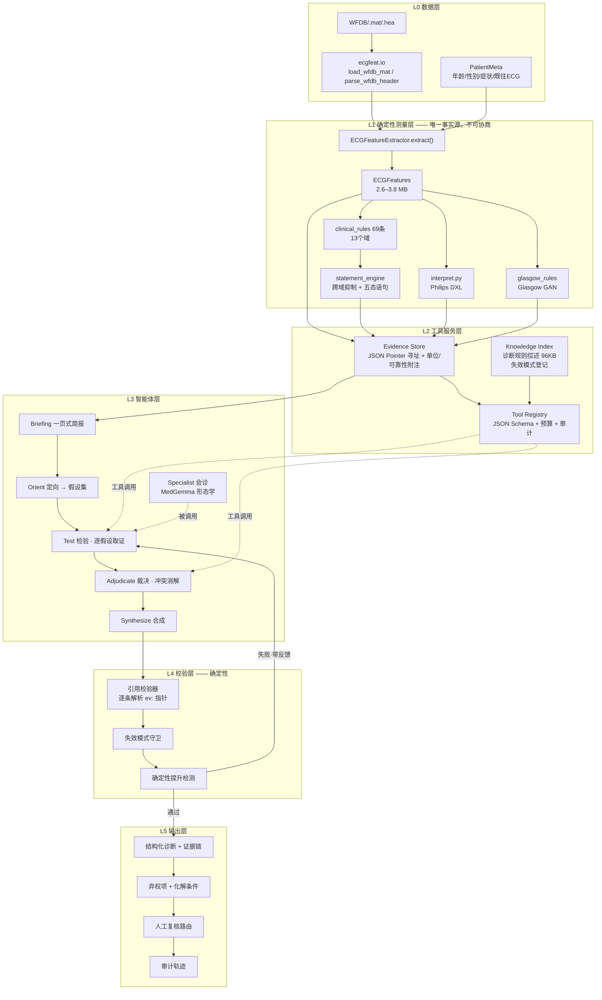

<!-- i18n-nav -->
[中文](ecg_agent_architecture.md) | [English](ecg_agent_architecture.en.md) | [日本語](ecg_agent_architecture.ja.md)
<!-- /i18n-nav -->

> 翻訳に関する注意：この日本語版は参考用です。原文と相違がある場合は、原文を優先します。

<a id="ecg-推理智能体系统架构设计"></a>
# ECG 推論エージェント システム アーキテクチャ設計

> 目標: `feature_extraction/ecgfeat` を決定論的ツールキットとして使用し、その上に **合理的、監査可能、および節制可能な** ツールキットを構築する
> 12 誘導 ECG 診断用の LLM エージェント システム。
>
> ステータス: v27 実装アーキテクチャ (2026-08-01)。記事の最初の部分では、現在の実装について説明します。後半は追跡のための歴史的なデザインを保持しています。
> このシステムは依然として研究および補助解釈ツールであり、規制上の検証を受けた医療機器ではありません。

<a id="2026-08-01-当前实现诊断优先-v27"></a>
## 2026-08-01 現在の実装: 最初の診断 v27

この記事では、履歴追跡のための元の「ルール規則」設計が維持されています。現在の実装はこのセクションの対象となります。

- **LLM は、ECG 診断推論の主題です。 ** ECG 特徴データが与えられると、エージェントは独自に品質を完了します。
  リズム、心拍数、P/AV 関係、間隔、軸、伝導、異所性拍動、心室/電圧、Q/ST-T/U
  波とペーシングの体系的な解釈。
- **ecgfeat は測定ツールであり、診断審判ではありません。 ** グローバルなリードごとの情報のみを提供します。
  ビート間の測定、信頼性に関する警告、および検証可能な `ev:/...` ポインター。
- **診断モードでは、ルールの結論がモデルに公開されません。 ** 中立ブリーフィングには、一致したルール、ルールの免除、
  エンジンの結論または PTB-XL タグを参照してください。 Survey、Investigate、Challenge は測定のみ可能です
  ツール。 「調査後の仮説」はツールを開かず、暫定的な診断を立てるために管理された一般知識の断片のみを受け取ります。
  対象を絞った検査計画。これらのクリップは患者の証拠ではありません。
- **出力にはベースラインの性質がありません。 ** `diagnoses` はモデルの肯定的な結論です。
  `differential_diagnoses` は未解決の代替説明です。もう使われていない
  `unchanged / added / withdrawn / downgraded`。
- **ルールのベースラインとデータセットのラベルは、推論後のブラインド評価にのみ使用されます。 ** 彼らはエージェントの利益を測定できます。
  ただし、エージェントの入力にはなりません。
- **影響の大きい手段は改ざん可能でなければなりません。 ** ペーススパイク検出、QRS アライメント、およびペースビートフラグは同じに属します
  アルゴリズム チェーンは、相互に独立した証拠として機能することはできません。証拠が矛盾する場合、候補となる観測値のみが保持され、測定ルートを変更することはできません。
  または、ネイティブ ST/T をブロックします。
- **コンパクトで反復的なネイティブビートがビートの外側に保持されている証拠を表します。 ** `qrs_infarct` パネルは Q 波をビートごとにチェックするために使用されます
  R 波進行では、ペーシングが疑われる場合、`repolarization` パネルを使用して非ペーシング ST/T/QT の表示を継続します。
  信頼性の低い測定値はダウングレードされますが、削除されません。
- **診断入力は、バージョン管理された物理ホワイトリスト DTO です。 ** `diagnosis-evidence.v2` は明示的に登録されたコピーのみを使用します
  測定、品質、取得および診断の中立モードフィールド。不明なトップレベル フィールドまたは高リスク フィールドは、デフォルトでは診断ストアに入力されません。
  ドロップされた/未分類のフィールドは監査に書き込まれ、最初に新しいフィールドを更新する必要があります。
- **ツールが到達しても、モデルが表示されるわけではありません。 ** ツールレイヤーは、タッチされた引用と表示された引用をそれぞれ登録します
  引用。ツールの切り捨て、バックエンドのエイリアス置換、およびコンテキスト圧縮後の値を保持する `ev:/...` タグのみ
  次のモデルリクエストにまだ表示される場合にのみ、検証ホワイトリストに追加されます。ポインターのリストだけでは参照を許可できません。
- **主な結果は有効な証拠のみを保存し、ベア パス リストを繰り返し保存することはありません。 ** 各ツール呼び出しはメイン JSON にのみ書き込みます
  タッチ/表示カウントとコンテンツアドレス指定ハッシュ。完全なポインターと raw は別のトレースに返されます。最終評決
  取得される実際の参照は、不変の証拠ストアから実際の値、単位、信頼性の警告までのコードによって具体化されます。
  ソースおよびサポート/反対の役割。`audit.tools.effective_evidence` に保存されます。モデルによって与えられた
  単一の直接数値参照も、転記エラーを回避するために、統一された臨床表示精度にコードによってバックフィルされます。元の完全精度の値はのみ残されます。
  効果的な証拠監査。検証では、数値を比較するのではなく、単位と公差を使用して、臨床的に丸められた値が元の値と等しいかどうかを判断します。
  文字列;したがって、モデル コンテキストに入らないポインターは、数値または参照適格になりません。
- **アンケートは単一のコンパクトなエントリです。 ** 第 1 フェーズ、予算 1 では、`get_diagnostic_overview` のみがオープンです。
  暫定的な仮説が形成された後、リードごと、ビートごと、および形態のテーブルをオンデマンドで読み取る必要があります。予算 6 ～ 8 を調査する、
  課題予算 3-4.
- **法医学計画は構造化された列挙であり、臨床の散文を解析するものではありません。 ** 仮説出力 enum 診断ドメイン、enum
  ツールの名前と方向の問題。オーケストレーターの決定論的ドメイン → 完全な未評価ドメインへのツール マッピング、最大 8 つのツールに対応、
  また、`get_measurement` と `search_measurements` は常に安全に保管してください。
- **バックエンド機能は明示的に宣言されています。 ** ネイティブ ツール呼び出し、構造化出力レベル、コンテキスト圧縮、参照エイリアス、
  位相メモリ、プリフェッチ、並列幅は `BackendCapabilities` によって均一に提供され、オーケストレーターは推測に頼ることがなくなりました。
  特定のバックエンドがこれらの機能をサポートしているかどうか。
- **Clinical Hard Door は、バージョン化された最小限のセキュリティ戦略です。 **`clinical-safety.v1` を中心とするしきい値は、ブロックまたは
  ダウングレードおよび定義レベルの測定結果と矛盾する肯定的な結論は、新しい診断を追加することはできません。特定のパラメータとポリシーのバージョンは、実行中の監査に書き込まれます。
- **リリースは製品が継続的に受け入れられることを条件とします。 ** `ecgagent.acceptance` 検査成功率、検証率、P90
  待ち時間、改訂回数、ステージガード、目に見える引用範囲、および独立した臨床レポート。
  `ecgagent.evaluation_protocol` ルール、シングルターン、エージェント スリーアームについては、`patient_id` を押してください
  アブレーションの概要を実行します。 Three Arms は、評価管理者の秘密キーを使用して、安定した不透明なエイリアスを生成します。非盲検レポートはバインドする必要がある
  臨床関係者によって実際にレビューされたブラインドレビュー製品のハッシュは、別のランダム マッピング後にリリース ドアに直接送信することはできません。

現在のメインパスは次のとおりです。

```text
ECG → ecgfeat 测量/质量 artifact → 中性简报
    → Survey（全局患者测量盘点）
    → 受控知识导航 → Hypothesize（暂定诊断/鉴别诊断/检查计划）
    → 移除知识原文 → Investigate（针对性 ecgfeat 检查）
    → Challenge → Synthesize
    → 确定性引用/数值/caveat 校验 → 独立诊断
    →（可选）隔离的诊断后知识挑战 → ecgfeat 重新取证后方可修订
    →（推理结束后）PTB-XL 与规则基线评估
```

患者レベルの知識ナビゲーションとチャレンジは、`diagnostic_reference`、`morphology_reference`、
`measurement_reliability_reference`、`failure_modes`。臨床ルール、フィリップス
DXL、グラスゴーおよび機能ブループリントは、オフライン開発監査のみに引き続き使用されます。最終的に患者は元に戻らなければならないと主張します。
このセッションで読み取られた `ev:/...` 測定値。知識の断片は、患者が何らかの基準を満たしていることを証明するものではありません。

実装エントリは `ecgagent.agent.diagnostic.ECGDiagnosticAgent` です。 CLI とバッチ処理がデフォルトで使用されます
入り口。古い `ECGAgent` は、明示的な `--mode adjudicate` への互換パスとしてのみ保持されます。

---

<a id="目录"></a>
## ディレクトリ

- [1.設計の出発点: エージェントが行うべきこととすべきではないこと](#1-设计出发点智能体该做什么不该做什么)
- [2.現在のステータスのインベントリ: v1 階層型 CoT の機能と上限](#2-现状盘点v1-分层-cot-的能力与天花板)
- [3.ターゲット アーキテクチャの概要](#3-目标架构总览)
- [4.コアコンポーネント設計](#4-核心组件设计)
  - [4.1 証拠ストア](#41-证据存储-evidence-store)
  - [4.2 ツールレジストリ](#42-工具集-tool-registry)
  - [4.3 エージェント層: 有界仮説検証サイクル](#43-智能体层有界假设-检验循环)
  - [4.4 障害モードレジストリ](#44-失效模式注册表)
  - [4.5 検証レイヤー: 参照検証者](#45-校验层引用校验器)
  - [4.6 出力コントラクト](#46-输出契约)
- [5.モデルとランタイムの選択](#5-模型与运行时选型)
- [6.主な制約とリスク](#6-关键约束与风险)
- [7.評価計画](#7-评测方案)
- [8.段階的実装ルート](#8-分阶段落地路线)
- [9.推奨されるモジュール配置](#9-建议的模块落点)

---

<a id="1-设计出发点智能体该做什么不该做什么"></a>
## 1. 設計の開始点: エージェントが行うべきこととすべきではないこと

これは、アーキテクチャ全体の最も重要なセクションです。 **エージェントの配置が間違っていると、後続のすべてのプロジェクトでエラーが増幅されます。 **

`ecgfeat` は、信号レベル測定 (LUDB/QTDB の相互検証)、
69 の CLIN ルール (AHA/ACCF/HRS 2009 + UDMI 2018 ベースライン) のしきい値の決定、および
`matched / not_matched / indeterminate / unavailable / suppressed` 5 つの状態のステートメント分析。
LLM にこれら 3 つのことをやり直すように依頼すると、再現可能な正確な値が再現不可能な近似値に置き換えられるだけです。

<a id="智能体的四项真实增量"></a>
### エージェントの 4 つの実際の増分

| # |責任 |ルールエンジンがそれを実行できない理由 |
|---|---|---|
| **A** | **複数のソースによる紛争の裁定** |ウェアハウスには 3 セットの **相互非調停** エンジン (`clinical_rules` / `interpret.py` Philips DXL / `glasgow_rules`) と、「コンセンサス測定とリードバイリードの生測定」のペアがあります。 `sources.py` は、相互にカバーしないことを明確に示しています。誰が正しいかは、特定の証拠に基づいて判断される必要があり、固定された優先順位によって解決することはできません。
| **B** | **既知の障害連鎖の仮説検証** | `docs/诊断层待修改清单.md` 記録された最も危険なエラーは「診断の見逃し」ではなく、**上流の誤検出が下流の誤陽性カスケードを引き起こす**: F 波が P 波とみなされる → PR が測定される → 第 1 度 AVB + 左心房異常 (FP は 5 つの心房粗動記録で 5 回トリガーされる)。ルール エンジンは独自のドメイン内では正しいですが、クロスドメインの前提では間違っています。
| **C** | **権利放棄の二次マイニング** |入力が不十分な場合 (例: 2:1 AV ブロック、三束ブロック)、ルール エンジンは `indeterminate` / `unavailable` を正しく与えます。多くの場合、これらの場所で選択できる**他の証拠の道**が存在するか、少なくとも「判断を下すために何が欠けているか」を明確に言うことができます。これは限定された検索の問題であり、エージェントに適しています。
| **D** | **コンテキストの統合と読みやすい説明** |年齢/性別/症状/過去のECG/臨床問題、そして大人がレビューできる一連の証拠を言葉にする |

<a id="三条硬红线"></a>
### 3 本の赤い太い線

1. **エージェントは、ツールによって返されない値を生成してはなりません。 ** 各番号には、`features.json` を指す証拠参照が含まれている必要があります。
   これは、決定的検証ツールによって項目ごとに解析およびチェックされます ([4.5](#45-校验层引用校验器) を参照)。
2. **エージェントは確実性を宣伝してはなりません。 ** ルール エンジンはアイテム `indeterminate` を決定し、エージェントは次の場合にのみ新しい証拠を導入できます **
   （新しいツールの返却）、どの証拠がそれを裏付けるかを明確に記録する必要があります。 「総合的に判断して×であるはずだ」ということは許されません。
3. **確実性を維持するために関係を抑制します。 ** `statement_engine` のクロスドメイン抑制 (持続的な心室ペーシング抑制形態ステートメントなど、
   AF 抑制 P 波依存ステートメント) はコードによって実行され、LLM には渡されません。エージェントは阻害の**前提に疑問を呈する**ことができ、
   しかし、結果を抑制することを自分で決めることはできません。

---

<a id="2-现状盘点v1-分层-cot-的能力与天花板"></a>
## 2. 現状のインベントリ: v1 階層型 CoT の機能と上限

既存の `run_layered_diagnosis()` または `medgemma_ecg_core.py` は、すでにかなり完全な階層推論パイプラインです。

```
features.json ──► summarize_layered_evidence()  ──► L0..L4 五份固定证据包
                  build_validated_measurement_facts() ──► 确定性算术约束
                  sanitize_report_text() ──► 去诊断化的报告摘录
                       │
                       ▼
      L0(质量) → L1(节律) → L2(传导/间期) → L3(电轴/心腔) → L4(Q波/ST-T)
        每层一次独立 generate，只带 L0 结论下传
                       │
                       ▼
      run_feature_guardrails() + run_stage_claim_guardrails()
        → 命中则 build_layer_revision_prompt() 重做该层（≤1 轮）
                       │
                       ▼
      L5 synthesis → parse → run_synthesis_guardrails() → 修订 → 输出
```

**正しいこと（覆すのではなく、継承する必要があります）:**

- **ドメイン分解 L0 ～ L4 は臨床的に正しく**、`statement_engine` の阻害トポロジーと一致します。
- **モデルが `probable_af` などの結論ラベルをコピーするのを防ぐために、すべての `interpretation` フィールドが証拠パッケージから削除されます**。これが重要な漏れ防止設計です。
- **`build_validated_measurement_facts()` 算術制約を前に置きます**。そうすれば、モデルはそれらに従うことのみができますが、反駁することはできません。
- **ガード→方向修正→再チェック** 閉ループ形状自体は正しい。

**天井はどこですか:**

|核心 |特定の症状 |
|---|---|
| **証拠は押されるものであり、引っ張られるものではありません** | `summarize_layered_evidence()` は手書きの固定スライスです。スライスがカバーされていない状況 (たとえば、ベンチュリを決定するために心拍ごとの PR シーケンスが必要な場合や、特定のリードの元の波形を確認する必要がある場合) に遭遇した場合、モデルは不完全な証拠に基づいて難しい質問に答えるしかありません。
| **反事実はできません** |モデルは、「T 波リファインメントがオフになっている場合、この QT は依然としてこの値を持ちますか?」と尋ねることはできません。それとも「Q 波はまだ 40 ミリ秒であると判断されるのでしょうか?」そして、これはまさに測定の信頼性を判断する最も効果的な方法です。
| **ガードは徹底的にハードコーディングされています** | `check_q_wave_lvh_false_positive` / `check_qrs_consensus_bbb_gap` / `check_rr_outlier_driven_irregularity` 3 つの機能は、3 つの既知の落とし穴に対するパッチです。 4 番目のピットが表示されると、コードを変更する必要がありますが、モデルはそれを自力で見つけることができません。
| **L0 結論のみがレイヤー間で送信されます** |上流の誤検出チェーン (F 波 → P 波) はたまたま L1 と L2 にまたがっており、L2 は L1 の疑いを得ることができません。
| **予算管理と監査証跡がない** |呼び出しの数は固定されており、「この推論中にどのような証拠が閲覧されたか」というレビュー可能な記録はありません。
| **`DEFAULT_MODEL_MAX_LEN = 8192`** |また、`medgemma-27b/config.json` の `max_position_embeddings` は **131072** です。現在の自主的な上限は、モデルの容量の 6% のみを使用します。

> **結論: v2 は書き換えではありませんが、「プッシュ固定証拠パッケージ」を「プルツール呼び出し」に置き換え、「ハードコードされたガード」を「宣言的失敗モード + 仮説テスト」に置き換え、検証と監査を追加しています。ドメイン分解と漏れ防止設計はそのまま維持されます。 **

---

<a id="3-目标架构总览"></a>
## 3. ターゲットアーキテクチャの概要



**データ フローの 1 文の要約**: 決定論的レイヤーがすべての事実を計算し、証拠ストレージにドロップします。→ エージェントは 1 ページの説明を受けた後、独自の決定を下します**
注目すべき点** → 証拠収集のすべてのステップが記録される → すべての出力された数値は、証拠ストレージ内の特定のパスを回復できる必要がある → 回復できない場合は、やり直しとなります。

---

<a id="4-核心组件设计"></a>
## 4. コアコンポーネントの設計

<a id="41-证据存储-evidence-store"></a>
### 4.1 証拠ストア 証拠ストア

**解決すべき問題**: `features.json` 2.6 ～ 3.8 MB、深く入れ子になった構造
(`representative_leads.V3.measurements.st_j_mv` この種)。 LLM は、ネストされた JSON をナビゲートするのには適しておらず、得意でもありません。

**デザイン**：

```python
class EvidenceStore:
    """features.json 的只读寻址层。所有工具的取值都经过它，因此所有取值都可被引用和复核。"""

    def resolve(self, pointer: str) -> EvidenceValue: ...
    def resolve_many(self, pointers: list[str]) -> list[EvidenceValue]: ...
    def search(self, name_fragment: str, limit: int = 20) -> list[str]: ...
```

```python
@dataclass(frozen=True)
class EvidenceValue:
    pointer: str            # "/representative_leads/V3/measurements/st_j_mv"
    value: Any
    unit: str | None        # "mV" / "ms" / "deg"
    reliability: str | None # 来自 quality[lead].reliable_for_* 与 *_reliability 字段
    provenance: str | None  # 来自 qt_path / p_duration_source / measurement_paths 的口径标记
    caveats: list[str]      # 如 "该导联 T 波不可靠"、"共识值与逐导联原始值差 18 ms"
```

3 つの重要な設計ポイント:

1. **`caveats` が自動的に挿入されます。 ** `/global_features/qt_ms` を服用すると、ストレージ層が自動的に付加されます
   `qt_reliability`、`qt_unreliable_reasons`、`qt_path`、`qt_excluded_leads`。
   信頼性コンテキストなしでモデルが裸の数値を取得することは不可能です。これにより、「モデルが信頼性をチェックするのを忘れた」などのエラーが構造的に排除されます。
2. **フレンドリーな別名テーブル。 ** `"QTc(Bazett)" → "/global_features/qtc_bazett_ms"` の双方向マッピングを維持します。
   出力が規範的なポインターに収まっている間、モデルが臨床名で質問できるようにします。
3. **読み取り専用 + コンテンツアドレス指定。 ** セッション全体内で不変に保存され、ポインタは参照 ID、`ev:/global_features/qrs_ms` です。
   この文字列は、「証拠のアドレス」と「検証可能な資格情報」の両方です。

**1 ページのブリーフィング `build_chart_briefing()`** (最初のメッセージとしてプッシュされる約 1.5 ～ 2.5,000 のトークンは、ツール呼び出しのバジェットを考慮していません):

```
[记录]      JS00956 | 男 | 58岁 | fs=500Hz | 10.0s | 采集 2026-03-11
[门控]      gate=partial | 允许域: rhythm, intervals, conduction, voltage
                        | 受限域: ischemia_infarction (原因: V2/V3 T 波不可靠)
[质量]      record_grade=Q2 | 不可靠导联: V2(baseline_wander), V3(emg)
            P不可靠: — | QRS不可靠: — | T不可靠: V2,V3 | QT不可靠: V2,V3
[整体]      HR 78 | 心房率 —(退化) | PR 214ms | QRS 96ms
            QTcB 431ms(可靠性=moderate, 口径=normal_qt, 用了7导联)
            电轴 P 62° / QRS 18° / T —(不可靠)
[已触发]    CLIN-INTERVAL-PR-01        matched      一度房室传导延迟   MEDIUM P3
            CLIN-HYPERTROPHY-LAE-01    matched      左房异常           MEDIUM P4
[已弃权]    CLIN-RHYTHM-AFL-01         indeterminate  缺: 独立心房事件序列验证
            CLIN-INTERVAL-QT-01        partial        缺: V2/V3 T 波终点
[跨引擎分歧] Philips DXL: sinus rhythm | Glasgow: possible atrial flutter  ← 分歧
[失效模式预警] FM-AFL-P-CASCADE 前提命中: PR>200 且 LAE 阳性 且 房扑判定不可用
```

最後の 2 行は **アクティブ** です。決定論的なコードによって計算され、最も疑わしいものをエージェントの前に直接配置します。
これは、`docs/诊断层待修改清单.md` A.0 の実際の教訓をシステム機能に定着させるためです。

---

<a id="42-工具集-tool-registry"></a>
### 4.2 ツールレジストリ

ツールの粒度が、設計全体の成功または失敗の鍵となります。 **薄すぎる → 通話数が爆発的に増加します。厚すぎる→プッシュスタイルに退化。 **
原則は次のとおりです。 ** 1 回の呼び出しで臨床上の質問に答える必要があり、モデルの戻り値の形状が読みやすい必要があります (テーブル > ネストされた JSON)。 **

⭐ のマークが付いている 6 つは、最小利用可能セット (MVP) です。

<a id="a-族-定向"></a>
#### 家族 A · オリエンテーション

|ツール |署名 |説明書 |
|---|---|---|
| ⭐ `list_findings` | `(status?, domain?, min_priority?) -> Row[]` |ルール評価をリストします。デフォルトでは、`matched` + `indeterminate` が返されます。 **これは、エージェントが「エンジンが何を言ったか/何を言わなかったか」を理解するための入り口です** |
| ⭐ `get_rule_detail` | `(rule_id) -> RuleEvaluation` | `evidence` / `thresholds` / `missing_inputs` / `suppressed_by` / `source` の単一ルール。 「なぜそのような判断をするのか？」に答えてください。 |

<a id="b-族-取值"></a>
#### ファミリー B · 価値

|ツール |署名 |説明書 |
|---|---|---|
| ⭐ `get_measurement` | `(pointer \| alias) -> EvidenceValue` |正確な単一値の取得、内蔵ユニット/信頼性/注意事項 |
| ⭐ `get_lead_table` | `(fields[], leads?) -> Markdown 表` | **最高周波数ツール**。 12 行 × N 列の行列は、ネストされた JSON よりも 1 桁読みやすいです。例: `fields=["q_dur_ms","q_amp_mv","r_amp_mv","st_j_mv","t_amp_mv"]` 必要な Q 波解釈をすべて取得します。
| `get_beat_table` | `(fields[], beat_range?) -> Markdown 表` |ビートからビートへのシーケンス。宣告、収縮前、交互脈、2:1 伝導が必要 |

<a id="c-族-探查相对固定流水线的真正增量"></a>
#### ファミリ C · プローブ (固定パイプラインに対する実際の増分)

|ツール |署名 |説明書 |
|---|---|---|
| ⭐ `remeasure` | `(overrides, fields_of_interest[]) -> Diff` |異なるエクストラクター パラメーターを使用して再実行すると、**差分**が返されます。 `ECGFeatureExtractor.__init__` には、`enable_t_wave_refinement` / `enable_hybrid_st_measurement` / `fs_internal` / `lp_hz` / `enable_pacing` などの公開スイッチがあり、直接既製の反事実プローブです。 **「この測定は安定していますか?」に答える** |
| `recompute_rule` | `(rule_id, threshold_overrides) -> RuleEvaluation` |閾値感度。例: Q 波の制限時間は UDMI 30 ms と教科書の 40 ms に従って判定されます (`sources.py: BASELINE_DIVERGENCES` はこの一連の違いを登録しています) |
| `get_signal_window` | `(lead, t0_ms, t1_ms, decimate) -> 数值序列 + 基准标注` |波形値の小さなセグメントを取得し、J 点/P 開始/終了/T 終了マークを付けます。他の人の形状の説明を見るのではなく、モデルに形状を直接見てもらいます。

> **`remeasure` のコストに関する注意**: 完全な再実行には数秒かかります。 **キャッシュ + セッションあたりの呼び出し数の上限 (推奨 ≤3)** を実行する必要があります。
> そして、完全な新機能ではなく、`fields_of_interest` の差分のみが返されます。

<a id="d-族-知识"></a>
#### Dファミリー・ナレッジ

|ツール |署名 |説明書 |
|---|---|---|
| ⭐ `lookup_criteria` | `(topic) -> 章节片段` | `docs/心电图诊断规则系统综述.md`(1923行/21章/付録A正常値クイックチェック+付録B識別処理)を取得します。 **固定トークン ウィンドウに基づいて切り取らないで、章スライスに基づいてインデックスを構築します** - ドキュメントの「異常なパフォーマンス → 鑑別診断 → 診断基準」構造自体が最適な検索単位です。
| `lookup_failure_mode` | `(measurement \| pattern) -> FailureMode[]` |障害モード レジストリ + `docs/诊断特征缺口登记.md` + 各相互検証レポートを取得します。 「どのような状況でこの測定値が嘘をつくことになりますか?」への答え|

<a id="e-族-会诊"></a>
#### E 家族・相談

|ツール |署名 |説明書 |
|---|---|---|
| `ask_specialist` | `(question, evidence_bundle) -> 意见` |オーケストレーション モデルが MedGemma ではない場合、形態の問題は MedGemma-27B に任せます。戻り値は事実ではなく「別のモデルの意見」として明確にマークされており、引用元として使用することはできません。

<a id="工具层的横切约定"></a>
#### ツールレイヤーの横断的な規則

```python
@dataclass
class ToolResult:
    ok: bool
    payload: Any
    citations: list[str]      # 工具触达的候选指针；不是自动授权的引用白名单
    cost_hint: str            # "cheap" | "moderate" | "expensive(remeasure)"
    truncated: bool
    note: str | None          # 如 "请求的 18 个字段中 3 个不可用，原因见 caveats"
```

- **ツールが戻るたびに、最初の登録は `citations`** にタッチされます。最終的なバックエンドのレンダリング/圧縮の後、実際のサーバーから送信されます。
  モデルのメッセージから目に見える引用を抽出します。後者のみが、このセッションの法的参照ホワイトリストを蓄積します。
  エージェントがホワイトリスト外のポインタを参照→バリデータが直接イリュージョンと判断する。
- **予算**: 各段階には厳しい上限があります (4.3 を参照)。制限を超えると、ツール レイヤーは `ok=False` を返し、残りの予算を要求します。
  エージェントを強制的に収束させます。
- **監査**: すべての呼び出し (パラメーター、戻り値の概要、消費時間、ステージ) が `audit.tool_calls` に書き込まれます。

---

<a id="43-智能体层有界假设-检验循环"></a>
### 4.3 エージェント層: 有界仮説検証ループ

> このセクションの次のボックスは、元のルールベースの v1 設計を文書化しています。診断の優先順位を実装するための現在の 5 段階のプロセスは、以下から始まります。
> 「2026-08-01 の現在の実装」および `ecgagent/README.md` が優先されます。

無料の ReAct は必要ありません (予算が限られており、監査もできず、8K コンテキストでクラッシュします)。また、v1 の完全に修正されたパイプラインに従いません。
侵害の解決策は **段階的に行われ、各段階にはツールの予算があり、段階内では無料の証拠が収集されます**:

```
┌─ Phase 1 · Orient 定向 ─────────────────── 预算 0 次工具调用 ─┐
│ 输入：一页式简报                                              │
│ 输出：假设集 Hypothesis[]（结构化，不含结论）                  │
│ 三个强制来源（缺一不可）：                                     │
│   (a) 每条 matched 规则 → 一个"待证实"假设                     │
│   (b) 每条 indeterminate/unavailable → 一个"可否化解"假设      │
│   (c) 简报里命中的每个失效模式前提 → 一个"上游误检"假设         │
│   (d) 跨引擎分歧 → 一个"裁决"假设                              │
└──────────────────────────────────────────────────────────────┘
                              ▼
┌─ Phase 2 · Test 检验 ────────────── 预算 8–12 次（可并行）─┐
│ 对每个假设，智能体必须先声明"我要用什么证据支持/推翻它"，       │
│ 再发起工具调用。每个假设结算为：                               │
│   supported / refuted / unresolved(+缺什么)                   │
│ 允许在本阶段内派生新假设，但派生深度 ≤2                        │
└──────────────────────────────────────────────────────────────┘
                              ▼
┌─ Phase 3 · Adjudicate 裁决 ──────────────── 预算 3–5 次 ─┐
│ 只处理冲突：                                                  │
│   · 三引擎分歧                                                │
│   · 共识测量 vs 逐导联原始测量分歧                             │
│     （已知：QRS 在 100–120 ms 区间共识值会低估，见记忆与文档）  │
│   · 上游误检链：若"这个 P 不是 P"成立，下游哪些结论要撤         │
│ 裁决必须给出依据，不能给偏好                                   │
└──────────────────────────────────────────────────────────────┘
                              ▼
┌─ Phase 4 · Synthesize 合成 ────────────────── 预算 0 次 ─┐
│ 产出 4.6 的结构化输出。每条诊断带证据链与反证                  │
└──────────────────────────────────────────────────────────────┘
                              ▼
┌─ Phase 5 · Verify 校验（确定性代码，无 LLM）────────────┐
│ 引用校验 → 失效模式守卫 → 确定性提升检测                       │
│ 失败：带**具体反馈**回 Phase 2 或 4，最多 2 轮                 │
└──────────────────────────────────────────────────────────────┘
```

**この形状の理由:**

- **フェーズ 1 ではツールの調整ができません**。モデルは最初にブリーフィングで「何を確認するか」を明確に考える必要があります。これにより、通話の総数を大幅に削減できます。
- **最初に証拠収集計画を述べてから証拠を収集する必要があると想定されている**ため、「最初に結論を出し、その後証拠を探す」という道が妨げられ、同時に監査証跡が読みやすくなります。
- **フェーズ 3 は独立しています**。競合解決では複数のドメインを同時に調べる必要があり、v1 の層間分離ではこれを行うことができないためです。
  （このF波→P波の連鎖はL1/L2にまたがります）。
- **フェーズ 5 はすべて決定論的なコードです**。LLM は自己検証に参加しません。自己検証は無意味です。

**想定される構造:**

```python
@dataclass
class Hypothesis:
    id: str                    # "H3"
    kind: str                  # confirm_rule | resolve_abstention | upstream_artifact | adjudicate_conflict
    statement: str             # "PR 214ms 的一度房室延迟成立"
    origin: str                # "CLIN-INTERVAL-PR-01 (matched)"
    supporting_plan: list[str] # 计划取哪些证据来支持
    refuting_plan: list[str]   # 计划取哪些证据来推翻 ← 强制字段，防单向验证
    outcome: str | None        # supported | refuted | unresolved
    citations: list[str]
    blocked_by: str | None     # 缺什么才能定
```

`refuting_plan` は **必須フィールド**です。この制約だけでも、かなりの量の確証バイアスをブロックできます。モデルを作成する必要があります。
「どうやって自分を証明するか」だけではなく、「どうやって自分を打ち破るか」。

**ドメイン並列**: フェーズ 2 では、4 つのドメイン L1 ～ L4 が相互に依存していない場合、それぞれにバジェットを持つ 4 つのワーカーに並列化できます。
同じ EvidenceStore を共有します。ただし、裁定にはグローバルな視点が必要であるため、フェーズ 3 では単一のポイントをシリアル化する必要があります。

---

<a id="44-失效模式注册表"></a>
### 4.4 障害モードレジストリ

**ハードコーディングされた `check_*` 関数を宣言型データに変換します。 ** 1 つのデータが同時に 3 つのことを推進します。
ブリーフィングアラート、仮説生成、フェーズ 5 の警備。

```python
@dataclass(frozen=True)
class FailureMode:
    id: str                          # "FM-AFL-P-CASCADE"
    title: str
    trigger: Callable[[EvidenceStore], bool]   # 前提检测，纯确定性
    affected_statements: list[str]   # 会被污染的下游规则 ID
    hypothesis_template: str         # 注入 Phase 1 的假设文本
    discriminating_evidence: list[str]  # 能区分真伪的证据指针/工具调用
    verification: Callable[[Output, EvidenceStore], list[str]]  # Phase 5 守卫
    source_doc: str                  # 出处，便于追溯
```

エントリの最初のバッチ (すべてはこのリポジトリに記録された実際のレッスンからのものであり、推測ではありません):

| ID |故障モード |本人確認証拠 |来歴 |
|---|---|---|---|
| `FM-AFL-P-CASCADE` | P 波として測定された F 波 → PR 偽延長 + V1 終末陰性偽拡大 → 第 1 度 AVB + LAE 偽陽性 | `v1_terminal_p_duration_ms` (>90 ミリ秒は生理学的に不可能、正常な P 合計時間は <120 ミリ秒);心房イベント/RR比。心房粗動判定の利用可能性 | `诊断层待修改清单.md` A |
| `FM-QWAVE-LVH-FP` |高振幅 QRS Q/R 比の上昇 → 病的な Q / 古い MI 偽陽性 | `q_wave_mi_ratio`; Q 波 **絶対持続時間**;継続的な地域主導サポート。 LVH電圧基準 | `check_q_wave_lvh_false_positive` + メモリ |
| `FM-QRS-CONSENSUS-NARROW` | 100 ～ 120 ミリ秒間隔のコンセンサス QRS 過小評価 → リーク LBBB/IVCD | `consensus_vs_independent_per_lead`;リードごとの生の QRS 分布 | `check_qrs_consensus_bbb_gap` + メモリ |
| `FM-RR-OUTLIER-AF` |わずかな心停止/外値上昇フルセグメント RR CV → 偽陽性心房細動 |中央RRのCV。 RMSSD; pNN50;ポアンカレ SD1/SD2;組織化された心房活動 | `check_rr_outlier_driven_irregularity` |
| `FM-T-OFFSET-FUSION` | T エンドポイント融合の信頼性がコンセンサスと一致しない → QT の歪み | `t_fusion_*` 家族全員。 `qt_path`; `qt_excluded_leads`; `t_derived_disagreement_ms` | `qtdb_cross_dataset_validation.md` + メモリ |
| `FM-P-SENSITIVITY` | P 波検出感度が低い (LUDB 0.872 vs NeuroKit 0.958) → 心房活動が欠落していると誤判断される |リードごとの P 検出の一貫性。 `p_duration_support`;非 QRST 区間残差 | `ludb_benchmark` + `qtdb` 相互検証 |
| `FM-CALIBRATION` |紙送り速度・ゲイン未確認 → 電圧種類診断全体オフセット | `input_contract` ユニットとゲイン。スケーリング情報 | `心电图诊断规则系统综述.md` §0.2 |

**利点**: 新しいピットが発見されました。データを書き込むことで、早期警告、仮説、防御を同時に得ることができます。ここで 3 つのコードを変更する必要があります。
そしてモデルはそれを自分自身で見つけることができません。

---

<a id="45-校验层引用校验器"></a>
### 4.5 検証レイヤー: 参照バリデーター

フェーズ 5 の最初で最も重要なステップ。 **純粋な決定主義、LLM の関与はゼロ。 **

```python
def verify_citations(output: AgentOutput, store: EvidenceStore,
                     whitelist: set[str]) -> VerifierReport:
    """
    逐条检查：
      1. 语法      —— 每个 ev: 指针在 EvidenceStore 中可解析
      2. 白名单    —— 该指针的值与引用标记曾真正进入模型上下文（防止猜路径或引用被截断的行）
      3. 数值一致  —— 文本中出现的数字与指针解析值一致（容差按单位定：ms±1, mV±0.01, deg±1）
      4. 无孤儿数字 —— 输出中每个临床数字都至少被一个引用覆盖
      5. 可靠性一致 —— 引用了 reliability=low/unavailable 的值时，
                       文本必须包含相应限定，否则判失败
    """
```

項目 5 は、この一連の設計の中で最も価値のあるものです。「モデルは信頼性の低い測定値を使用していますが、決定的なものである」と説明しています。
解決する必要がある問題からコンパイル時エラーまで。

残りの2人の警備員は、

- **障害モード ガード**: レジストリ内のすべてのエントリ `verification` を実行し、既存の `run_stage_claim_guardrails` を移行します。
  初期セットは 3 つの関数を使用して取得できます。
- **確定的なブースト検出**: ルール エンジンの `status/confidence` をエージェントの出力と比較します。
  エージェントが `indeterminate` から `matched` を参照する場合は、ルール エンジンがその時点で持っていない証拠を参照しているかどうかを確認します。
  (つまり、フェーズ 2/3 の新しいツール呼び出しによって生成される参照)。なし→拒否。

**失敗のフィードバックは具体的である必要があります。 ** 「出力に問題があるので修正してください」ではありませんが、
`「H3 は QTc 431ms は問題ないと主張していますが、参照されている /global_features/qt_ms には信頼性 = 低が設定されています。
理由 t_fusion_reliable=false。制限を追加するか、判定を不確定に変更してください。 「」
v1 の既存の `build_layer_revision_prompt` ターゲット リビジョン メカニズムを直接再利用できます。

---

<a id="46-输出契约"></a>
### 4.6 出力コントラクト

```jsonc
{
  "schema_version": "ecg_agent.v1",
  "record_id": "JS00956",
  "gate": { "status": "partial", "allowed_domains": [...], "reasons": [...] },

  "diagnoses": [
    {
      "code": "first_degree_av_delay",
      "statement": "一度房室传导延迟",
      "status": "withdrawn",              // matched | withdrawn | downgraded | added | unchanged
      "confidence": "unavailable",
      "priority": "P3",
      "source": "rule+agent",
      "rule_ids": ["CLIN-INTERVAL-PR-01"],
      "evidence": [
        { "claim": "PR 测量值 214 ms", "value": 214, "unit": "ms",
          "citations": ["ev:/global_features/pr_ms"] }
      ],
      "counterevidence": [
        { "claim": "V1 终末 P 时限 94 ms，超过正常 P 波总时限的生理上限",
          "value": 94, "unit": "ms",
          "citations": ["ev:/representative_leads/V1/measurements/v1_terminal_p_duration_ms"] }
      ],
      "adjudication": "FM-AFL-P-CASCADE 成立：被测为 P 的成分更可能是房扑 F 波，PR 测量前提不成立，撤回本诊断",
      "differential": ["atrial_flutter_2to1"]
    }
  ],

  "abstentions": [
    { "topic": "房扑确诊", "reason": "缺独立于 QRS 的心房事件序列验证",
      "what_would_resolve_it": "多导联独立心房率验证；每个心房事件的检出置信度（当前只有计数）",
      "blocking_rule": "CLIN-RHYTHM-AFL-01" }
  ],

  "conflicts_resolved": [
    { "topic": "节律", "sources": { "philips_dxl": "sinus", "glasgow": "possible_flutter" },
      "resolution": "glasgow", "basis": "见 FM-AFL-P-CASCADE 判别证据" }
  ],

  "human_review": {
    "required": true,
    "reasons": ["撤回了规则引擎的 matched 诊断", "gate=partial", "命中高危失效模式"]
  },

  "audit": {
    "tool_calls": [ { "phase": "test", "tool": "get_lead_table", "args": {...},
                      "citations": [...], "ms": 12 } ],
    "hypotheses": [ ... ],
    "verifier_report": { "passed": true, "rounds": 1, "findings": [] },
    "model": { "orchestrator": "...", "specialist": "medgemma-27b" },
    "token_cost": { "prompt": 18432, "completion": 3106 }
  }
}
```

3つのデザインポイント：

- **`status` は、絶対的な結論ではなく、相対的なルール エンジンのアクション** (撤回/ダウングレード/追加/維持) を記録します。
  これにより、「エージェントによって具体的に何が変更されたのか」が一目でわかるようになり、diffのみで評価することも可能になります。
- **`what_would_resolve_it` は実行可能です**。 `docs/诊断特征缺口登记.md` のエントリに直接対応します。
  バッチで実行すると、頻度別に分類された機能要件のリストが自動的に生成されます。
- **`human_review.required` のトリガーは決定的**であり、モデル自体によって決定されません。

---

<a id="5-模型与运行时选型"></a>
## 5. モデルとランタイムの選択

<a id="51-一个硬约束medgemma-没有原生-function-calling"></a>
### 5.1 厳しい制約: MedGemma にはネイティブ関数呼び出しがありません

`medgemma-27b/config.json`: `model_type = gemma3_text`、`architectures = ["Gemma3ForCausalLM"]`、
**`vision_config` は存在しません**。 2 つの直接的な影響:

1. **視覚的能力がない** - 「ECG 画像をモデルにレンダリングする」は、現在のチェックポイントでは実行できません。
   波形形状は、`get_signal_window` の数値シーケンスのみを通過できます。視覚的なルートを選択したい場合は、
   ビジョンタワーを備えた MedGemma マルチモーダル チェックポイントに置き換える必要があります。
2. **ネイティブ ツール呼び出しなし** - 確認するには **制約デコード** を使用する必要があります。 vLLM/`guided_json`
   (xgrammar / アウトライン バックエンド) は、ツール呼び出しスキーマに準拠した JSON の出力を強制でき、実際の測定は信頼できます。

`max_position_embeddings = 131072` および `medgemma_ecg_core.py:15` にも注意してください。
`DEFAULT_MODEL_MAX_LEN = 8192`。 **インテリジェントエージェントを作成する前に最初に行うことは、この上限を上げることです**——
8kは「ブリーフィング＋マルチホイールツール返却＋仮説セット」には当てはまりません。 32k から始めることをお勧めします (KV キャッシュ メモリはそれに応じて増加するため、測定する必要があります)。

<a id="52-推荐编排与专科分离"></a>
### 5.2 推奨事項: 振り付けと専門分野の分離

|役割 |要件 |提案 |
|---|---|---|
| **オーケストレーター オーケストレーション** |強力なコマンド準拠、信頼性の高いツール呼び出し、長いコンテキスト、安定した構造化出力 |クロード優先(`requirements.txt`はすでに`anthropic>=0.86.0`)、オフラインシナリオはMedGemma + `guided_json` | に戻ります。
| **スペシャリスト** |事前の ECG 形態 | MedGemma-27B、`ask_specialist` ツールと呼ばれます。

理由: 手配タスクでは、医学的知識ではなく、**プロセスの規律** (予算を守ること、必須フィールドに記入すること、権限を超えないこと) がテストされます。
医学的知識は、`clinical_rules` の 69 のルールと 96 KB の概要ですでに明示されています。
逆に、MedGemma に規律と知識を同時に持たせると、規律の部分が先に崩壊します。

**ただし、アーキテクチャは両方のパスをサポートする必要があります** - これは研究プロジェクトであり、「純粋なローカル MedGemma がどの程度達成できるか」それ自体が結論です。
したがって、抽象化レベルは次のようになります。

```python
class LLMBackend(Protocol):
    def complete(self, messages, tools: list[ToolSpec] | None,
                 max_tokens: int) -> LLMResponse: ...

class VLLMGemmaBackend:   # guided_json 模拟工具调用；复用 medgemma_runtime.build_generate_text_fn
class AnthropicBackend:   # 原生 tool use
```

`medgemma_runtime.py` は `Callable[[str], str]` (入力および出力のプレーン テキスト) を返すようになりました。
`guided_json` のバリアントは拡張する必要があり、署名の互換性は維持されます。

<a id="53-成本与延迟"></a>
### 5.3 コストと遅延

単一レコードの概算: ブリーフィング 2,000 + 平均 15 ツール呼び出し × 返される平均 600 トークン ≈ 11,000 プロンプト トークン
LLMまで5往復。シングルカード fp8 で 27B ~20–60 s/bar。

- **バッチ** (`batch_medgemma_diagnostics.py` シナリオ): 許容されます。
- **インタラクティブ** (`app.py` Gradio): ユーザーが「仮説 H3 のテスト」を確認できるように、ステージの進行状況のストリーミング出力が必要です。
- **最適化ビット**: フェーズ 2 ドメイン並列処理。 `remeasure` 結果キャッシュ。ブリーフィング テンプレートをプレフィックス キャッシュとして再利用します。

---

<a id="6-关键约束与风险"></a>
## 6. 主要な制約とリスク

|リスク |結果 |緩和 |
|---|---|---|
| **モデル製造値** |最も深刻で、エラー診断に直接つながります。参照バリデータ (4.5) + ホワイトリスト メカニズム。これは、モデルの動作に依存しない**構造的な**緩和策です。
| **確実性の向上** |ルールエンジンの正しい棄権を誤った診断に変える |検出の確実性を向上させます。新しい証拠がなければ評決の変更は許されない |
| **コンテキスト オーバーフロー** |このツールは、8k/32k | の累積合計を返します。 **証拠の圧縮**は各段階の最後に行われます。確定した仮説を 1 行の結論 + 参考リストにまとめ、元のツールを破棄します。
| **確証バイアス** |裏付けとなる証拠のみを探してください | `refuting_plan` 必須フィールド。 `counterevidence` 必須の空でないまたは明示的なステートメントは「反証なしで取得されました」 |
| **再現不可能** |医療監査では受け入れられない | `temperature=0`;完全なレコード `audit`;出力 `clinical_fingerprint` (`export.py` はすでに存在します)。同じ入力と同じシードは、回帰テストに書き込まれる同じ出力である必要があります。
| **ツール呼び出しが制御不能** |コスト爆発・無限ループ |ステージ予算には厳しい制限があります。導出の深さ ≤ 2;総ラウンド数 ≤ 2 リビジョン |
| **ルール エンジン自体が間違っています** |エージェントは誤った前提に基づいて推論しています |これはまさに、障害モード レジストリがカバーすることを意図しているものです。 **ただし、レジストリでカバーできるのは既知の落とし穴だけです** - 未知の落とし穴を発見するには、依然として [7](#7-评测方案) の外部検証が必要です。
| **エージェントの判断に対する過度の信頼** |研究ツールを臨床ツールとして使用する | `human_review` 決定論的トリガー。すべての出力には補助的な解釈ステートメントが保持されます。 「引き出しルール エンジン一致診断」操作では手動レビューが必要 |

---

<a id="7-评测方案"></a>
## 7. 評価計画

**新しいシステムが良いかどうかだけでなく、アブレーションの比較も行う必要があります。 ** 3 つのベースラインがレコードの同じバッチに対して実行されます。

1. `ecgfeat` ルール エンジンの出力のみ (`clinical_rules` のステートメント)
2. v1 階層型 CoT (`run_layered_diagnosis`)
3.v2エージェント

<a id="71-诊断质量指标"></a>
### 7.1 診断品質指標

既存キャリバー`evaluate_target_ecgfeat_diagnosis.py` / `evaluate_ludb_diagnosis.py`を踏襲し、
ただし、**`status` に従ってレイヤーを見てください**:

- **純利益** ベースライン 1 と比較: `added` の TP の数 − `withdrawn` の TP の数 (正しい出金にはボーナスポイント、誤った出金には重いペナルティ)
- 各ドメインの信号対雑音比は大きく異なるため、ドメイン (リズム / 伝導 / 虚血 / 肥大) ごとに分割します。
・棄権の妥当性：`indeterminate`のうち実際に棄権した割合

<a id="72-智能体专属指标"></a>
### 7.2 エージェント固有の指標

|メトリクス |目標 |説明 |
|---|---|---|
|見積もりの​​効率化 | 100% |バリデータ項目 1 ～ 2。 100% 未満はブロッキング レベルの欠陥です。
|幻覚数値率 | 0 |バリデータ項目 3 ～ 4 |
|信頼性制限のコンプライアンス | 100% |バリデータ項目 5 |
|ツール呼び出しの平均数 | ≤15 |仕様仮説セットの発散を超えています |
|検証の再試行率 | ≤20% |説明プロンプト ワードや予算の高いデザインに問題があります |
|一次通過率 | ≥80% | |

<a id="73-固定回归集关键"></a>
### 7.3 固定回帰セット (キー)

このウェアハウスの**既知の失敗例**を永続的な回帰セットにします。変更を行った場合は実行する必要があります。

- **心房粗動カスケード**: JS00956/JS00970/JS00987/JS01019/JS01040
  (希望: LAE 偽陽性を伴う 1° AVB が取り下げられるか、少なくとも判定不能に格下げされ、心房粗動の同定が促される)
- **Q 波偽陽性**: `ecgfeat_diagnosis_01_019/` に記録された高い Q/R 比を持つ LVH
- **T エンド/QT**: LUDB 24 / 73 / 81 / 125
- **QRS コンセンサス過小評価**: リードごとの生の値の不一致が大きい、100 ～ 120 ミリ秒の範囲のレコード
- **何も表示しない**: 通常のレコードのバッチ (**エージェントが「常に何かを言う」傾向があるのを防ぐため** - これは LLM 診断システムの最も一般的な障害モードであり、特別にテストする必要があります)

<a id="74-人工复核研究"></a>
### 7.4 マニュアルレビュー調査

最終的には、`ecgfeat_diagnostic_contract_v10.md` の要求に従って、医師の審査が依然として必要となります。
エージェントに特有の質問は、「証拠チェーンがレビュー担当者に本当に役立つかどうか**」です。比較することをお勧めします。
医師は証拠チェーンを使用して v1 の出力と v2 の出力を調べ、レビュー時間とエラー修正率を比較します。

---

<a id="8-分阶段落地路线"></a>
## 8. 段階的な実装ルート

各段階は独立して利用および測定可能であり、すべてが完了するまで待つ必要はありません。

<a id="phase-0-证据存储与引用校验不改-llm-流程"></a>
### フェーズ 0 · 証拠の保管と参照の検証 (LLM プロセスに変更なし)
- `EvidenceStore` + ポインター解析 + `caveats` 自動インジェクション + フレンドリーなエイリアス テーブルを実装します。
- 参照バリデータの実装
- **修正 v1**: `summarize_layered_evidence()` によって出力される各数値にポインターを持たせるようにします。
  バリデーターを使用して v1 の既存の出力を確認する
- **利点**: 「現在の組み立てラインで幻覚を起こしている数字の数」を即座に定量化します。この数字には驚かれるかもしれませんが、
  そしてそれはその後のすべての作業のベースラインとなります

<a id="phase-1-失效模式注册表"></a>
### フェーズ 1 · 障害モード レジストリ
- `check_q_wave_lvh_false_positive` / `check_qrs_consensus_bbb_gap` / を入れます
  `check_rr_outlier_driven_irregularity` 3 つの関数が宣言エントリに移行されました
- `FM-AFL-P-CASCADE` を完了します (現在最も優先度が高く、すでに 5 つの測定済み FP があります)
- v1 証拠パッケージに「障害モード警告」セクションを追加
- **利点**: エージェントを導入せずに v1 を改善します。同時に、v2 の仮説生成ツールでもあります。

<a id="phase-2-工具化-简报mvp-智能体"></a>
### フェーズ 2 · ツール化 + ブリーフィング (MVP エージェント)
- コンテキストの上限を増加 (8192 → 32768)、ビデオメモリを測定
- 6 つの ⭐ ツール + `build_chart_briefing()` を実装
- 2 つのバックエンドで `LLMBackend` 抽象化を実装します
- **最初に 2 つのドメインのみを実行** (リズムと間隔が推奨され、障害の連鎖が最も密になります)、残りは引き続き v1 を使用します
- **利点**: 「プルとプッシュ」の直接比較データを初めて取得しました。

<a id="phase-3-完整循环"></a>
### フェーズ 3 · フルサイクル
- 裁定と予算管理を含む 5 つのフェーズすべてが実装される
- 5 つのドメインすべてへのアクセス
- 出力契約 v1 + 監査証跡
- ストリーミング インタラクションのために `app.py` にアクセスします

<a id="phase-4-探查工具"></a>
### フェーズ 4 · 探索ツール
- `remeasure` / `recompute_rule` / `get_signal_window`
- これは上限を最も増やすことができるステップですが、最も高価でもあります。最後に置いてください。
- マルチモーダル MedGemma チェックポイントに切り替える場合は、この段階で `render_strip` を追加します

---

<a id="9-建议的模块落点"></a>
## 9. 推奨されるモジュール配置ポイント

`docs/codebase_guide.md` の規則に従ってください。再利用可能なロジックをパッケージに入力でき、入力スクリプトはパラメーターの解析と配置のみを行います。
**`feature_extraction/ecgfeat/` Stay Still** - これは決定論的な真実の情報源であり、エージェントはその消費者であり、その一部ではありません。

```
ecgagent/                          # 新包，与 feature_extraction 平级
  evidence/
    store.py          # EvidenceStore, EvidenceValue
    pointer.py        # 指针解析、友好别名表
    briefing.py       # build_chart_briefing()
  tools/
    registry.py       # ToolSpec, ToolResult, 预算, 审计, JSON Schema 生成
    orient.py         # list_findings, get_rule_detail
    query.py          # get_measurement, get_lead_table, get_beat_table
    probe.py          # remeasure, recompute_rule, get_signal_window
    knowledge.py      # lookup_criteria, lookup_failure_mode
    consult.py        # ask_specialist
  knowledge/
    index.py          # 综述文档按章节切片建索引
    corpus.py         # 语料注册（综述 / 缺口登记 / 各验证报告）
  failure_modes/
    registry.py       # FailureMode 数据类与注册表
    definitions.py    # 首批 7 条定义
  agent/
    orchestrator.py   # 五阶段循环
    hypothesis.py     # Hypothesis 生成与结算
    adjudicate.py     # 冲突裁决
    compress.py       # 阶段间证据压缩
  verify/
    citations.py      # 引用校验器
    guards.py         # 失效模式守卫（迁移 run_stage_claim_guardrails）
    certainty.py      # 确定性提升检测
  backends/
    base.py           # LLMBackend Protocol
    vllm_gemma.py     # guided_json 工具调用
    anthropic.py      # 原生 tool use
  contracts/
    output.py         # 输出 schema + 版本

run_agent_single.py                # 单条，对标 run_layered_single.py
run_agent_batch.py                 # 批量，对标 run_layered_batch_flat.py
tests/test_ecgagent_*.py           # 契约测试 + 固定回归集
```

**既存のコードとの関係:**

- `medgemma_ecg_core.py` の v1 パスは変更されず、アブレーション ベースラインとして残ります。
  このうち、`sanitize_report_text` / `_fmt_*` シリーズの書式設定関数は、`ecgagent.evidence.briefing` で再利用できます。
- `medgemma_runtime.py` は、既存の署名の互換性を維持しながら、`guided_json` の生成機能を拡張します。
- `docs/心电图诊断规则系统综述.md` はナレッジ ベースのメイン コーパスになります。**これは、このプロジェクトの比較的一般的な ECG LLM の中核資産です**——
  「異常なパフォーマンス→鑑別診断→診断基準（リード＋特徴）」で整理されており、当然検索単位となります。
- `docs/诊断特征缺口登记.md` および `docs/诊断层待修改清单.md` は障害モード レジストリになり、
  `what_would_resolve_it` のデータ ソースは閉ループを形成します。エージェントがバッチを実行し、ギャップの頻度を自動的にカウントし、機能開発スケジュールをフィードバックします。

---

<a id="附一次完整推理的示例轨迹"></a>
## 添付ファイル: 完全な推論の軌跡の例

JS00956 (参照アノテーション心房粗動、v1 は 2 つの偽陽性 `left_atrial_abnormality` + `first_degree_av_delay` を出力) を例に挙げます。

```
[简报] gate=partial | PR 214ms | 已触发: CLIN-INTERVAL-PR-01, CLIN-HYPERTROPHY-LAE-01
       已弃权: CLIN-RHYTHM-AFL-01 (indeterminate, 缺独立心房事件验证)
       失效模式预警: FM-AFL-P-CASCADE 前提命中

Phase 1 定向（0 次调用）
  H1 [confirm_rule]      PR 214ms 一度房室延迟成立
     refuting_plan: 检查被测 P 是否为真 P（时限、形态、与 QRS 的固定关系）
  H2 [confirm_rule]      左房异常成立
     refuting_plan: 检查 V1 终末负向成分时限是否超生理上限
  H3 [upstream_artifact] 被测为 P 的成分实为房扑 F 波   ← 来自失效模式预警
  H4 [resolve_abstention] 房扑能否用 P 波以外的证据确立

Phase 2 检验（5 次调用）
  get_lead_table(["p_dur_ms","p_amp_mv","v1_terminal_p_duration_ms"])
    → V1 终末负向 94 ms
  lookup_criteria("左房异常 诊断标准")
    → 综述 §3：正常 P 波总时限 <120 ms；LAE 判据为 V1 终末负向 ≥40 ms·mm
  → H2 refuted：终末负向单独占 94 ms，超过正常 P 波总时限，测量前提不成立
  get_beat_table(["pr_ms","rr_ms","atrial_events_in_rr"])
    → 每个 RR 含 2 个心房事件，PR 逐搏波动 196–228 ms
  get_measurement("/global_features/atrial_rate_bpm")
    → None（P 波检测退化时回落，caveat 已标注）
  → H3 supported；H1 refuted（PR 的测量前提不成立）
  → H4 unresolved，blocked_by: 缺独立于 QRS 的心房事件序列验证

Phase 3 裁决（1 次调用）
  跨引擎分歧: Philips DXL=sinus, Glasgow=possible_flutter
  → 采纳 Glasgow 方向；但证据不足以确诊，落到 pattern 层

Phase 4 合成
  withdrawn: first_degree_av_delay（前提不成立）
  withdrawn: left_atrial_abnormality（前提不成立）
  added:     possible_atrial_flutter_pattern (confidence=LOW, 需人工复核)
  abstention: 房扑确诊 — what_would_resolve_it: 多导联独立心房率验证 +
              每个心房事件的检出置信度

Phase 5 校验
  引用有效 5/5 | 无孤儿数字 | 可靠性限定遵守 | 无未授权确定性提升 → 通过
  human_review.required = true（撤回了两条 matched 诊断）
```

このレコードの v1 の出力を比較すると (両方の誤検知を受け入れます)、違いはモデルがより賢いということではありません。
そして、** 障害モード警告では、疑うべき事項がテーブルに置かれ、ツールがチェックできるようにし、検証者はチェック後に無意味なことを言えないようにする。
