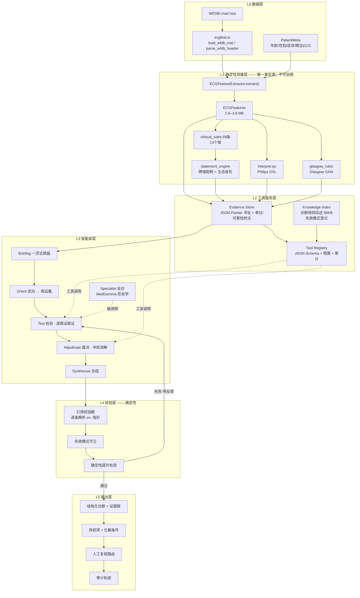

# ECG 推理智能体系统架构设计

> 目标：以 `feature_extraction/ecgfeat` 为确定性 toolkit，在其上构建一个**可推理、可审计、可弃权**的
> LLM 智能体系统，用于 12 导联心电图诊断。
>
> 状态：v27 实现架构（2026-08-01）。文首描述当前实现；后半保留历史设计供追踪。
> 本系统仍是研究与辅助判读工具，不是经过监管验证的医疗器械。

## 2026-08-01 当前实现：诊断优先 v27

本文后续保留了最初的“规则裁决”设计，供历史追踪；当前实现以本节为准。

- **LLM 是 ECG 诊断推理主体。** 给定一份 ECG 特征数据，Agent 独立完成质量、
  节律、心率、P/AV 关系、间期、电轴、传导、异位搏动、心腔/电压、Q/ST-T/U
  波与起搏的系统判读。
- **ecgfeat 是测量工具，不是诊断裁判。** 它只向 Agent 提供全局、逐导联、
  逐搏测量，可靠性 caveat 和可校验 `ev:/...` 指针。
- **诊断模式不向模型暴露规则结论。** 中性简报不包含 matched rules、规则弃权、
  参考引擎结论或 PTB-XL 标签；Survey、Investigate、Challenge 只开放 measurement
  tools。Survey 后的 Hypothesize 不开放工具，只接收受控通用知识片段来制定暂定诊断
  和针对性检查计划；这些片段不是患者证据。
- **输出没有 baseline disposition。** `diagnoses` 是模型的正向结论，
  `differential_diagnoses` 是尚未解决的替代解释；不再使用
  `unchanged / added / withdrawn / downgraded`。
- **规则基线与数据集标签只在推理结束后用于盲评。** 它们可以衡量 Agent 的增益，
  但不能成为 Agent 的输入。
- **高影响模态必须可证伪。** 起搏尖峰检测、QRS 对齐和 paced-beat 标记属于同一
  算法链，不能互相充当独立证据；证据冲突时只保留候选观察，不允许它改变测量路由
  或屏蔽原生 ST/T。
- **代表搏之外保留紧凑的重复原生搏证据。** `qrs_infarct` 面板用于逐搏核对 Q 波
  与 R 波进展，`repolarization` 面板用于疑似起搏时继续查看非起搏搏的 ST/T/QT；
  低可靠测量降权但不删除。
- **诊断输入是版本化物理白名单 DTO。** `diagnosis-evidence.v2` 只复制明确登记的
  测量、质量、采集和诊断中性模态字段；未知顶层或高风险字段默认不进入诊断 Store，
  dropped/unclassified 字段写入审计，新增字段必须先更新合同。
- **工具触达不等于模型可见。** 工具层分别登记 touched citations 与 visible
  citations；只有携带数值的 `ev:/...` 标记经过工具截断、后端别名替换和上下文压缩后
  仍出现在下一次模型请求中，才进入校验白名单。仅有指针清单不能授权引用。
- **主结果只保存有效证据，不重复保存裸路径清单。** 每次工具调用在主 JSON 中只写
  touched/visible 数量和内容寻址哈希；完整指针与原始返回进入独立 trace。最终 verdict
  实际采用的引用由代码从不可变 Evidence Store 物化为真实值、单位、可靠性 caveat、
  来源及 supporting/opposing 角色，保存到 `audit.tools.effective_evidence`。模型给出的
  单一直接数值引用也由代码按统一临床显示精度回填，避免抄写错误；原始全精度值只留在
  有效证据审计。验证使用单位和容差判断临床舍入值与原值是否等价，而不是比较数值
  字符串；未进入模型上下文的指针不会因此获得数值或引用资格。
- **Survey 是单一紧凑入口。** 第一阶段只开放 `get_diagnostic_overview`，预算 1；
  逐导联、逐搏和形态大表必须在形成暂定假设后按需读取。Investigate 预算 6–8，
  Challenge 预算 3–4。
- **取证计划是结构化枚举，不解析临床散文。** Hypothesize 输出 enum 诊断域、enum
  工具名和定向问题；编排器以确定性的域→工具映射补齐未评估域，最多开放 8 个工具，
  并始终保留 `get_measurement` 与 `search_measurements` 兜底。
- **后端能力显式声明。** native tool calling、结构化输出等级、上下文压缩、引用别名、
  phase memory、预取和并行宽度由 `BackendCapabilities` 统一提供，编排器不再散落猜测
  某个后端是否支持这些能力。
- **临床硬门是版本化最小安全策略。** 阈值集中在 `clinical-safety.v1`，仅能阻止或
  降级与定义级测量矛盾的正向结论，不能新增诊断；具体参数和策略版本写入运行审计。
- **发布由持久化产物验收。** `ecgagent.acceptance` 检查成功率、verified 率、P90
  时延、修订次数、阶段 guard、可见引用覆盖及独立临床报告；
  `ecgagent.evaluation_protocol` 对 rules、single-turn、Agent 三臂按 `patient_id`
  做消融汇总。三臂使用评测管理员私有密钥生成稳定不透明别名；解盲报告必须绑定
  临床人员实际审阅过的盲评产物哈希，不能另起一次随机映射后直接送入发布门。

当前主路径为：

```text
ECG → ecgfeat 测量/质量 artifact → 中性简报
    → Survey（全局患者测量盘点）
    → 受控知识导航 → Hypothesize（暂定诊断/鉴别诊断/检查计划）
    → 移除知识原文 → Investigate（针对性 ecgfeat 检查）
    → Challenge → Synthesize
    → 确定性引用/数值/caveat 校验 → 独立诊断
    →（可选）隔离的诊断后知识挑战 → ecgfeat 重新取证后方可修订
    →（推理结束后）PTB-XL 与规则基线评估
```

患者级知识导航和挑战只允许 `diagnostic_reference`、`morphology_reference`、
`measurement_reliability_reference`、`failure_modes`。clinical rules、Philips
DXL、Glasgow 和 capability blueprint 继续只用于离线开发审计。最终患者断言必须回到
本次会话读取的 `ev:/...` 测量；知识片段不能证明患者满足任何判据。

实现入口是 `ecgagent.agent.diagnostic.ECGDiagnosticAgent`；CLI 与批处理默认使用
该入口。旧 `ECGAgent` 仅作为显式 `--mode adjudicate` 的兼容路径保留。

---

## 目录

- [1. 设计出发点：智能体该做什么，不该做什么](#1-设计出发点智能体该做什么不该做什么)
- [2. 现状盘点：v1 分层 CoT 的能力与天花板](#2-现状盘点v1-分层-cot-的能力与天花板)
- [3. 目标架构总览](#3-目标架构总览)
- [4. 核心组件设计](#4-核心组件设计)
  - [4.1 证据存储 Evidence Store](#41-证据存储-evidence-store)
  - [4.2 工具集 Tool Registry](#42-工具集-tool-registry)
  - [4.3 智能体层：有界假设-检验循环](#43-智能体层有界假设-检验循环)
  - [4.4 失效模式注册表](#44-失效模式注册表)
  - [4.5 校验层：引用校验器](#45-校验层引用校验器)
  - [4.6 输出契约](#46-输出契约)
- [5. 模型与运行时选型](#5-模型与运行时选型)
- [6. 关键约束与风险](#6-关键约束与风险)
- [7. 评测方案](#7-评测方案)
- [8. 分阶段落地路线](#8-分阶段落地路线)
- [9. 建议的模块落点](#9-建议的模块落点)

---

## 1. 设计出发点：智能体该做什么，不该做什么

这是整个架构最重要的一节。**如果智能体的定位错了，后面所有工程都是在放大错误。**

`ecgfeat` 已经完成了三件本来最难的事：信号级测量（对 LUDB/QTDB 做过交叉验证）、
69 条 CLIN 规则的阈值判定（AHA/ACCF/HRS 2009 + UDMI 2018 基线）、以及带
`matched / not_matched / indeterminate / unavailable / suppressed` 五态的语句解析。
让 LLM 重做这三件事，只会用一个不可复现的近似去替换一个可复现的精确值。

### 智能体的四项真实增量

| # | 职责 | 为什么规则引擎做不了 |
|---|---|---|
| **A** | **多源冲突裁决** | 仓库里有三套**互不仲裁**的引擎（`clinical_rules` / `interpret.py` Philips DXL / `glasgow_rules`），加上"共识测量 vs 逐导联原始测量"这一对。`sources.py` 明确写了它们互不覆盖。谁对，需要按具体证据判断，不是固定优先级能解决的 |
| **B** | **已知失效链的假设检验** | `docs/诊断层待修改清单.md` 记录的最危险错误不是"漏一条诊断"，而是**上游误检引发下游级联假阳性**：F 波被当成 P 波 → PR 被量长 → 一度 AVB + 左房异常（5 条房扑记录里触发了 5 次 FP）。规则引擎在自己的域内是对的，错在跨域前提 |
| **C** | **弃权项的二次开采** | 规则引擎在输入不足时正确地给出 `indeterminate` / `unavailable`（如 2:1 房室阻滞、三分支阻滞）。这些位置往往还有**别的证据路径**可以走，或者至少能说清"缺什么才能定"。这是有界搜索问题，适合智能体 |
| **D** | **上下文整合与可读解释** | 年龄/性别/症状/既往 ECG/临床问题，以及把证据链讲成人能复核的话 |

### 三条硬红线

1. **智能体不得产出任何未经工具返回的数值。** 每个数字必须携带指向 `features.json` 的证据引用，
   由确定性校验器逐条解析核对（见 [4.5](#45-校验层引用校验器)）。
2. **智能体不得提升确定性。** 规则引擎判 `indeterminate` 的项，智能体只能在**引入了新证据**
   （新的工具返回）的前提下改判，并且必须显式记录是哪条证据支撑的。不允许"综合判断认为应该是 X"。
3. **抑制关系保持确定性。** `statement_engine` 的跨域抑制（如持续心室起搏抑制形态学语句、
   AF 抑制 P 波依赖语句）由代码执行，不交给 LLM。智能体可以**质疑抑制的前提**，
   但不能自己决定抑制结果。

---

## 2. 现状盘点：v1 分层 CoT 的能力与天花板

现有 `medgemma_ecg_core.py` 的 `run_layered_diagnosis()` 已经是一个相当完整的分层推理流水线：

```
features.json ──► summarize_layered_evidence()  ──► L0..L4 五份固定证据包
                  build_validated_measurement_facts() ──► 确定性算术约束
                  sanitize_report_text() ──► 去诊断化的报告摘录
                       │
                       ▼
      L0(质量) → L1(节律) → L2(传导/间期) → L3(电轴/心腔) → L4(Q波/ST-T)
        每层一次独立 generate，只带 L0 结论下传
                       │
                       ▼
      run_feature_guardrails() + run_stage_claim_guardrails()
        → 命中则 build_layer_revision_prompt() 重做该层（≤1 轮）
                       │
                       ▼
      L5 synthesis → parse → run_synthesis_guardrails() → 修订 → 输出
```

**做对的地方（必须继承，不要推翻）：**

- **域分解 L0–L4 是临床上正确的**，也和 `statement_engine` 的抑制拓扑一致。
- **证据包里剥离了所有 `interpretation` 字段**，防止模型照抄 `probable_af` 之类的结论标签。这是关键的防泄漏设计。
- **`build_validated_measurement_facts()` 把算术约束前置**，模型只能服从不能反驳。
- **守卫 → 定向修订 → 再校验**的闭环形状本身就是对的。

**天花板在哪：**

| 症结 | 具体表现 |
|---|---|
| **证据是推送的，不是拉取的** | `summarize_layered_evidence()` 是手写的固定切片。遇到切片没覆盖的情形（如需要逐搏 PR 序列判文氏、需要看某导联原始波形），模型无路可走，只能在残缺证据上硬答 |
| **无法做反事实** | 模型不能问"如果关掉 T 波精修，这个 QT 还是这个值吗"、"Q 波按 40 ms 判还成立吗"。而这恰恰是判断测量可靠性最有效的手段 |
| **守卫是硬编码的穷举** | `check_q_wave_lvh_false_positive` / `check_qrs_consensus_bbb_gap` / `check_rr_outlier_driven_irregularity` 三个函数是三个已知坑的补丁。第四个坑出现时要改代码，且模型自己发现不了 |
| **层间只传 L0 结论** | 上游误检链（F 波→P 波）恰好跨越 L1 与 L2，而 L2 拿不到 L1 的怀疑 |
| **无预算控制与审计轨迹** | 调用次数固定，没有"这次推理看了哪些证据"的可复核记录 |
| **`DEFAULT_MODEL_MAX_LEN = 8192`** | 而 `medgemma-27b/config.json` 的 `max_position_embeddings` 是 **131072**。当前自设上限只用了模型能力的 6% |

> **结论：v2 不是重写，是把"推送固定证据包"换成"拉取式工具调用"，把"硬编码守卫"换成"声明式失效模式 + 假设检验"，并补上校验与审计。域分解和防泄漏设计原样保留。**

---

## 3. 目标架构总览



**数据流的一句话概括**：确定性层算出全部事实并落进证据存储 → 智能体拿到一页简报后**自己决定
再看什么** → 每一步取证都被记录 → 输出的每个数字都要能追回证据存储里的一个具体路径 → 追不回就打回重做。

---

## 4. 核心组件设计

### 4.1 证据存储 Evidence Store

**要解决的问题**：`features.json` 2.6–3.8 MB，而且是深层嵌套结构
（`representative_leads.V3.measurements.st_j_mv` 这种）。LLM 既装不下，也不擅长在嵌套 JSON 里导航。

**设计**：

```python
class EvidenceStore:
    """features.json 的只读寻址层。所有工具的取值都经过它，因此所有取值都可被引用和复核。"""

    def resolve(self, pointer: str) -> EvidenceValue: ...
    def resolve_many(self, pointers: list[str]) -> list[EvidenceValue]: ...
    def search(self, name_fragment: str, limit: int = 20) -> list[str]: ...
```

```python
@dataclass(frozen=True)
class EvidenceValue:
    pointer: str            # "/representative_leads/V3/measurements/st_j_mv"
    value: Any
    unit: str | None        # "mV" / "ms" / "deg"
    reliability: str | None # 来自 quality[lead].reliable_for_* 与 *_reliability 字段
    provenance: str | None  # 来自 qt_path / p_duration_source / measurement_paths 的口径标记
    caveats: list[str]      # 如 "该导联 T 波不可靠"、"共识值与逐导联原始值差 18 ms"
```

三个关键设计点：

1. **`caveats` 自动注入。** 取 `/global_features/qt_ms` 时，存储层自动附上
   `qt_reliability`、`qt_unreliable_reasons`、`qt_path`、`qt_excluded_leads`。
   模型**不可能拿到一个脱离可靠性上下文的裸数字**——这从结构上消灭了"模型忘了检查可靠性"这类错误。
2. **友好别名表。** 维护 `"QTc(Bazett)" → "/global_features/qtc_bazett_ms"` 的双向映射，
   让模型可以按临床名称提问，同时输出仍落到规范指针上。
3. **只读 + 内容寻址。** 存储在整个会话内不可变，指针即引用 ID，`ev:/global_features/qrs_ms`
   这个字符串同时是"证据地址"和"可校验凭证"。

**一页式简报 `build_chart_briefing()`**（约 1.5–2.5k token，作为首条消息推送，不占工具调用预算）：

```
[记录]      JS00956 | 男 | 58岁 | fs=500Hz | 10.0s | 采集 2026-03-11
[门控]      gate=partial | 允许域: rhythm, intervals, conduction, voltage
                        | 受限域: ischemia_infarction (原因: V2/V3 T 波不可靠)
[质量]      record_grade=Q2 | 不可靠导联: V2(baseline_wander), V3(emg)
            P不可靠: — | QRS不可靠: — | T不可靠: V2,V3 | QT不可靠: V2,V3
[整体]      HR 78 | 心房率 —(退化) | PR 214ms | QRS 96ms
            QTcB 431ms(可靠性=moderate, 口径=normal_qt, 用了7导联)
            电轴 P 62° / QRS 18° / T —(不可靠)
[已触发]    CLIN-INTERVAL-PR-01        matched      一度房室传导延迟   MEDIUM P3
            CLIN-HYPERTROPHY-LAE-01    matched      左房异常           MEDIUM P4
[已弃权]    CLIN-RHYTHM-AFL-01         indeterminate  缺: 独立心房事件序列验证
            CLIN-INTERVAL-QT-01        partial        缺: V2/V3 T 波终点
[跨引擎分歧] Philips DXL: sinus rhythm | Glasgow: possible atrial flutter  ← 分歧
[失效模式预警] FM-AFL-P-CASCADE 前提命中: PR>200 且 LAE 阳性 且 房扑判定不可用
```

最后两行是**主动的**：由确定性代码算出，直接把最该怀疑的东西摆到智能体面前。
这就是把 `docs/诊断层待修改清单.md` A.0 那个真实教训固化成了系统能力。

---

### 4.2 工具集 Tool Registry

工具粒度是整个设计的成败关键。**太细 → 调用次数爆炸；太粗 → 退化成推送式。**
原则是：**一次调用应当回答一个临床问题，返回形状应当是模型好读的（表格 > 嵌套 JSON）。**

标 ⭐ 的 6 个是最小可用集（MVP）。

#### A 族 · 定向

| 工具 | 签名 | 说明 |
|---|---|---|
| ⭐ `list_findings` | `(status?, domain?, min_priority?) -> Row[]` | 列出规则评估。默认返回 `matched` + `indeterminate`。**这是智能体理解"引擎说了什么/没说什么"的入口** |
| ⭐ `get_rule_detail` | `(rule_id) -> RuleEvaluation` | 单条规则的 `evidence` / `thresholds` / `missing_inputs` / `suppressed_by` / `source`。回答"它凭什么这么判" |

#### B 族 · 取值

| 工具 | 签名 | 说明 |
|---|---|---|
| ⭐ `get_measurement` | `(pointer \| alias) -> EvidenceValue` | 单值精确取数，自带 unit / reliability / caveats |
| ⭐ `get_lead_table` | `(fields[], leads?) -> Markdown 表` | **最高频工具**。12 行 × N 列的矩阵，比嵌套 JSON 好读一个数量级。例：`fields=["q_dur_ms","q_amp_mv","r_amp_mv","st_j_mv","t_amp_mv"]` 一次拿全 Q 波判读所需 |
| `get_beat_table` | `(fields[], beat_range?) -> Markdown 表` | 逐搏序列。判文氏、期前收缩、电交替、2:1 传导必需 |

#### C 族 · 探查（相对固定流水线的真正增量）

| 工具 | 签名 | 说明 |
|---|---|---|
| ⭐ `remeasure` | `(overrides, fields_of_interest[]) -> Diff` | 用不同抽取器参数重跑并返回**差异**。`ECGFeatureExtractor.__init__` 已经暴露了 `enable_t_wave_refinement` / `enable_hybrid_st_measurement` / `fs_internal` / `lp_hz` / `enable_pacing` 等开关——直接就是现成的反事实探针。**回答"这个测量稳不稳"** |
| `recompute_rule` | `(rule_id, threshold_overrides) -> RuleEvaluation` | 阈值敏感性。例：Q 波时限按 UDMI 30 ms 与教材 40 ms 分别判（`sources.py: BASELINE_DIVERGENCES` 已经登记了这组分歧） |
| `get_signal_window` | `(lead, t0_ms, t1_ms, decimate) -> 数值序列 + 基准标注` | 取一小段波形数值，附 J 点/P 起止/T 终点标记。让模型直接看形态而不是看别人的形态描述 |

> **`remeasure` 的成本注意**：全量重跑一次是秒级。必须做**缓存 + 每次会话调用上限（建议 ≤3）**，
> 并且只返回 `fields_of_interest` 的差异而非完整新 features。

#### D 族 · 知识

| 工具 | 签名 | 说明 |
|---|---|---|
| ⭐ `lookup_criteria` | `(topic) -> 章节片段` | 检索 `docs/心电图诊断规则系统综述.md`（1923 行 / 21 章 / 附录 A 正常值速查 + 附录 B 鉴别流程）。**按章节切片建索引，不要按固定 token 窗口切**——该文档的 "异常表现 → 鉴别诊断 → 诊断标准" 结构本身就是最好的检索单元 |
| `lookup_failure_mode` | `(measurement \| pattern) -> FailureMode[]` | 检索失效模式注册表 + `docs/诊断特征缺口登记.md` + 各交叉验证报告。回答"这个测量在什么情况下会骗我" |

#### E 族 · 会诊

| 工具 | 签名 | 说明 |
|---|---|---|
| `ask_specialist` | `(question, evidence_bundle) -> 意见` | 当编排模型不是 MedGemma 时，把形态学问题交给 MedGemma-27B。返回值**明确标注为"另一个模型的意见"而非事实**，不能作为引用来源 |

#### 工具层的横切约定

```python
@dataclass
class ToolResult:
    ok: bool
    payload: Any
    citations: list[str]      # 工具触达的候选指针；不是自动授权的引用白名单
    cost_hint: str            # "cheap" | "moderate" | "expensive(remeasure)"
    truncated: bool
    note: str | None          # 如 "请求的 18 个字段中 3 个不可用，原因见 caveats"
```

- **每次工具返回先登记 touched `citations`**；最终后端渲染/压缩后，再从真正发给
  模型的消息中提取 visible citations。只有后者累积成本次会话的合法引用白名单。
  智能体引用白名单外的指针 → 校验器直接判定为幻觉。
- **预算**：每阶段有硬上限（见 4.3），超限时工具层返回 `ok=False` 并提示剩余预算，
  强制智能体收敛。
- **审计**：所有调用（参数、返回摘要、耗时、阶段）写入 `audit.tool_calls`。

---

### 4.3 智能体层：有界假设-检验循环

> 本节以下方框记录最初的规则裁决型 v1 设计。当前诊断优先实现的五阶段流程以文首
> “2026-08-01 当前实现”和 `ecgagent/README.md` 为准。

不用自由 ReAct（不可预算、不可审计、在 8k 上下文里会崩），也不沿用 v1 的完全固定流水线。
折中方案是**分阶段、每阶段有工具预算、阶段内自由取证**：

```
┌─ Phase 1 · Orient 定向 ─────────────────── 预算 0 次工具调用 ─┐
│ 输入：一页式简报                                              │
│ 输出：假设集 Hypothesis[]（结构化，不含结论）                  │
│ 三个强制来源（缺一不可）：                                     │
│   (a) 每条 matched 规则 → 一个"待证实"假设                     │
│   (b) 每条 indeterminate/unavailable → 一个"可否化解"假设      │
│   (c) 简报里命中的每个失效模式前提 → 一个"上游误检"假设         │
│   (d) 跨引擎分歧 → 一个"裁决"假设                              │
└──────────────────────────────────────────────────────────────┘
                              ▼
┌─ Phase 2 · Test 检验 ────────────── 预算 8–12 次（可并行）─┐
│ 对每个假设，智能体必须先声明"我要用什么证据支持/推翻它"，       │
│ 再发起工具调用。每个假设结算为：                               │
│   supported / refuted / unresolved(+缺什么)                   │
│ 允许在本阶段内派生新假设，但派生深度 ≤2                        │
└──────────────────────────────────────────────────────────────┘
                              ▼
┌─ Phase 3 · Adjudicate 裁决 ──────────────── 预算 3–5 次 ─┐
│ 只处理冲突：                                                  │
│   · 三引擎分歧                                                │
│   · 共识测量 vs 逐导联原始测量分歧                             │
│     （已知：QRS 在 100–120 ms 区间共识值会低估，见记忆与文档）  │
│   · 上游误检链：若"这个 P 不是 P"成立，下游哪些结论要撤         │
│ 裁决必须给出依据，不能给偏好                                   │
└──────────────────────────────────────────────────────────────┘
                              ▼
┌─ Phase 4 · Synthesize 合成 ────────────────── 预算 0 次 ─┐
│ 产出 4.6 的结构化输出。每条诊断带证据链与反证                  │
└──────────────────────────────────────────────────────────────┘
                              ▼
┌─ Phase 5 · Verify 校验（确定性代码，无 LLM）────────────┐
│ 引用校验 → 失效模式守卫 → 确定性提升检测                       │
│ 失败：带**具体反馈**回 Phase 2 或 4，最多 2 轮                 │
└──────────────────────────────────────────────────────────────┘
```

**为什么是这个形状：**

- **Phase 1 不许调工具**，强制模型先在简报上把"要查什么"想清楚。这一条能显著压低总调用数。
- **假设必须先声明取证计划再取证**，把"先有结论再找证据"的路堵死，同时让审计轨迹可读。
- **Phase 3 独立出来**，因为冲突裁决需要同时看多个域，而 v1 的层间隔离恰恰做不到这一点
  （F 波→P 波这条链跨 L1/L2）。
- **Phase 5 全部是确定性代码**，LLM 不参与自我校验——自我校验没有意义。

**假设的结构：**

```python
@dataclass
class Hypothesis:
    id: str                    # "H3"
    kind: str                  # confirm_rule | resolve_abstention | upstream_artifact | adjudicate_conflict
    statement: str             # "PR 214ms 的一度房室延迟成立"
    origin: str                # "CLIN-INTERVAL-PR-01 (matched)"
    supporting_plan: list[str] # 计划取哪些证据来支持
    refuting_plan: list[str]   # 计划取哪些证据来推翻 ← 强制字段，防单向验证
    outcome: str | None        # supported | refuted | unresolved
    citations: list[str]
    blocked_by: str | None     # 缺什么才能定
```

`refuting_plan` 是**强制字段**。这条约束单独就能挡掉相当一部分确认偏误——模型必须写出
"我要怎么推翻自己"，而不只是"我要怎么证明自己"。

**域并行**：Phase 2 里 L1–L4 四个域的假设互不依赖时可以并行成四个 worker，各自带预算，
共享同一个 EvidenceStore。但 Phase 3 必须串行单点，因为裁决需要全局视野。

---

### 4.4 失效模式注册表

**把现在硬编码的 `check_*` 函数变成声明式数据。** 一份数据同时驱动三件事：
简报预警、假设生成、Phase 5 守卫。

```python
@dataclass(frozen=True)
class FailureMode:
    id: str                          # "FM-AFL-P-CASCADE"
    title: str
    trigger: Callable[[EvidenceStore], bool]   # 前提检测，纯确定性
    affected_statements: list[str]   # 会被污染的下游规则 ID
    hypothesis_template: str         # 注入 Phase 1 的假设文本
    discriminating_evidence: list[str]  # 能区分真伪的证据指针/工具调用
    verification: Callable[[Output, EvidenceStore], list[str]]  # Phase 5 守卫
    source_doc: str                  # 出处，便于追溯
```

首批条目（全部来自本仓库已记录的真实教训，不是臆想）：

| ID | 失效模式 | 判别证据 | 出处 |
|---|---|---|---|
| `FM-AFL-P-CASCADE` | F 波被测成 P 波 → PR 假性延长 + V1 终末负向假性增宽 → 一度 AVB + LAE 假阳性 | `v1_terminal_p_duration_ms`（>90 ms 生理上不可能，正常 P 总时限 <120 ms）；心房事件/RR 比；房扑判定可用性 | `诊断层待修改清单.md` A |
| `FM-QWAVE-LVH-FP` | 高振幅 QRS 抬高 Q/R 比 → 病理性 Q / 陈旧心梗假阳性 | `q_wave_mi_ratio`；Q 波**绝对时限**；连续区域导联支持；LVH 电压判据 | `check_q_wave_lvh_false_positive` + 记忆 |
| `FM-QRS-CONSENSUS-NARROW` | 100–120 ms 区间共识 QRS 低估 → 漏 LBBB/IVCD | `consensus_vs_independent_per_lead`；逐导联原始 QRS 分布 | `check_qrs_consensus_bbb_gap` + 记忆 |
| `FM-RR-OUTLIER-AF` | 少数停搏/外れ値抬高全段 RR CV → 房颤假阳性 | 中央 RR 的 CV；RMSSD；pNN50；Poincaré SD1/SD2；有组织心房活动 | `check_rr_outlier_driven_irregularity` |
| `FM-T-OFFSET-FUSION` | T 终点融合置信度与共识不一致 → QT 失真 | `t_fusion_*` 全族；`qt_path`；`qt_excluded_leads`；`t_derived_disagreement_ms` | `qtdb_cross_dataset_validation.md` + 记忆 |
| `FM-P-SENSITIVITY` | P 波检出灵敏度偏低（LUDB 0.872 vs NeuroKit 0.958）→ 心房活动被误判为缺失 | 逐导联 P 检出一致性；`p_duration_support`；非 QRST 区间残差 | `ludb_benchmark` + `qtdb` 交叉验证 |
| `FM-CALIBRATION` | 走纸速度/增益未确认 → 电压类诊断全盘偏移 | `input_contract` 的单位与增益；定标信息 | `心电图诊断规则系统综述.md` §0.2 |

**收益**：新发现一个坑，写一条数据即可同时获得预警、假设和守卫；而现在要改三处代码，
且模型自己发现不了。

---

### 4.5 校验层：引用校验器

Phase 5 的第一道，也是最重要的一道。**纯确定性，零 LLM 参与。**

```python
def verify_citations(output: AgentOutput, store: EvidenceStore,
                     whitelist: set[str]) -> VerifierReport:
    """
    逐条检查：
      1. 语法      —— 每个 ev: 指针在 EvidenceStore 中可解析
      2. 白名单    —— 该指针的值与引用标记曾真正进入模型上下文（防止猜路径或引用被截断的行）
      3. 数值一致  —— 文本中出现的数字与指针解析值一致（容差按单位定：ms±1, mV±0.01, deg±1）
      4. 无孤儿数字 —— 输出中每个临床数字都至少被一个引用覆盖
      5. 可靠性一致 —— 引用了 reliability=low/unavailable 的值时，
                       文本必须包含相应限定，否则判失败
    """
```

第 5 条是这套设计里最有价值的一条：它把"模型用了不可靠的测量却说得斩钉截铁"
从一个**需要人去抓的问题**变成了一个**编译期错误**。

另外两道守卫：

- **失效模式守卫**：跑注册表里每条 `verification`，迁移现有 `run_stage_claim_guardrails`
  的三个函数即可获得初始集合。
- **确定性提升检测**：对比规则引擎的 `status/confidence` 与智能体输出。
  若智能体把 `indeterminate` 提到 `matched`，检查它是否引用了**规则引擎当时没有的证据**
  （即 Phase 2/3 中新工具调用产生的引用）。没有 → 拒绝。

**失败反馈必须具体。** 不是"输出有问题请修改"，而是
`"H3 声称 QTc 431ms 正常，但引用的 /global_features/qt_ms 携带 reliability=low，
原因 t_fusion_reliable=false。请补充限定或改判 indeterminate。"`
v1 已有的 `build_layer_revision_prompt` 定向修订机制可以直接复用。

---

### 4.6 输出契约

```jsonc
{
  "schema_version": "ecg_agent.v1",
  "record_id": "JS00956",
  "gate": { "status": "partial", "allowed_domains": [...], "reasons": [...] },

  "diagnoses": [
    {
      "code": "first_degree_av_delay",
      "statement": "一度房室传导延迟",
      "status": "withdrawn",              // matched | withdrawn | downgraded | added | unchanged
      "confidence": "unavailable",
      "priority": "P3",
      "source": "rule+agent",
      "rule_ids": ["CLIN-INTERVAL-PR-01"],
      "evidence": [
        { "claim": "PR 测量值 214 ms", "value": 214, "unit": "ms",
          "citations": ["ev:/global_features/pr_ms"] }
      ],
      "counterevidence": [
        { "claim": "V1 终末 P 时限 94 ms，超过正常 P 波总时限的生理上限",
          "value": 94, "unit": "ms",
          "citations": ["ev:/representative_leads/V1/measurements/v1_terminal_p_duration_ms"] }
      ],
      "adjudication": "FM-AFL-P-CASCADE 成立：被测为 P 的成分更可能是房扑 F 波，PR 测量前提不成立，撤回本诊断",
      "differential": ["atrial_flutter_2to1"]
    }
  ],

  "abstentions": [
    { "topic": "房扑确诊", "reason": "缺独立于 QRS 的心房事件序列验证",
      "what_would_resolve_it": "多导联独立心房率验证；每个心房事件的检出置信度（当前只有计数）",
      "blocking_rule": "CLIN-RHYTHM-AFL-01" }
  ],

  "conflicts_resolved": [
    { "topic": "节律", "sources": { "philips_dxl": "sinus", "glasgow": "possible_flutter" },
      "resolution": "glasgow", "basis": "见 FM-AFL-P-CASCADE 判别证据" }
  ],

  "human_review": {
    "required": true,
    "reasons": ["撤回了规则引擎的 matched 诊断", "gate=partial", "命中高危失效模式"]
  },

  "audit": {
    "tool_calls": [ { "phase": "test", "tool": "get_lead_table", "args": {...},
                      "citations": [...], "ms": 12 } ],
    "hypotheses": [ ... ],
    "verifier_report": { "passed": true, "rounds": 1, "findings": [] },
    "model": { "orchestrator": "...", "specialist": "medgemma-27b" },
    "token_cost": { "prompt": 18432, "completion": 3106 }
  }
}
```

三个设计要点：

- **`status` 记录的是相对规则引擎的动作**（撤回/降级/新增/维持），而不是绝对结论。
  这让"智能体到底改了什么"一眼可见，也让评测可以只针对 diff 做。
- **`what_would_resolve_it` 是可执行的**。它直接对应 `docs/诊断特征缺口登记.md` 的条目，
  批量跑一遍就是一份自动生成的、按频次排序的特征需求清单。
- **`human_review.required` 的触发是确定性的**，不由模型自己决定。

---

## 5. 模型与运行时选型

### 5.1 一个硬约束：MedGemma 没有原生 function calling

`medgemma-27b/config.json`：`model_type = gemma3_text`，`architectures = ["Gemma3ForCausalLM"]`，
**`vision_config` 不存在**。两个直接后果：

1. **无视觉能力** —— 「渲染 ECG 图给模型看」这条路在当前 checkpoint 上走不通。
   波形形态只能通过 `get_signal_window` 的数值序列传递。若要走视觉路线，
   需要换成带 vision tower 的 MedGemma multimodal checkpoint。
2. **无原生工具调用** —— 必须用**约束解码**兜底。vLLM 的 `guided_json`
   （xgrammar / outlines 后端）可以强制输出符合工具调用 schema 的 JSON，实测可靠。

同时注意 `max_position_embeddings = 131072`，而 `medgemma_ecg_core.py:15`
`DEFAULT_MODEL_MAX_LEN = 8192`。**做智能体前第一件事就是把这个上限提上去**——
8k 装不下"简报 + 多轮工具返回 + 假设集"。建议 32k 起步（KV cache 显存随之上升，需实测）。

### 5.2 推荐：编排与专科分离

| 角色 | 要求 | 建议 |
|---|---|---|
| **Orchestrator 编排** | 强指令遵循、可靠工具调用、长上下文、稳定结构化输出 | 优先 Claude（`requirements.txt` 已有 `anthropic>=0.86.0`），离线场景退回 MedGemma + `guided_json` |
| **Specialist 专科** | 心电图形态学先验 | MedGemma-27B，作为 `ask_specialist` 工具被调用 |

理由：编排任务考的是**流程纪律**（守预算、填必填字段、不越权），不是医学知识；
医学知识在 `clinical_rules` 的 69 条规则和 96 KB 综述里已经是显式的。
反过来，让 MedGemma 同时扛纪律和知识，纪律那部分会先崩。

**但架构必须两条路都支持**——这是研究项目，"纯本地 MedGemma 能做到什么程度"本身就是个结论。
所以抽象一层：

```python
class LLMBackend(Protocol):
    def complete(self, messages, tools: list[ToolSpec] | None,
                 max_tokens: int) -> LLMResponse: ...

class VLLMGemmaBackend:   # guided_json 模拟工具调用；复用 medgemma_runtime.build_generate_text_fn
class AnthropicBackend:   # 原生 tool use
```

`medgemma_runtime.py` 现在返回的是 `Callable[[str], str]`（纯文本进出）。
需要扩展出一个带 `guided_json` 的变体，签名保持兼容。

### 5.3 成本与延迟

单条记录粗估：简报 2k + 平均 15 次工具调用 × 平均 600 token 返回 ≈ 11k prompt token，
5 次 LLM 往返。27B 在单卡 fp8 上约 20–60 s/条。

- **批处理**（`batch_medgemma_diagnostics.py` 场景）：可接受。
- **交互式**（`app.py` Gradio）：需要流式输出阶段进展，让用户看到"正在检验假设 H3"。
- **优化位**：Phase 2 域并行；`remeasure` 结果缓存；简报模板复用做 prefix cache。

---

## 6. 关键约束与风险

| 风险 | 后果 | 缓解 |
|---|---|---|
| **模型编造数值** | 最严重，直接导致错误诊断 | 引用校验器（4.5）+ 白名单机制。这是**结构性**缓解，不依赖模型行为 |
| **确定性提升** | 把规则引擎正确的弃权变成错误的确诊 | 确定性提升检测；无新证据不许改判 |
| **上下文溢出** | 工具返回累积撑爆 8k/32k | 每阶段结束做**证据压缩**：把已结算假设折叠成一行结论 + 引用列表，丢弃原始工具返回 |
| **确认偏误** | 只找支持证据 | `refuting_plan` 强制字段；`counterevidence` 强制非空或显式声明"已检索无反证" |
| **不可复现** | 医疗审计不可接受 | `temperature=0`；记录完整 `audit`；输出 `clinical_fingerprint`（`export.py` 已有）；同输入同种子必须同输出，写进回归测试 |
| **工具调用失控** | 成本爆炸 / 死循环 | 阶段预算硬上限；派生深度 ≤2；总轮数 ≤2 次修订 |
| **规则引擎本身错了** | 智能体在错误前提上推理 | 这正是失效模式注册表要覆盖的。**但注册表只能覆盖已知的坑**——未知的坑仍然需要 [7](#7-评测方案) 的外部验证来发现 |
| **过度信任智能体的裁决** | 把研究工具当临床工具用 | `human_review` 确定性触发；所有输出保留辅助判读声明；任何"撤回规则引擎 matched 诊断"的操作强制人工复核 |

---

## 7. 评测方案

**必须做消融对比，不能只看新系统好不好。** 三条基线在同一批记录上跑：

1. `ecgfeat` 规则引擎单独输出（`clinical_rules` 的 statements）
2. v1 分层 CoT（`run_layered_diagnosis`）
3. v2 智能体

### 7.1 诊断质量指标

沿用现有 `evaluate_target_ecgfeat_diagnosis.py` / `evaluate_ludb_diagnosis.py` 的口径，
但**按 `status` 分层看**：

- 相对基线 1 的**净收益**：`added` 里的 TP 数 − `withdrawn` 里的 TP 数（撤对了加分，撤错了重罚）
- 按域拆（rhythm / conduction / ischemia / hypertrophy），因为各域信噪比差异很大
- 弃权恰当性：`indeterminate` 里实际为阴性的比例

### 7.2 智能体专属指标

| 指标 | 目标 | 说明 |
|---|---|---|
| 引用有效率 | 100% | 校验器第 1–2 项。低于 100% 是阻断级缺陷 |
| 幻觉数值率 | 0 | 校验器第 3–4 项 |
| 可靠性限定遵守率 | 100% | 校验器第 5 项 |
| 平均工具调用数 | ≤15 | 超了说明假设集发散 |
| 校验重试率 | ≤20% | 高说明提示词或预算设计有问题 |
| 首轮通过率 | ≥80% | |

### 7.3 固定回归集（关键）

把本仓库**已知的失效案例**做成永久回归集，任何改动都要跑：

- **房扑级联**：JS00956 / JS00970 / JS00987 / JS01019 / JS01040
  （期望：撤回 1° AVB 与 LAE 假阳性，或至少降级为 indeterminate 并提示房扑鉴别）
- **Q 波假阳性**：`ecgfeat_diagnosis_01_019/` 里 LVH 伴高 Q/R 比的记录
- **T 终点/QT**：LUDB 24 / 73 / 81 / 125
- **QRS 共识低估**：100–120 ms 区间且逐导联原始值分歧大的记录
- **应当无所见**：一批正常记录（**防止智能体倾向于"总要说点什么"**——这是 LLM 诊断系统最常见的失败模式，必须专门测）

### 7.4 人工复核研究

最终仍需按 `ecgfeat_diagnostic_contract_v10.md` 的要求做医师复核。
智能体特有的问题是「**证据链是否真的帮助了复核者**」——建议做一次对照：
医师看 v1 输出 vs 看 v2 带证据链输出，比较复核耗时与纠错率。

---

## 8. 分阶段落地路线

每一阶段都独立可用、独立可评测，不需要等全部做完。

### Phase 0 · 证据存储与引用校验（不改 LLM 流程）
- 实现 `EvidenceStore` + 指针解析 + `caveats` 自动注入 + 友好别名表
- 实现引用校验器
- **改造 v1**：让 `summarize_layered_evidence()` 输出的每个数字都带上指针，
  用校验器检查 v1 现有输出
- **收益**：立刻能量化"当前流水线到底幻觉了多少数字"。这个数字很可能会让你意外，
  而且它是后续所有工作的基线

### Phase 1 · 失效模式注册表
- 把 `check_q_wave_lvh_false_positive` / `check_qrs_consensus_bbb_gap` /
  `check_rr_outlier_driven_irregularity` 三个函数迁移为声明式条目
- 补齐 `FM-AFL-P-CASCADE`（当前最高优先级，已有 5 条实测 FP）
- 在 v1 的证据包里加上"失效模式预警"段
- **收益**：不引入智能体就能改善 v1；同时是 v2 的假设生成器

### Phase 2 · 工具化 + 简报（MVP 智能体）
- 提上下文上限（8192 → 32768），实测显存
- 实现 6 个 ⭐ 工具 + `build_chart_briefing()`
- 实现 `LLMBackend` 抽象与两个后端
- **先只做 2 个域**（建议 rhythm + intervals，失效链最密集），其余仍走 v1
- **收益**：第一次拿到"拉取式 vs 推送式"的直接对比数据

### Phase 3 · 完整循环
- 五个 Phase 全部实现，含 Adjudicate 与预算控制
- 全部 5 个域接入
- 输出契约 v1 + 审计轨迹
- 接入 `app.py` 做流式交互

### Phase 4 · 探查工具
- `remeasure` / `recompute_rule` / `get_signal_window`
- 这是最能提升上限的一步，但也最贵，放最后
- 若换到 multimodal MedGemma checkpoint，在此阶段加 `render_strip`

---

## 9. 建议的模块落点

遵循 `docs/codebase_guide.md` 的约定：可复用逻辑进包，入口脚本只做参数解析与落盘。
**`feature_extraction/ecgfeat/` 保持不动**——它是确定性事实源，智能体是它的消费者，不是它的一部分。

```
ecgagent/                          # 新包，与 feature_extraction 平级
  evidence/
    store.py          # EvidenceStore, EvidenceValue
    pointer.py        # 指针解析、友好别名表
    briefing.py       # build_chart_briefing()
  tools/
    registry.py       # ToolSpec, ToolResult, 预算, 审计, JSON Schema 生成
    orient.py         # list_findings, get_rule_detail
    query.py          # get_measurement, get_lead_table, get_beat_table
    probe.py          # remeasure, recompute_rule, get_signal_window
    knowledge.py      # lookup_criteria, lookup_failure_mode
    consult.py        # ask_specialist
  knowledge/
    index.py          # 综述文档按章节切片建索引
    corpus.py         # 语料注册（综述 / 缺口登记 / 各验证报告）
  failure_modes/
    registry.py       # FailureMode 数据类与注册表
    definitions.py    # 首批 7 条定义
  agent/
    orchestrator.py   # 五阶段循环
    hypothesis.py     # Hypothesis 生成与结算
    adjudicate.py     # 冲突裁决
    compress.py       # 阶段间证据压缩
  verify/
    citations.py      # 引用校验器
    guards.py         # 失效模式守卫（迁移 run_stage_claim_guardrails）
    certainty.py      # 确定性提升检测
  backends/
    base.py           # LLMBackend Protocol
    vllm_gemma.py     # guided_json 工具调用
    anthropic.py      # 原生 tool use
  contracts/
    output.py         # 输出 schema + 版本

run_agent_single.py                # 单条，对标 run_layered_single.py
run_agent_batch.py                 # 批量，对标 run_layered_batch_flat.py
tests/test_ecgagent_*.py           # 契约测试 + 固定回归集
```

**与现有代码的关系：**

- `medgemma_ecg_core.py` 的 v1 路径**保留不动**，作为消融基线长期存在。
  其中 `sanitize_report_text` / `_fmt_*` 系列格式化函数可以被 `ecgagent.evidence.briefing` 复用。
- `medgemma_runtime.py` 扩展一个带 `guided_json` 的生成函数，保持现有签名兼容。
- `docs/心电图诊断规则系统综述.md` 成为知识库主语料，**这是这个项目相对通用 ECG LLM 的核心资产**——
  它已经按「异常表现 → 鉴别诊断 → 诊断标准（导联 + 特征量）」组织，天然就是检索单元。
- `docs/诊断特征缺口登记.md` 与 `docs/诊断层待修改清单.md` 成为失效模式注册表与
  `what_would_resolve_it` 的数据来源，形成闭环：智能体跑批 → 自动统计缺口频次 → 反哺特征开发排期。

---

## 附：一次完整推理的示例轨迹

以 JS00956（参考标注房扑，v1 输出了 `left_atrial_abnormality` + `first_degree_av_delay` 两个假阳性）为例：

```
[简报] gate=partial | PR 214ms | 已触发: CLIN-INTERVAL-PR-01, CLIN-HYPERTROPHY-LAE-01
       已弃权: CLIN-RHYTHM-AFL-01 (indeterminate, 缺独立心房事件验证)
       失效模式预警: FM-AFL-P-CASCADE 前提命中

Phase 1 定向（0 次调用）
  H1 [confirm_rule]      PR 214ms 一度房室延迟成立
     refuting_plan: 检查被测 P 是否为真 P（时限、形态、与 QRS 的固定关系）
  H2 [confirm_rule]      左房异常成立
     refuting_plan: 检查 V1 终末负向成分时限是否超生理上限
  H3 [upstream_artifact] 被测为 P 的成分实为房扑 F 波   ← 来自失效模式预警
  H4 [resolve_abstention] 房扑能否用 P 波以外的证据确立

Phase 2 检验（5 次调用）
  get_lead_table(["p_dur_ms","p_amp_mv","v1_terminal_p_duration_ms"])
    → V1 终末负向 94 ms
  lookup_criteria("左房异常 诊断标准")
    → 综述 §3：正常 P 波总时限 <120 ms；LAE 判据为 V1 终末负向 ≥40 ms·mm
  → H2 refuted：终末负向单独占 94 ms，超过正常 P 波总时限，测量前提不成立
  get_beat_table(["pr_ms","rr_ms","atrial_events_in_rr"])
    → 每个 RR 含 2 个心房事件，PR 逐搏波动 196–228 ms
  get_measurement("/global_features/atrial_rate_bpm")
    → None（P 波检测退化时回落，caveat 已标注）
  → H3 supported；H1 refuted（PR 的测量前提不成立）
  → H4 unresolved，blocked_by: 缺独立于 QRS 的心房事件序列验证

Phase 3 裁决（1 次调用）
  跨引擎分歧: Philips DXL=sinus, Glasgow=possible_flutter
  → 采纳 Glasgow 方向；但证据不足以确诊，落到 pattern 层

Phase 4 合成
  withdrawn: first_degree_av_delay（前提不成立）
  withdrawn: left_atrial_abnormality（前提不成立）
  added:     possible_atrial_flutter_pattern (confidence=LOW, 需人工复核)
  abstention: 房扑确诊 — what_would_resolve_it: 多导联独立心房率验证 +
              每个心房事件的检出置信度

Phase 5 校验
  引用有效 5/5 | 无孤儿数字 | 可靠性限定遵守 | 无未授权确定性提升 → 通过
  human_review.required = true（撤回了两条 matched 诊断）
```

对比 v1 在这条记录上的输出（两个假阳性照单全收），差别不在模型更聪明，
而在**失效模式预警把该怀疑的东西摆到了台面上，工具让它能去查，校验器保证它查完不能乱说**。
