<!-- i18n-nav -->
[中文](ecg_agent_architecture_diagram.md) | [English](ecg_agent_architecture_diagram.en.md) | [日本語](ecg_agent_architecture_diagram.ja.md)
<!-- /i18n-nav -->

> 翻訳に関する注意：この日本語版は参考用です。原文と相違がある場合は、原文を優先します。

# ECGAgent v38 アーキテクチャ図

青は患者の測定と証拠のフロー、紫のモデル推論、緑の決定論的プログラムの決定、灰色の破線は非患者の証拠またはオプション/バイパスのフローを示します。

ダウンロード: [SVG ベクター](ecg_agent_architecture_diagram.svg) · [PNG イメージ](ecg_agent_architecture_diagram.png)

編集可能な人魚のソース:

```mermaid
flowchart LR
    subgraph INPUT[① Input & Measurement]
        ECG[Standard 12-Lead ECG] --> FEAT[ecgfeat Deterministic Feature Extraction]
        FEAT --> FULL[Full features.json]
        FULL -.After blind planning.-> RULE[Rule Second-Opinion Snapshot<br/>Non-citable]
    end

    subgraph EVIDENCE[② Evidence & Tools]
        DTO[diagnosis-evidence.v2<br/>Diagnosis Evidence Allowlist DTO]
        STORE[Immutable EvidenceStore<br/>Pointers · units · caveats · fingerprints]
        TOOLS[Tool Registry<br/>14 Measurement Tools]
        VIEW[model-evidence.v3<br/>Atomic Qn Evidence View]
        DTO --> STORE --> TOOLS --> VIEW
    end

    FULL --> DTO

    subgraph ORCH[③ Agent Orchestration]
        QUALITY[Quality Gate + Urgent Review<br/>pass / partial / stop]
        PLAN[Compact Plan<br/>Up to 3 Blind Candidates]
        MERGE[Program-Validated Candidate Merge<br/>Rule Second Opinion · Up to 5 Total]
        PATH[Fixed Diagnostic Pathway Compiler<br/>Up to 13 Views / 6 Nodes per Path]
        QUALITY -->|pass / partial| PLAN --> MERGE --> PATH
    end

    STORE --> QUALITY
    VIEW --> PLAN
    RULE -.Non-patient evidence routing.-> MERGE

    subgraph DUAL[④ Dual-Channel Decision]
        MODEL[Model Channel<br/>Candidates and owner=model Open Nodes<br/>pass / fail / unknown]
        PROGRAM[Program Channel<br/>Thresholds · Counts · Ratios · Sequences<br/>owner=program Three-State Nodes]
        PLACE[Program Owns Final Placement<br/>confirmed / unresolved / rejected]
        MODEL --> PLACE
        PROGRAM --> PLACE
    end

    PATH --> MODEL
    PATH --> PROGRAM

    subgraph OUTPUT[⑤ Verification & Output]
        VERDICT[Expanded Structured Verdict<br/>Program-Materialized Values and Caveats]
        VERIFY[Deterministic Verification<br/>Schema · Provenance · Numbers · Qualifiers · Semantics]
        KNOW[Optional Isolated Knowledge Check<br/>Neutral Evidence-Review Questions Only]
        ARTIFACTS[JSON · Clinical Report · Markdown Trace<br/>Checkpoints · Batch · Blind Review / Release Gate]
        VERDICT --> VERIFY --> ARTIFACTS
        VERIFY -.After verification.-> KNOW
    end

    PLACE --> VERDICT
    QUALITY -.stop: program emits non-diagnostic verdict.-> VERDICT
    KNOW -.Reread patient evidence and reverify.-> TOOLS
```

[完全な ECGAgent 設計ドキュメント](ecg_agent_complete_design.ja.md) (中国語) を参照してください。
