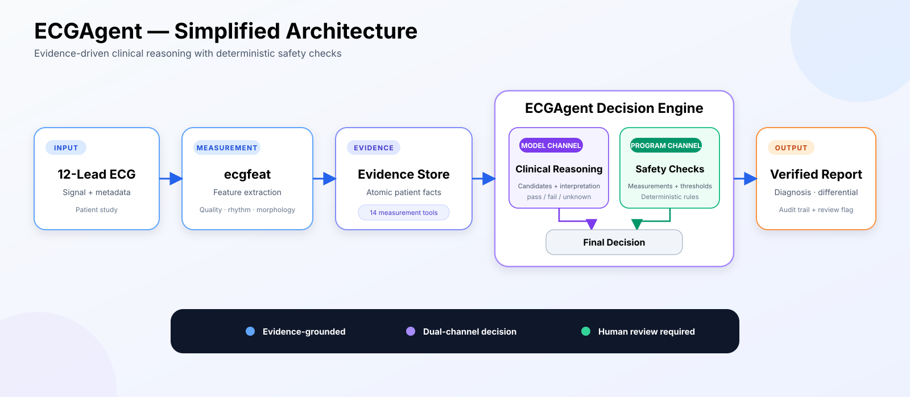
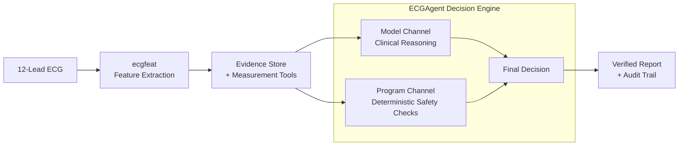

<!-- i18n-nav -->
[中文](ecg_agent_architecture_simple.md) | [English](ecg_agent_architecture_simple.en.md) | [日本語](ecg_agent_architecture_simple.ja.md)
<!-- /i18n-nav -->

> 翻訳に関する注意：この日本語版は参考用です。原文と相違がある場合は、原文を優先します。

# ECGAgent 簡略化されたアーキテクチャ

このアーキテクチャは、ECG 入力 → 特徴抽出 → 証拠とツール → デュアルチャネル エージェントの決定 → 検証済みレポートという 1 つの明確なパスに従います。

ダウンロード: [SVG ベクター](ecg_agent_architecture_simple.svg) · [PNG イメージ](ecg_agent_architecture_simple.png)

すべての出力には人間によるレビューが必要です。
