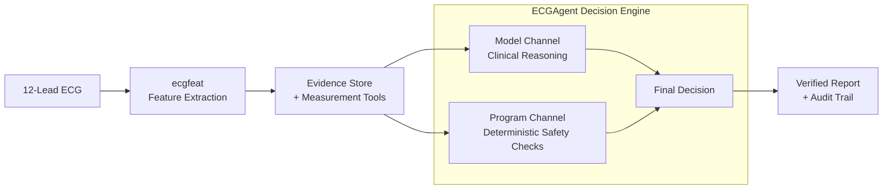

# ECGAgent Simplified Architecture

The architecture follows one clear path: ECG input → feature extraction → evidence and tools → dual-channel agent decision → verified report.

Downloads: [SVG vector](ecg_agent_architecture_simple.svg) · [PNG image](ecg_agent_architecture_simple.png)

All outputs require human review.
