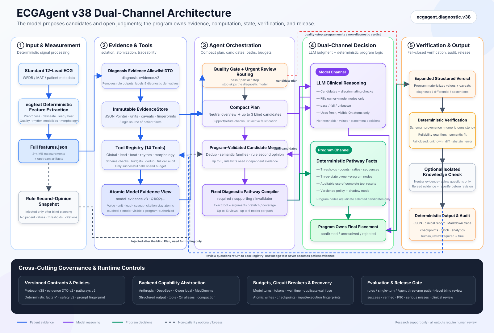
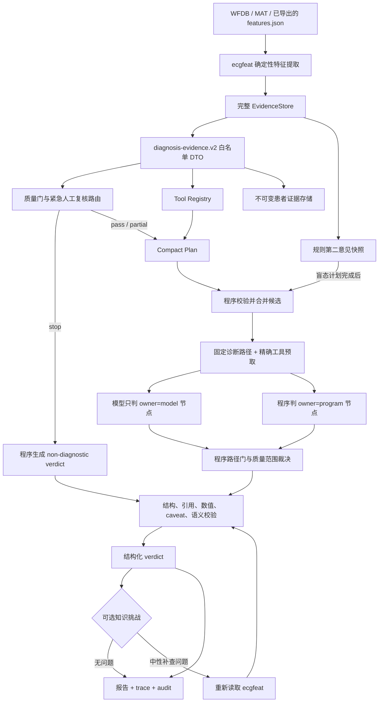
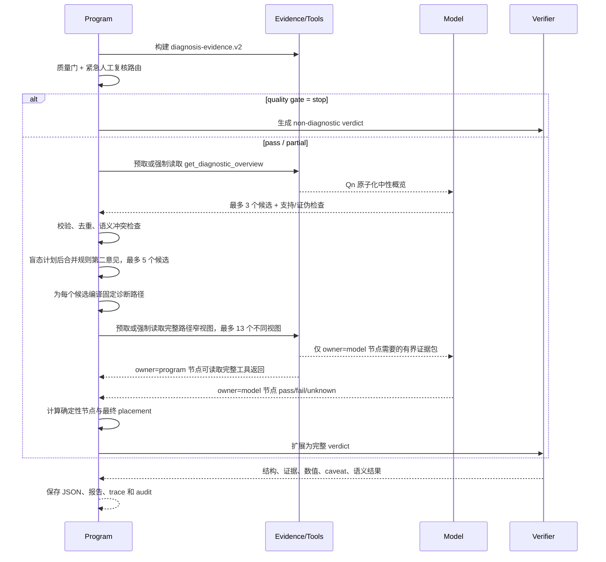

<!-- i18n-nav -->
[中文](ecg_agent_complete_design.md) | [English](ecg_agent_complete_design.en.md) | [日本語](ecg_agent_complete_design.ja.md)
<!-- /i18n-nav -->

> Translation note: This English version is provided for convenience. If it differs from the source document, the source document prevails.

<a id="ecgagent-完整设计文档"></a>
# ECGAgent Complete design document

> Documentation Status: Current Implementation Overview
> Corresponding code date: 2026-08-07 (Added 4 exclusive paths for diagnostic codes + fixed 3 deterministic node defects, see §7.2/§7.5 for details; the rest of the content still corresponds to 2026-08-03)
> Current diagnostic protocol: `ecgagent.diagnostic.v38`
> Scope of application: Diagnostic Agent, evidence tool, model backend, verification, knowledge challenge, report, batch processing and evaluation under `ecgagent/`
> Safety statement: This system is research and auxiliary interpretation software, not a medical device; all output requires manual review and cannot be directly used for clinical diagnosis or treatment decision-making.

<a id="1-文档定位"></a>
## 1. Document positioning

This article is the unified design baseline of the current ECGAgent, answering the following questions:

- Why Agent exists, what work is done by the model, and what work must be done by the program;
- A piece of ECG What stages does it go through from `features.json` to the final structured diagnosis;
- How to isolate rule conclusions, data set labels, general knowledge and patient evidence;
- How tools, evidence references, diagnostic paths, deterministic nodes, quality gates and validators work together;
- What are the differences between Compact and Legacy diagnostic workflows;
- How to extend diagnostic codes, tools, evidence fields, backends and security policies;
- How to save tracks, restore batches, measure and execute release gates.

There are several earlier or thematic design materials in the warehouse, and this article will not delete them:

| Documentation | Positioning | Relationship to this article |
|---|---|---|
| `docs/ecg_agent_architecture.md` | Evolutionary design from v1 hierarchical inference to early diagnosis-first architecture | Retain historical motivations and early solutions; where "current implementation v27" is no longer the latest protocol |
| `docs/agent_revise_loop_analysis.md` | Real disk failure analysis of Legacy revision cycle | This is thematic evidence of the revision mechanism and does not represent the default behavior of Compact |
| `docs/ecgagent_determinism_refactor_plan.md` | Measurements, plans and experimental records to determine the diagnostic path | Is an important basis for the evolution of v38 dual-channel design |
| `ecgagent/README.md` | Usage, commands and backend deployment | For operators; this article is for design, maintenance and auditing |

If there is a conflict between documentation and code, the versioned protocol configuration and current code shall prevail. See Section 22 for the main entry.

<a id="2-设计目标与非目标"></a>
## 2. Design goals and non-goals

<a id="21-目标"></a>
### 2.1 Objectives

ECGAgent provides five incremental capabilities on top of deterministic ECG feature extraction:

1. Form a systematic explanation from the domains of quality, rhythm, atrioventricular relationship, interval, electrical axis, conduction, ectopic beat, cardiac chamber voltage, Q/ST-T/U wave and pacing;
2. Generate candidate diagnoses and proactively request narrow measurement views that can support or falsify the candidates;
3. Downgrade, retain identification or give up when the measurement is incomplete, the detection chain conflicts or the defined conditions are not met;
4. Let each patient value and key evidence be traced back to the immutable `features.json` pointer;
5. Save complete, reproducible, and recoverable operational audits, and support blind evaluation and release acceptance.

<a id="22-非目标"></a>
### 2.2 Non-target

Currently Agent does not undertake the following tasks:

- Do not re-perform signal preprocessing, R-peak detection, wave boundary localization or ECG feature extraction;
- Do not treat the LLM as a numerical calculator, counter, threshold comparator or state machine;
- Models are not allowed to directly modify patient evidence or diagnostic ledgers;
- Do not consider ecgfeat rule hits, Philips DXL/Glasgow interpretations, or PTB-XL tags as patient evidence;
- Not demonstrating that a patient meets diagnostic criteria through a piece of general knowledge;
- Complete automatic detection of critical ECG is not promised;
- It does not replace the doctor's viewing of original twelve-lead waveforms and clinical data.

<a id="23-核心不变式"></a>
### 2.3 Core Invariants

1. **Patient Facts Only Source**: Patient facts can only come from the read-only `EvidenceStore` bound to the current session.
2. **Authorization based on visibility**: The tool touching a pointer does not mean that the model sees it; only complete numerical atoms that actually enter the model request or are consumed by a deterministic program node will enter the final evidence whitelist.
3. **Knowledge is not patient evidence**: Knowledge bases, rule second opinions, rule misses, and dataset labels cannot provide patient-level references.
4. **The program has repeatable calculations**: thresholds, counts, proportions, sequence reconstruction, path state migration, numerical transcription and final position are completed by the program.
5. **The model is open to judgment**: The model is responsible for candidate formation, discriminative check design, and morphological/mechanical explanation that cannot be fully formalized.
6. **Failed Close**: When `unknown` is missing, invisible, has no direct evidence or does not meet reliability requirements, is a differential diagnosis, has been waived or is of limited quality, it cannot be automatically upgraded to a positive diagnosis.
7. **Final manual review required**: Structured output contract requirement `human_review.required = true`.

<a id="3-模型与程序的职责边界"></a>
## 3. Responsibility boundaries between models and programs

| Job | Model | Programmer/Deterministic Layer |
|---|---:|---:|
| Form up to three independent candidates | Responsible for | Verifying diagnostic codes, references, duplications and semantic conflicts |
| Design support/falsification check | Responsible for | Compile tool names into safe parameters and remove duplicates |
| Supplementary Rules Second Opinion Candidates | Not visible in blind plans | Appended after the plan is completed, and only for routing prompts |
| Tool execution | Not directly executed | Responsible for budgeting, parameters, deduplication, prefetching and auditing |
| Thresholds, counts, proportions, sequence judgments | Not responsible | Calculated by versioned deterministic nodes |
| Open form/mechanism node | Given `pass/fail/unknown` | Verify node identity, tool source and fresh references |
| Candidate final position | Only estimate | Calculated based on path gate `confirmed/rejected/unresolved` |
| Patient values are written into the report | Do not copy | Materialize from reference pointer to clinical display accuracy |
| Reliability caveat | Required | Automatically attached and enforced by a validator |
| Final JSON structure, semantics and evidence verification | Generate restricted objects | Responsible for standardization, verification, revision control and acceptance |
| Human-readable report | No adaptation | Deterministic rendering from the same structured verdict |

This division of labor is called a dual-channel workflow: the model channel handles clinical candidacy and open judgment, and the program channel handles evidence, calculations, status, and release.

<a id="4-总体架构"></a>
## 4. Overall architecture



See the block diagram and Mermaid source code that can be viewed individually and reused.
[ECGAgent v38 architecture block diagram](ecg_agent_architecture_diagram.en.md).



<a id="41-分层结构"></a>
### 4.1 Hierarchical structure

| Layer | Component | Function |
|---|---|---|
| L0 input layer | `feature_extraction/ecgfeat`, `features.json` | Generate measurement, mass, lead-by-lead, beat-by-beat, and modality data |
| L1 isolation layer | `evidence/diagnostic_contract.py` | Build diagnostic-specific physical whitelist DTO from wide input |
| L2 Evidence Layer | `EvidenceStore`, `ModelEvidenceView`, `EvidenceLedger` | Addressing, units, caveat, atomization, visibility and source tracking |
| L3 Tool Layer | `ToolRegistry` with 14 diagnostic tools | Provides bounded global, lead-by-lead, beat-by-beat and specialized modality views |
| L4 orchestration layer | `ECGDiagnosticAgent`, `ECGAgent` | Managing stages, budgets, prefetching, candidates, context and recovery |
| L5 reasoning layer | Compact/Legacy prompts and LLM backend | Form candidates, plan checks, and complete open judgments |
| L6 decision-making layer | diagnostic pathways, deterministic pathways, quality/safety policies | Programs calculate path nodes, placement, emergency routing and hard vetoes |
| L7 Check Layer | `verify/`, `semantic_guard.py` | Mandatory References, Values, Reliability, Structure and Diagnostics—Measuring Consistency |
| L8 output layer | `report.py`, `trace.py`, `batch.py` | Structured results, Chinese reports, full trajectories and batch analysis |
| L9 evaluation layer | `evaluation_protocol.py`, `acceptance.py` | Three-arm blind evaluation, patient-level indicators and release gate |

<a id="5-输入与证据隔离"></a>
## 5. Isolation of input and evidence

<a id="51-完整输入"></a>
### 5.1 Complete input

The agent's direct input is usually a `*_features.json`. A complete feature object may contain:

- global measurement;
- 12 leads represent pulse measurement;
- Beat-by-beat and lead-by-lead measurements;
- QRS form grouping;
- P wave assessment, atrial events and rhythm patterns;
- Detector observation of pacing, pre-excitation, AV relationship, etc.;
- Quality and collection metadata;
- Upstream rule interpretation, reference engine output, or dataset metadata.

Complete objects cannot be given directly to the diagnostic model because they are too large and contain upstream conclusions that would cause diagnostic leakage.

<a id="52-诊断证据-dto"></a>
### 5.2 Diagnostic Evidence DTO

`EvidenceStore.diagnostic_view()` Use `ecgagent.diagnosis-evidence.v2` to build the physical isolation document. Allowed top-level fields are:

```text
fs
global_features
representative_leads
beat_features
beats
groups
p_wave_assessments
rhythm_inputs
morphology_inputs
quality
metadata
```

Among them, `metadata`, `rhythm_inputs`, and `morphology_inputs` each have a secondary whitelist. The following high-risk fields will be recursively eliminated:

- `clinical_interpretation`, `interpretation`, `statement_engine`;
- `reference_metadata`, Glasgow/Philips interpretation image;
- Diagnostic derived tags such as `probable_af`, `probable_flutter`, `wpw_pattern`;
- Medications, clinical diagnosis codes, and other fields that may reveal answers.

New fields do not enter diagnostic view by default. Dropped, unclassified, and sensitive fields are written to `ContractAudit`, so the contract version must be explicitly reviewed and upgraded when extending the upstream schema.

### 5.3 EvidenceStore

`EvidenceStore` is an immutable, read-only, addressable evidence source for a single record:

- Support JSON Pointer, `ev:/...`, point path and clinical alias;
- Automatically infer units;
- Automatically attach quality, reliability, source and accompanying fields caveat;
- The inline limit for a single container is 800 characters to avoid overwhelming the context with one query;
- Provide content fingerprint and bind the input actually used in this run;
- Pointer values are not allowed to drift within the same session.

The core fields of `EvidenceValue` include `pointer`, `value`, `unit`, `caveats`, `companions` and `source`. The tool display values ​​use unified clinical precision; the final report is also materialized with the display precision actually seen by the model, and the original full precision value is only used for auditing and tolerance verification.

<a id="54-原子化模型视图"></a>
### 5.4 Atomized model view

Original tool tables can be quite large. `ecgagent.model-evidence.v3` Re-parses a successful tool return into complete evidence atoms, each atom bound:

```text
引用 + 字段/导联身份 + 值 + 单位 + 可靠性 + caveat
```

The budget is only truncated between complete atoms and never separates values ​​from references or caveats. Fair ordering allocates space between leads, beats, and fields; omitted atoms are explicitly marked as invisible, non-referenceable, and a narrower view must be requested when needed.

The Compact native/compatible backend maps long `ev:/...` pointers to short references `Q1`, `Q2`, etc. The model can only copy displayed Qn and cannot construct paths. The orchestrator restores Qn to a canonical pointer before final validation.

<a id="55-三种证据集合"></a>
### 5.5 Three types of evidence collections

| Set | Meaning | Whether the final conclusion can be supported |
|---|---|---:|
| touched | All pointers touched during tool processing | No |
| model-visible | The full numeric atom is still visible on the actual next model request | Yes, for use by model nodes |
| program-authorized | The complete input returned by a successful tool call and actually consumed by the deterministic node | Yes, for use by program nodes |

The final whitelist is `model-visible ∪ program-authorized`. The main result only holds the collection size and content hash, the full list of pointers, raw returns, and compressed returns actually seen by the model are held in separate traces.

<a id="6-当前默认-compact-工作流"></a>
## 6. Current default Compact workflow

CLI, Batch, and `run_diagnostic_agent()` `workflow=compact` is selected by default. It is designed for 27B local models; on backends that support orchestrator prefetching, there are typically only two main model decisions: `plan` and `adjudicate`. Provider-native backends that do not support prefetching still execute the same phase contract, but complete required views via the standard assistant/tool-result handshake, thus potentially increasing model rounds.

<a id="61-时序"></a>
### 6.1 Timing



<a id="62-阶段合同"></a>
### 6.2 Stage Contract

| Stages | Model Responsibilities | Tools and Budgets | Maximum Generation |
|---|---|---|---:|
| `plan` | Propose up to 3 substantive candidates from a neutral overview, each containing supporting evidence, 1–2 discriminant checks, at least one check for falsification | Prefetched backends are read by the program; other backends force the model to be called once `get_diagnostic_overview`; Budget 1 | 1200 tokens |
| `adjudicate` | Only fill in the nodes of `owner=model` in the fixed path; each node gives `pass/fail/unknown` and fresh Qn evidence | Prefetching backend is read by the program; other backends are called according to the exact coverage contract; up to 13 different views | 2200 tokens |

The model evidence package limit for `adjudicate` is 8000 characters. Views used only by program nodes are not copied into the model context.

<a id="63-质量门短路"></a>
### 6.3 Quality gate short circuit

When `/metadata/diagnostic_gate/state == stop`, the diagnostic model is not called. The program directly generates:

- No positive diagnosis;
- `non_diagnostic` quality status;
- Clear reasons for stopping, suggestions for re-production and manual review requirements;
- A verdict that is also verified by structure and evidence.

`partial` does not equal a stop, but will limit the diagnostic categories that can be released. A suppressed domain cannot become a positive conclusion just because the model has candidates.

<a id="64-盲态候选计划"></a>
### 6.4 Blind candidate plan

The model first only looks at the diagnostically neutral overview, and the rule conclusions have not yet entered the context. The plan has the following hard constraints:

- Up to 3 independent candidates;
- Candidates must come from a versioned diagnostic vocabulary;
- Quality/suggestion non-hypothetical codes cannot be used to pass themselves off as disease candidates;
- Each candidate has at least one authorized overview Qn;
- 1–2 direct view checks per candidate;
- At least one check must attempt to falsify;
- Only one candidate is retained for the same semantic family;
- Candidates that are invalid, duplicates, without references, without checks or that clearly conflict with physical measurements are deleted by the program.

<a id="65-规则第二意见"></a>
### 6.5 Rules for Second Opinions

Compact only reads an isolated `ecgagent.rule-second-opinion.v2` snapshot from the full input after the blind schedule ends.

It contains only a small amount of candidate identity and routing metadata and does not include:

- Rule evidence value;
- Rule threshold;
- Text of the diagnostic statement;
- `not_matched` negative result;
- A citation that can be used as final evidence.

Rule tips can add sources to existing candidates, or occupy remaining slots in merged candidates. The total upper limit of blind candidates plus rule candidates is 5; when the blind plan has reached 3, up to 2 more can be added. If there are not enough blind candidates, the current implementation may add more rule candidates. The rule prompt must be re-passed through the independent measurement path and cannot be confirmed directly.

<a id="66-视图预算与候选保留"></a>
### 6.6 View Budget and Candidate Retention

The program compiles each candidate fixed path into a precise `tool + arguments` call signature, removing duplication by parameter. Only candidates whose complete paths fit within the upper limit of 13 different views were entered into the verdict.

Preserve order first coverage:

1. The first two blind independent candidates;
2. Missing candidates for the second opinion supplement of the rules;
3. The third blind candidate;
4. Other compatible candidates.

This is not a mechanical truncation by the number of tool calls, but a boundary calculation based on the true view requirements of the candidate full path. Candidates discarded by the cap go into audit and throttling instructions.

<a id="7-诊断词表与候选路径"></a>
## 7. Diagnostic vocabulary and candidate paths

<a id="71-诊断词表"></a>
### 7.1 Diagnostic Vocabulary

`diagnosis_catalog.py` provides a stable diagnostic vocabulary independent of single record rule hits. There are currently 123 codes, distributed as follows:

| Category | Quantity |
|---|---:|
| rhythm | 17 |
| rate | 5 |
| conduction | 24 |
| ectopy | 3 |
| interval | 7 |
| axis | 3 |
| chamber | 16 |
| ischemia_repolarization | 25 |
| pacing | 5 |
| quality | 9 |
| other | 9 |

The vocabulary can absorb existing statement codes in the record as compatible extensions, but the rule status does not determine whether the model is allowed to raise the diagnosis. If the input record has been normalized by lead-by-lead amplitude, the pure voltage diagnostic code will be removed by the program and changed to `uncalibrated_amplitudes`.

<a id="72-固定诊断路径"></a>
### 7.2 Fixed diagnostic path

`ecgagent.diagnostic-pathways.v6` Expand each candidate to up to 6 nodes. According to the static expansion of the current 123 codes, there are a total of 310 "diagnosis code × node" instances and 74 different node identifiers:

- 151 instances are the responsibility of the program;
- 159 instances are responsible for the model;
- 254 `required`;
- 24 `supporting`;
- 32 `invalidator`.

114 of the 123 codes have specially designed paths (including the two-node template shared by the pacing category); the remaining 9 are all quality/coverage meta-information codes in `NON_HYPOTHESIS_CODES` or For `unclassified_ecg_abnormality` (a classification that is deliberately kept open and not suitable for splitting the exclusive evidence chain), the model either cannot propose them as disease candidates, or the definition itself is "unclassified". Falling into the general classification is due to correct design rather than a gap. 2026-08-07 Filled in the previous four real gaps of "can be legally nominated by the model but still follow the universal cover" - `electrical_alternans`, `exclude_2_to_1_atrial_flutter`, `possible_precordial_lead_reversal`, `limb_lead_reversal_suspected` - now each has 3-4 exclusive nodes; among them, the limb lead reverse path is reused The same criterion for lead I/aVR main wave direction in `semantic_guard.py` avoids conflict between path judgment and hard gate criterion.

Each node declares:

```json
{
  "id": "qrs_duration_support",
  "gate": "required",
  "question": "...",
  "tool": "get_morphology_groups",
  "arguments": {"include_beats": false},
  "owner": "program"
}
```

Paths are workflow contracts, not patient evidence. It only specifies what views are required, who is responsible for judgment, and how placement is affected.

<a id="73-三种门语义"></a>
### 7.3 Three types of gate semantics

| gate | semantics | impact on final position |
|---|---|---|
| `required` | Conditions necessary for diagnosis | Any `fail` → rejected; any `unknown` → unresolved; all `pass` may be confirmed |
| `supporting` | Helpful but not necessary evidence | Save status and evidence without directly blocking or confirming |
| `invalidator` | Denial prerequisite for criterion applicability | Only explicit `fail` blocks; `pass/unknown` does not reduce sensitivity |

`invalidator` Used for "whether the voltage standard is still applicable under pacing or wide QRS" type of premise. If it is written as `supporting`, it can never be rejected structurally; if it is written as `required`, it will not be detected and true positives will be lost unnecessarily.

<a id="74-路径放置算法"></a>
### 7.4 Path placement algorithm

The program determines candidate locations in the following order:

1. Any `invalidator == fail` → `rejected`;
2. Otherwise any `required == fail` → `rejected`;
3. Otherwise all required are `pass`, at least there is supporting evidence and the quality range allows → `confirmed`;
4. The rest → `unresolved`.

`unresolved` Enter `differential_diagnoses` when there is supporting evidence and list the necessary nodes that have not yet been completed; enter the waiver audit when there is no supporting evidence. Model submissions `overall_status` and urgency are estimates only, the final position, confidence, urgency, summary and human review text are all program generated.

<a id="75-确定性节点"></a>
### 7.5 Deterministic Node

`ecgagent.deterministic-pathway-facts.v2` is responsible for repeatable calculations, including:

- Heart rate and electrical axis threshold;
- PR/QT reportability and thresholds;
- P wave reliability, 1:1 atrioventricular relationship, repeat block events and AV sequences;
- Rule RR unevenness (including robust background regularity fallback added on 2026-08-07, anchored by the median, and tolerating a single isolated abnormal interval), representative proportions, and morphological group counts;
- QRS time limit (including the wide QRS criterion for complete bundle branch block/incomplete RBBB, the new wide QRS criterion for bifascicular/trifascicular block from 2026-08-07, and the isolated fascicular block "QRS" Time limit is not used as a criterion for "threshold"), premature beat timing, wide QRS sequence;
- Applicability of low voltage, chest R-wave progression and voltage criteria;
- Pacing flags, capture relationships and repeatability.

There is a calling trap in node coverage that does not depend on the `owner` field: `_compact_deterministic_pathway_step` attempts deterministic parsing unconditionally for each node. As long as `step_id` hits a certain branch, the model judgment will be overwritten without checking the ownership declared by `program_owns_pathway_step()` - `owner=model` only affects prompt display and audit labels, but does not affect actual coverage. Before 2026-08-07, `qrs_duration_support` branches uniformly returned `unknown` for double/trifascicular block and isolated left anterior/left posterior fascicular block, causing these candidate `required` nodes to be permanently stuck in `unresolved` (corresponding to the entire family of conduction block 0/11 in the batch run) direct cause); after the new branch has been repaired according to the clinical definition (double/three-fascicular block is compared with the wide QRS criterion for complete bundle branch block, while isolated fascicular block does not use the QRS time limit as the threshold, which is consistent with the existing design of `clinical_rules/conduction.py::_lafb`). In the same batch, the gender matching of LVH `cross_lead_voltage_criterion` (`diagnostic.py`) was expanded from exact matching `"female"` to `{"female","f","woman"}`, and the missing gender threshold of the Peguero-Lo Presti criterion was filled in to align with `clinical_rules/hypertrophy.py::_adult_lvh`.

All resolvers return conservative tristate:

- `pass`: Sufficient direct measurement support;
- `fail`: There is a direct contradiction at the definition level;
- `unknown`: Incomplete, critical, low reliability, or candidate detector observation only.

Deterministic nodes do not create diagnostics and can only process path nodes that have entered the candidate set. The environment variable `ECG_AGENT_DETERMINISTIC_NODES_SHADOW=1` can be switched to shadow mode: the model state determines the position, and the program state is still written for auditing, for pre- and post-migration divergence measurement and overall rollback.

<a id="76-模型节点授权"></a>
### 7.6 Model node authorization

`pass/fail` of the model node is only valid when the following conditions are met at the same time:

- The node ID exactly matches the candidate fixed path;
- Citing evidence from new reads in this phase `adjudicate`;
- referenced in the Qn package actually seen by the model;
- The reference comes from the node's specified tool, or from a sibling view that reads the same evidence namespace;
- There is at least one authorized evidence atom.

Otherwise, the status is changed to `unknown` by the program. The model cannot add new nodes, rename nodes, fill in `owner=program` nodes, or introduce unplanned candidates.

<a id="8-工具系统"></a>
## 8. Tool system

Diagnostic mode only registers the following 14 tools, all of which return measurements, mass, or detector observations, and do not return rule diagnostics:

| Tools | Main purposes | Compact plan direct selection |
|---|---|---:|
| `get_diagnostic_overview` | Overview of neutral mass, heart rate, rhythm screening, intervals, axis and modality availability | Fixed must-read; read by program when prefetching is supported |
| `get_global_table` | Read up to 24 global fields at a time | Yes |
| `get_measurement` | Read exactly a pointer or clinical alias | No, as Legacy/Revision Dump |
| `get_lead_table` | Same field comparison across 12 leads | Yes |
| `get_beat_table` | Beat-to-beat measurement at rhythm level or specified lead | Yes |
| `search_measurements` | Pointer found when field name not known | No, only found; results must be reread |
| `get_rhythm_profile` | RR, atrial residual, AV correlation, pre-excitation and differential transmission candidate observations | Yes |
| `get_atrial_event_table` | Independent Chamber Events, Confidence, P-QRS Correlation and Source Leads | Yes |
| `get_p_assessment_table` | Beat-by-beat P wave boundary acceptance/rejection, confidence and valid leads | Yes |
| `get_morphology_groups` | QRS Shape family, proportion, run length, template correlation and members | Yes |
| `get_morphology_map` | P/QRS/ST/T-U/quality fixed translead observation chart | Yes |
| `get_interval_waveform_context` | PR or QT/QTc Limited time read constitute wave and failure context | Yes |
| `get_pacing_profile` | Pacing spikes, capture/sense availability and paced-beat members | Yes |
| `get_native_beat_profile` | Repetitive native beats with dominant non-pacing pattern Q/R/ST/T/QT Evidence | Yes |

<a id="81-域到工具的默认路由"></a>
### 8.1 Default route from domain to tool

| Diagnostic Domains | Priority Tools |
|---|---|
| quality | morphology map, precise measurement |
| rhythm_rate | rhythm profile, beat table |
| p_av | rhythm profile, P assessment, atrial event table |
| intervals | global table, interval waveform context |
| axis | global table, lead table |
| conduction_preexcitation | morphology map/groups, native beat profile |
| ectopy_pauses | beat table, morphology groups, rhythm profile |
| voltage_chamber_r_progression | morphology map, lead table, native beat profile |
| q_st_t_u | morphology map, native beat profile, lead table |
| pacing_high_risk | pacing profile, native beat profile, morphology groups |

<a id="82-registry-约束"></a>
### 8.2 Registry Constraints

`ToolRegistry` is responsible for:

- Each stage has a separate budget, and only successful calls are calculated;
- Strictly verify required/unknown parameters;
- Press `tool + 规范化 arguments` to remove duplicates at the same stage;
- Repeated calls will not consume the budget and may trigger a tool loop circuit breaker;
- Prevent further parameter guessing when rejecting a call that exceeds 3 times the budget;
- Convert all exceptions into auditable errors, preventing tool exceptions from directly crashing the entire record;
- Also save original full returns, compressed digests, hashes, hit citations and visible citations.

<a id="9-prompt-与输出合同"></a>
## 9. Prompt and output contract

<a id="91-compact-system-prompt-的职责约束"></a>
### 9.1 Responsibilities of Compact system prompt

Compact prompt explicitly tells the model:

- The orchestrator has workflows, tools, reference expansion, numerical transcription, deterministic nodes, path status and report rendering;
- The model is only responsible for candidate plans and `owner=model` nodes;
- Rules A second opinion is not patient evidence;
- Missing values do not prove normality or abnormality;
- Heart rate is not equal to rhythm mechanism, and morphological group is not equal to rhythm;
- A single non-dominant pattern or isolated event cannot be automatically generalized to a recurring mechanism;
- Restricted measurements must retain limitations;
- Patient values are not transcribed by the model and are ultimately backfilled by the program.

<a id="92-compact-中间-schema"></a>
### 9.2 Compact intermediate schema

Plan schema contains:

- `candidates[]`: `id/code/domains/support/counter/checks/uncertainty`;
- `review_tools[]`;
- `quality_limitations[]`.

Adjudicate schema contains:

- `overall_status`;
- `decisions[]`: candidate identity, model urgency estimate and `pathway_steps[]`;
- `interval_contexts[]`.

The program expands the compact result into a complete output contract. Compact does not perform free text revision by default: `max_revisions=0`, stage status retry is 0; invalid status is handled by grammar/schema, program normalization and failure closure.

<a id="93-完整-verdict"></a>
### 9.3 full verdict

The final structured output contains:

```text
summary
ranked_complete_interpretations[1..3]
diagnoses[]
differential_diagnoses[]
interval_measurement_contexts[]
abstentions[]
quality_assessment
human_review
```

Only `HIGH` or `MEDIUM` is allowed for positive diagnosis, and only `MEDIUM` or `LOW` is allowed for differential diagnosis. When PR, QT/QTc is unavailable or limited, the interval conclusion, residual evidence of the constituent waves, explanation of impact and solution must be separately stated, and "interval cannot be measured" cannot be mistakenly equated with "waveform has no information".

<a id="94-prompt-指纹"></a>
### 9.4 Prompt fingerprint

Each run combines the following to calculate the SHA-256 fingerprint:

- system/phase/revision prompts;
- Diagnostic protocols and clinical safety strategies;
- Stage budget, prefetch and coverage contracts;
- Intermediate and final JSON schema;
- tool schema;
- Knowledge navigation/challenge version and runtime categories.

Batch acceptance requires only one locked prompt/backend/model execution signature for the same cohort.

<a id="10-legacy-诊断工作流"></a>
## 10. Legacy diagnostic workflow

`workflow=legacy` retains v31 five-stage research process:

```text
Survey → Hypothesize → Investigate → Challenge → Synthesize → Verify/Revise
```

| Stage | Function | Tool Budget |
|---|---|---:|
| Survey | Global neutral survey inventory | Fixed overview 1 time |
| Hypothesize | Formation of tentative diagnostic, differential and tool plans | 0 |
| Investigate | Targeted reading of patient measurements | 4–12, adjusted for complexity |
| Challenge | Proactively finding disproofs and uncovered areas | 2–6, requiring new views |
| Synthesize | Output fully structured verdict | 0 |

Legacy uses `diagnostic-ledger.v3` as the assumed state owned by the program: the model can only submit typed patches, and the program is responsible for evidence materialization, identity, legal state migration, and append-only event history. Assume the state includes `raised/provisional/weak/supported/weakened/unresolved/rejected/abstain`. Unchallenged positive hypotheses fail and are closed as unresolved.

Legacy allows up to 2 stage status repairs and up to 4 final revisions; revisions use atomic top-level section patches to avoid silently changing the passed part when revising a paragraph. For special issues and improvement basis, see `docs/agent_revise_loop_analysis.md`.

Compact still builds diagnostic ledgers and saves audits, but the default master decision-making does not rely on models to maintain multi-stage ledger states.

<a id="11-旧规则裁决模式"></a>
## 11. Old rule ruling mode

The legacy `mode=adjudicate` of `ECGAgent` retains the `Orient → Test → Adjudicate → Synthesize` rule adjudication semantics, with the ability to view upstream rule discovery and decide to retain, withdraw, or downgrade. It is used for historical compatibility and explicit comparisons and is not the current standalone diagnostics default path.

The fixed L0–L5 hierarchical inference of the early `medgemma_ecg_core.py` is a push-based, non-tooled pipeline and is not equivalent to the current `ecgagent`. It is still available for baseline comparisons, but does not have the current diagnostic DTO, model visible reference whitelist, fixed disease pathways, and dual channel deterministic nodes.

<a id="12-质量安全和紧急路由"></a>
## 12. Quality, Security and Emergency Routing

<a id="121-质量门"></a>
### 12.1 Quality Gate

The quality gate has three states:

- `pass`: Allow full path evaluation;
- `partial`: Allow limited categories, suppress unreliable domains;
- `stop`: Program short circuit is reported as non-diagnostic.

Quality caution does not delete an existing measurement, but turns it into clear low-weight evidence. `null` or ungenerated fields indicate unavailability.

<a id="122-临床安全策略"></a>
### 12.2 Clinical Safety Strategy

`ecgagent.clinical-safety.v2` centrally manages adult-defined level hard boundaries such as heart rate, PR, short PR, QRS, QTc, repeated backpropagation evidence, and emergency routing thresholds. It can only:

- Discourage positive conclusions that directly contradict reliable measurements;
- Downgrade candidates that do not meet the defined conditions;
- Provide manual review of routes.

It cannot create models without proposed diagnostics. The policy version and all parameters are written to run the audit.

<a id="123-紧急人工复核"></a>
### 12.3 Emergency manual review

`ecgagent.urgent-review.v1` Check conservative measurement triggering before model completion:

- Extreme bradycardia or tachycardia;
- Fast and wide QRS;
- Exported complete AV block measurement markers;
- Reliable and reportable significant QTc extension;
- Pacing capture failure measurement flag for non-conflicting evidence;
- Technical quality stop.

It only produces the `do_not_delay_human_review` route and does not confirm the diagnosis. Acute ST injury and pacing sensing failure remain listed as incomplete assessment categories.

<a id="124-语义硬门"></a>
### 12.4 Semantic hard door

`semantic_guard.py` Check:

- Whether the arithmetic comparison written by the model really holds true;
- Whether bradycardia/tachycardia, atrial tachycardia, first degree AV block, bundle branch block, IVCD, short/long QT, etc. directly contradict reliable measurements;
- Whether there is independent and repeated evidence for the suspected atrioventricular conduction ratio and retrograde activation;
- summary whether to bypass the structured diagnoses list to sneak positive conclusions;
- Whether the limb lead reverse connection meets the defining main wave direction conditions of lead I and aVR.

These checks are minimally safe invariants, not a second set of hidden diagnostic engines.

<a id="13-确定性验证"></a>
## 13. Deterministic verification

The final verdict needs to be passed in order:

1. JSON/schema and output contract verification;
2. Diagnosis code, category, confidence level, mutually exclusive relationship and complete explanation verification;
3. Candidate evidence upgrade gate and quality range verification;
4. Reference and value verification;
5. Reliability limit verification;
6. Diagnosis—hard door to measurement semantics.

The reference validator performs five deterministic checks:

| Check | Question |
|---|---|
| resolvable | Whether each `ev:/...` can be resolved in the current Store |
| provenance | The pointer corresponding to the complete atom is visible to the model in this session, or authorized by the program node |
| consistency | Whether the written value is consistent within unit and clinical tolerances with the quoted value |
| support | Whether each patient-specific value has a reference |
| qualification | Whether measurements marked as restricted by ecgfeat are explicitly downgraded in the same claim |

Guideline thresholds are processed separately from patient measurements and will not be misjudged as unquoted patient values. Missing references to structured evidence items are blocking, not warnings, preventing the model from bypassing numerical inconsistencies by deleting references.

The program will materialize the finally adopted evidence into `audit.tools.effective_evidence`, recording the value, unit, caveat, source, model-visible/program-authorized status and supporting/opposing role.

<a id="14-知识库与知识挑战"></a>
## 14. Knowledge base and knowledge challenges

The knowledge base is a BM25-like local index completely separate from the patient tools, version `ecg-knowledge.v1`. The only categories allowed at runtime are:

- `diagnostic_reference`;
- `morphology_reference`;
- `measurement_reliability_reference`;
- `failure_modes`.

The source code of clinical rules, Philips DXL, Glasgow and capability blueprint are only for offline development audit and do not enter the patient runtime knowledge card. All knowledge cards will delete the case row and desensitize the record identification before entering the prompt.

<a id="141-survey-后导航"></a>
### 14.1 Navigation after Survey

Legacy can be enabled after Survey `ecg-knowledge-navigation.v2`:

- Up to 4 knowledge cards;
- Only helps form tentative identification and next measurement plans;
- After Hypothesize is completed, the original knowledge text is removed from the subsequent context;
- Final patient conclusion must still come back to `ev:/...`.

Compact To maintain blindness, small context, and two-stage stability, post-Survey knowledge navigation is currently forced to be turned off, even if parameter `knowledge_guidance=True` is constructed.

<a id="142-诊断后挑战"></a>
### 14.2 Post-diagnosis challenges

When `knowledge_challenge` is explicitly enabled, a verdict that passes evidence verification is handed over to an isolated, patient-free `ecg-knowledge-challenge.v1` session:

1. Search the universal reference by existing diagnosis;
2. Only generate up to three neutral follow-up questions;
3. The original knowledge text and conclusions are not returned to the diagnostic session;
4. The diagnostic session must successfully call the ecgfeat tool again at least once;
5. The revised verdict must pass the complete contract and patient evidence verification again;
6. Safely retain the verified verdict before the challenge if any step fails.

<a id="15-模型后端抽象"></a>
## 15. Model backend abstraction

The orchestrator only relies on the unified `LLMBackend`: `complete`, assistant turn, tool result turn and user turn. The backend explicitly declares capabilities via `BackendCapabilities` to avoid orchestrator guessing behavior by vendor name.

| Backend | Native tools | Structured output | Contextual compression | Reference aliases | Stage memory | Prefetching | Parallel width |
|---|---:|---|---:|---:|---:|---:|---:|
| Anthropic | yes | schema | no | no | no | no | 4 |
| DeepSeek | Yes | JSON object | No | Yes | No | Yes | 4 |
| Qwen local/vLLM | yes | schema | yes | yes | yes | yes | 3 |
| MedGemma local/vLLM | No, JSON envelope | grammar | Yes | Yes | Yes | Yes | 4 |
| Mock | Scripted | none | No | No | No | No | 1 |

Key adaptation differences:

- Anthropic requires the original playback of thinking/content blocks and supports system/tools prompt cache;
- DeepSeek Only JSON-object schema, schema is verified locally, tool arguments may be bad JSON;
- Qwen runs through the vLLM native tool parser, retaining the tool round reasoning content and compressing the evidence ledger;
- MedGemma has no native function calling, and uses grammar-constrained tool/final state JSON envelope;
- Local backend using atomic evidence bundles, Qn references, rolling phase memory and context compression.

The new backend must declare its real capabilities and cannot just implement a few optional methods with the same name.

<a id="16-预算熔断与上下文管理"></a>
## 16. Budget, circuit breaker and context management

<a id="161-全记录默认上限"></a>
### 16.1 Default upper limit for full records

| Project | Default |
|---|---:|
| Model Round | 28 |
| Cumulative token | 400,000 |
| Wall clock time | 1200 seconds |
| Continuous non-tool `max_tokens` | 3 |
| Legacy phase status retry | 2 |
| Legacy verdict revision | 4 |
| Compact stage status retry | 0 |
| Compact verdict revision | 0 |

Environment variables can override:

```text
ECG_AGENT_MAX_MODEL_TURNS
ECG_AGENT_MAX_TOTAL_TOKENS
ECG_AGENT_MAX_WALL_SECONDS
ECG_AGENT_MAX_CONSECUTIVE_MAX_TOKENS
ECG_AGENT_PHASE_STATE_ATTEMPTS
```

Local MedGemma also supports running configurations such as `ECG_GEMMA_AGENT_MAX_LEN`, `ECG_GEMMA_GPU_MEMORY_UTILIZATION`, `ECG_GEMMA_TP_SIZE`, `ECG_GEMMA_MAX_CONCURRENCY`, and `ECG_GEMMA_BATCH_WAIT_MS`.

<a id="162-上下文策略"></a>
### 16.2 Contextual strategy

- The program prefetches the forced view of known parameters to reduce the model's wasteful rounds of guessing parameters;
- Exactly repeated calls in the same phase will be suppressed and trigger the duplicate-loop fuse;
- The local backend compresses the transient tool transcription into a bounded evidence ledger;
- The stage boundary only retains the normalized status and selected evidence, and does not accumulate all original large tables;
- All character counts, omitted atoms and final visible references before and after compression are audited;
- The original complete return is always retained in a stand-alone trace and is not lost due to model context compression.

<a id="17-输出与审计产物"></a>
## 17. Output and audit products

<a id="171-单条结果"></a>
### 17.1 Single result

`AgentResult` contains:

- `verdict`: Complete structured diagnosis;
- `phases`: Phase, turn, tool, guard and stop reason;
- `verification`: Deterministic verification report;
- `knowledge_navigation/review`;
- `revisions`, `error`, `refused`;
- `audit`: Protocols, fingerprints, tools, backends, runtimes, policies and path decisions.

`ok` means there is verdict and no error/refusal; `verified` means there is a verification report and no blocking finding. The two are not the same concept.

<a id="172-报告"></a>
### 17.2 Report

`report.py` is generated deterministically from the same verdict:

- Brief Chinese Markdown report;
- Full auditable Chinese Markdown reporting.

Reporting does not invoke the second model rewrite, so machine results and human-readable text do not bifurcate silently. Unverified results are explicitly marked as debugging candidates and cannot be considered confirmed diagnoses.

<a id="173-运行轨迹"></a>
### 17.3 Running track

`ecgagent.trace.v4` Markdown trace save:

- Neutral initial input and inter-stage context;
- Model output at each stage;
- The parameters of each tool, the original results, and the compression results actually seen by the model;
- touched/visible/omitted citation statistics;
- phase guard, revision and validation findings;
- Knowledge navigation/challenge;
- Model, prompt/input fingerprint, token, time consumption and fuse status;
- Final result index.

Vendor-hidden internal inference fields do not enter this track.

<a id="174-批处理与恢复"></a>
### 17.4 Batch processing and recovery

`ecgagent.batch` supports:

- `extract`, `diagnose`, `reverify`, `analyze`, `all`;
- Atomic writing JSON/Markdown to avoid leaving half a file after interruption;
- checkpoint/progress file for each stage;
- Retry the entire record;
- Reuse completed results and check workflow, protocols, prompts and input fingerprints;
- Local vLLM micro-batch concurrency;
- Record-by-record CSV, overall JSON, metrics and analytics reports.

Old results cannot be treated as new reusable results when Compact, Legacy, model, backend or input fingerprints are inconsistent.

<a id="18-评测与发布门"></a>
## 18. Review and release gate

<a id="181-三臂盲法消融"></a>
### 18.1 Three-arm blind ablation

`ecgagent.blind-ablation.v2` Compare:

1. rules;
2. single-turn LLM;
3. Multi-stage Agent.

The input is aggregated by `patient_id` and uses the evaluation administrator private key to generate a stable, unreadable HMAC arm alias. The default report remains blinded; clinical review cannot be explicitly unblinded until clinical review is complete, and the unblinded report is bound to the SHA-256 of the reviewed blinded product.

Metrics include micro precision/recall/F1, patient exact match, serious diagnosis missed rate, and number of serious cases.

<a id="182-发布验收"></a>
### 18.2 Release acceptance

`ecgagent.acceptance.v1` Default threshold:

| Indicators | Thresholds |
|---|---:|
| Minimum records | 20 |
| Execution success rate | ≥ 95% |
| verified rate | ≥ 95% |
| P90 running time | ≤ 300 seconds |
| Average number of revisions | ≤ 1.5 |
| phase guard failure rate | ≤ 2% |
| Final citation visible source coverage | 100% |
| Agent F1 relative to optimal baseline increment | ≥ 0 |
| Serious missed diagnosis rate | ≤ 2% |

Also required:

- The entire cohort uses the current protocol;
- prompt/backend/model execution signature is unique and complete;
- Cannot use mock backend;
- By default, an unblinding report of completed clinical blind review and binding review hash must be provided;
- Contains at least one serious positive case.

<a id="19-测试策略"></a>
## 19. Testing Strategy

Current Agent related test coverage:

- EvidenceStore, pointers, units, caveats and diagnostic whitelists;
- Tools schema, parameters, budget, deduplication and modal views;
- touched/visible/program-authorized reference separation;
- Compact planning, rule candidate merging, path prefetching, deterministic nodes and placement;
- Legacy ledger status migration, recovery and revision;
- Anthropic/DeepSeek/Qwen/MedGemma backend message protocol;
- Reference, numerical, reliability and semantic gates;
- reporting, trace, batch and knowledge challenges;
- Lead reverse connection and clinical display accuracy contract.

As of the time this article was generated, 377 pytest cases were collected in relevant test files. It is recommended to at least run after changing the Agent design:

```bash
pytest -q tests/test_ecgagent*.py tests/test_lead_reversal_and_value_contract.py
```

Diagnostic path or certainty threshold changes should also run cohort-locked end-to-end replays, measured verifiable scores, and blinded clinical reviews, not just unit tests.

<a id="20-扩展规范"></a>
## 20. Extension specifications

<a id="201-新增患者证据字段"></a>
### 20.1 Add new patient evidence field

1. First determine whether the field is measurement, quality, collection metadata, candidate detector or diagnostic conclusion;
2. Only diagnostic neutral fields can enter the `diagnostic_contract.py` whitelist;
3. Establish rules for units, display precision, caveat, and sources;
4. Update tool view and atomic sorting;
5. Added the contract test of "Unknown fields do not enter diagnostic DTO by default";
6. If the visible contract is changed, upgrade the evidence/model-view version and update the prompt fingerprint.

<a id="202-新增工具"></a>
### 20.2 New tools

1. The tool only returns patient measurements/mass/detector observations, not diagnosis;
2. Define strictly JSON schema, required parameters and return references;
3. Register to `DIAGNOSTIC_TOOLS`;
4. Update domain routing and Compact direct-tool whitelist;
5. Update namespace authorization mapping and atomic view priority;
6. Write tests for budgeting, deduplication, visible references and error paths after truncation;
7. Changes in the tool schema will automatically affect the prompt fingerprint.

<a id="203-新增诊断码"></a>
### 20.3 New diagnostic code

1. Add stable vocabulary and correct categories;
2. Determine whether it belongs to `NON_HYPOTHESIS_CODES`;
3. Define semantic families to avoid synonymous candidates from crowding out the upper limit;
4. Define the required/supporting/invalidator node in `diagnostic_pathways.py`;
5. Specify fixed tools and security parameters for each node;
6. Migrate threshold/count/boolean/sequence nodes to deterministic resolver;
7. Update mutually exclusive relationships, quality scope, safety gates, urgency and reporting sequence;
8. Test placement with positive examples, negative examples, boundary values, missing values, and low-reliability inputs.

<a id="204-新增确定性节点"></a>
### 20.4 New deterministic node

1. The resolver must only process selected candidates and cannot create diagnoses by itself;
2. The output must be `pass/fail/unknown`, reason code, input pointer and auditable metrics;
3. The boundary interval returns `unknown` first;
4. Only the pointer reached by the successful tool call of the node is allowed to be consumed;
5. First compare the model/program differences in shadow mode, and then switch owners;
6. The versioning strategy must be upgraded and cohort attribution analysis must be performed for the change threshold.

<a id="205-新增后端"></a>
### 20.5 New backend

1. Implement unified messaging and tool-result protocols;
2. Correctly play back the thinking/reasoning content that the supplier requires to retain;
3. Explicitly declare `BackendCapabilities`;
4. Demonstrate structured output levels, tool parallelism width, and tool-call ID semantics;
5. If compression is performed, the exact model visible reference must be returned instead of the pointer list;
6. Provide usage, configuration and cache audit;
7. Test bad JSON, rejection, truncation, and tool loops using mock vs. real minimal services respectively.

<a id="206-修改-prompt-或预算"></a>
### 20.6 Modify Prompt or Budget

1. Update version notes and related tests;
2. Regenerate prompt fingerprint;
3. The results of different fingerprints cannot be mixed into a locked cohort;
4. Compare success rate, verified rate, P90, token, candidate recall, path node divergence and serious missed diagnosis;
5. Do case-by-case/node-by-node attribution for differences, and don’t just look at the total F1.

<a id="21-已知边界与维护风险"></a>
## 21. Known Boundaries and Maintenance Risks

1. **No Raw Waveform Tool**: The current Agent only looks at exported structured measurements and modalities, and will not request arbitrary waveform windows or remeasurements.
2. **Compact candidates still have an upper limit**: a maximum of 3 blinds, a maximum of 5 merges, and the full path must fit into 13 views; audits should continue to monitor discarded candidates.
3. **There are still open model nodes**: 159 of the current 310 node instances are still responsible for the model, and there are still model fluctuations in morphological conclusions.
4. **Incomplete record-level labels**: Measurement-defined diagnosis may be correct but the data set is not labeled; measurement verification and blind clinical evaluation must be combined.
5. **Critical Mode Coverage Incomplete**: Emergency routing is not complete STEMI, Brugada, Pacing Fault Detector.
6. **Rule Second Opinion Still Impacts Candidate Recall**: Although it does not provide patient evidence, it changes the set of candidates to be evaluated and must be reported separately in audits and ablation.
7. **Compact does not currently enable post-survey knowledge navigation**: only the optional post-diagnosis knowledge challenge remains available.
8. **Direct Constructor Default Trap**: The construction signature for `ECGDiagnosticAgent(...)` currently defaults to `workflow="legacy"`, while CLI, batch, and `run_diagnostic_agent()` default to `compact`. Library callers should explicitly pass in workflow; unifying default values ​​may be considered in the future.
9. **Old architecture documents contain historical "current version" description**: This article, `protocol.py` and the actual audit version should prevail during maintenance.
10. **Manual review is a system boundary, not a failure state**: Even if verified, the output cannot be interpreted as automatic clinical issuance.

<a id="22-代码索引"></a>
## 22. Code Index

| Design content | Main implementation |
|---|---|
| Current protocols, domains, tools, budget | `ecgagent/agent/protocol.py` |
| Compact/Legacy Orchestration and Candidate Merge | `ecgagent/agent/diagnostic.py` |
| Common stage cycle, budget, revision, audit | `ecgagent/agent/loop.py` |
| Compact prompt and schema | `ecgagent/agent/compact_diagnostic_prompts.py` |
| Legacy prompt, status and final schema | `ecgagent/agent/diagnostic_prompts.py` |
| Diagnostic glossary | `ecgagent/agent/diagnosis_catalog.py` |
| Fixed diagnostic path | `ecgagent/agent/diagnostic_pathways.py` |
| Deterministic path node | `ecgagent/agent/deterministic_pathways.py` |
| Rules Second Opinion | `ecgagent/agent/rule_second_opinion.py` |
| Diagnostic ledger | `ecgagent/agent/diagnostic_ledger.py` |
| Clinical Safety and Emergency Routing | `ecgagent/agent/safety_policy.py`, `urgent_review.py` |
| Diagnosis—Measurement Semantic Gate | `ecgagent/agent/semantic_guard.py` |
| Diagnostic evidence whitelist | `ecgagent/evidence/diagnostic_contract.py` |
| Evidence storage, pointers, caveat | `ecgagent/evidence/store.py`, `pointer.py`, `caveats.py` |
| Atomic model view and source ledger | `ecgagent/evidence/model_view.py`, `ledger.py` |
| Tool Implementation and Registry | `ecgagent/tools/` |
| Backend abstraction and adaptation | `ecgagent/backends/` |
| Reference and value verification | `ecgagent/verify/` |
| Knowledge Navigation and Challenges | `ecgagent/knowledge/` |
| Reports and Tracks | `ecgagent/report.py`, `ecgagent/trace.py` |
| Batch processing and recovery | `ecgagent/batch.py` |
| Three-arm blind review and release gate | `ecgagent/evaluation_protocol.py`, `ecgagent/acceptance.py` |

<a id="23-协议版本清单"></a>
## 23. Protocol version list

| Contract | Current Version |
|---|---|
| General Agent loop | `ecgagent.v10` |
| Diagnosis Agent | `ecgagent.diagnostic.v38` |
| Diagnostic evidence DTO | `ecgagent.diagnosis-evidence.v2` |
| Model Evidence View | `ecgagent.model-evidence.v3` |
| Diagnosis Ledger | `diagnostic-ledger.v3` |
| Fixed diagnostic path | `ecgagent.diagnostic-pathways.v6` |
| Deterministic path facts | `ecgagent.deterministic-pathway-facts.v2` |
| Rules Second Opinion | `ecgagent.rule-second-opinion.v2` |
| Clinical Safety Policy | `ecgagent.clinical-safety.v2` |
| Emergency manual review | `ecgagent.urgent-review.v1` |
| Knowledge Index | `ecg-knowledge.v1` |
| Knowledge Navigation | `ecg-knowledge-navigation.v2` |
| Knowledge Challenge | `ecg-knowledge-challenge.v1` |
| Markdown trace | `ecgagent.trace.v4` |
| Blind ablation | `ecgagent.blind-ablation.v2` |
| Release acceptance | `ecgagent.acceptance.v1` |

<a id="24-常用入口"></a>
## 24. Common entrances

View diagnostically neutral briefings, tools, or schemas:

```bash
python -m ecgagent.cli --features RECORD_features.json --briefing
python -m ecgagent.cli --features RECORD_features.json --list-tools
python -m ecgagent.cli --features RECORD_features.json --schema openai
```

Run a single default Compact Agent:

```bash
python -m ecgagent.cli \
  --features RECORD_features.json \
  --agent \
  --backend qwen-local \
  --diagnostic-workflow compact
```

Run the batch:

```bash
python -m ecgagent.batch diagnose \
  --dataset-dir /path/to/cohort \
  --output-dir /path/to/output \
  --backend deepseek \
  --diagnostic-workflow compact
```

Run Legacy control:

```bash
python -m ecgagent.cli \
  --features RECORD_features.json \
  --agent \
  --backend qwen-local \
  --diagnostic-workflow legacy
```

Run the release gate:

```bash
python -m ecgagent.acceptance /path/to/run \
  --clinical-report /path/to/post_review_unblinded.json
```

---

This article describes the engineering design of an auditable research system. Any changes to protocols, thresholds, evidence whitelists, path owners, model backends, or prompts should synchronize updates to versions, tests, locked cohort replays, and this design document.
