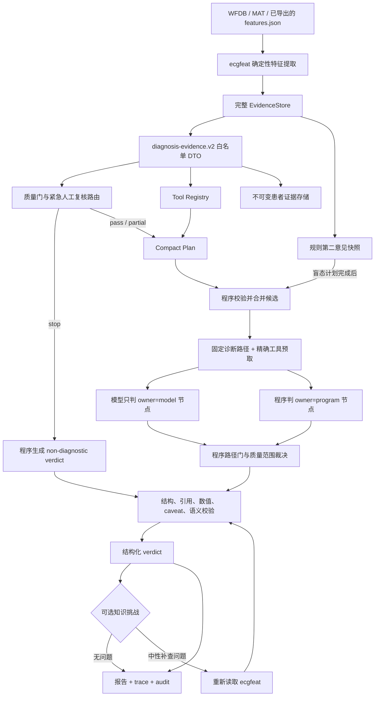
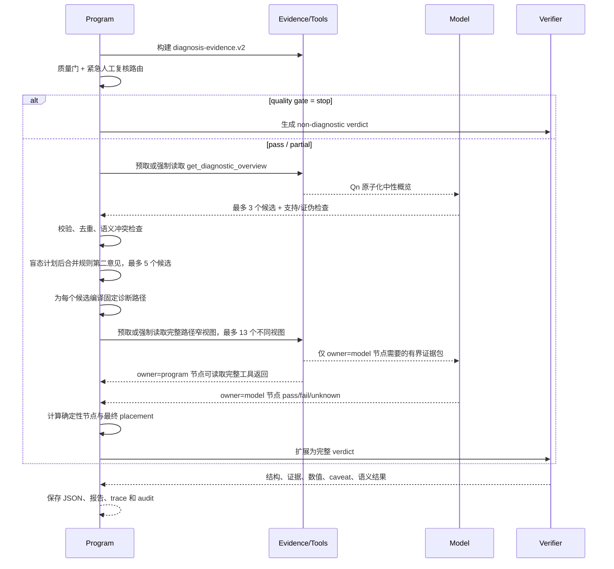

<!-- i18n-nav -->
[中文](ecg_agent_complete_design.md) | [English](ecg_agent_complete_design.en.md) | [日本語](ecg_agent_complete_design.ja.md)
<!-- /i18n-nav -->

> 翻訳に関する注意：この日本語版は参考用です。原文と相違がある場合は、原文を優先します。

<a id="ecgagent-完整设计文档"></a>
# ECGAgent 完全な設計ドキュメント

> ドキュメントのステータス: 現在の実装の概要
> 対応するコードの日付: 2026-08-07 (診断コード用の 4 つの排他的パスを追加 + 3 つの決定論的ノードの欠陥を修正。詳細については §7.2/§7.5 を参照。残りのコンテンツは 2026-08-03 に対応しています)
> 現在の診断プロトコル: `ecgagent.diagnostic.v38`
> 適用範囲: `ecgagent/` に基づく診断エージェント、証拠ツール、モデル バックエンド、検証、知識チャレンジ、レポート、バッチ処理および評価
> 安全性に関する声明: このシステムは研究および補助通訳ソフトウェアであり、医療機器ではありません。すべての出力は手動で確認する必要があり、臨床診断や治療の意思決定に直接使用することはできません。

<a id="1-文档定位"></a>
## 1. 文書の配置

この記事は、現在の ECGAgent の統一設計ベースラインであり、次の質問に答えます。

- エージェントが存在する理由、モデルによってどのような作業が行われるか、プログラムによってどのような作業が行われなければならないか。
- ECG の一部 `features.json` から最終的な構造化診断までどの段階を経ますか。
- ルールの結論、データセットのラベル、一般知識、および患者の証拠を分離する方法。
- ツール、証拠参照、診断パス、決定論的ノード、品質ゲート、バリデーターがどのように連携するか。
- コンパクト診断ワークフローとレガシー診断ワークフローの違いは何ですか。
- 診断コード、ツール、証拠フィールド、バックエンド、セキュリティ ポリシーを拡張する方法。
- トラックの保存、バッチの復元、リリースゲートの測定と実行方法。

ウェアハウスには以前のデザイン マテリアルやテーマ別のデザイン マテリアルがいくつかありますが、この記事ではそれらを削除しません。

|ドキュメント |ポジショニング |この記事との関係 |
|---|---|---|
| `docs/ecg_agent_architecture.md` | v1 階層推論から早期診断優先アーキテクチャへの進化的な設計 |歴史的な動機と初期の解決策を保持します。ここで、「現在の実装 v27」は最新のプロトコルではなくなりました。
| `docs/agent_revise_loop_analysis.md` |レガシー リビジョン サイクルの実ディスク障害分析 |これはリビジョン メカニズムの主題的な証拠であり、Compact | のデフォルトの動作を表すものではありません。
| `docs/ecgagent_determinism_refactor_plan.md` |診断経路を決定するための測定、計画、実験記録 | v38 デュアルチャネル設計の進化の重要な基盤です |
| `ecgagent/README.md` |使用法、コマンド、バックエンドの展開 |オペレーター向け;この記事は、設計、保守、監査を対象としています。

ドキュメントとコードの間に矛盾がある場合は、バージョン管理されたプロトコル構成と現在のコードが優先されます。主要なエントリについては、セクション 22 を参照してください。

<a id="2-设计目标与非目标"></a>
## 2. 目標と非目標を設計する

<a id="21-目标"></a>
### 2.1 目的

ECGAgent は、確定的な ECG 特徴抽出に加えて、次の 5 つの増分機能を提供します。

1. 品質、調律、房室関係、間隔、電気軸、伝導、異所性拍動、心室電圧、Q/ST-T/U 波、ペーシングの領域から体系的な説明を形成します。
2. 候補の診断を生成し、候補を裏付けるか偽装できる狭い測定ビューを積極的に要求します。
3. 測定が不完全な場合、検出チェーンが矛盾する場合、または定義された条件が満たされない場合には、ダウングレードするか、識別情報を保持するか、またはあきらめます。
4. 各患者の価値観と主要な証拠を不変の `features.json` ポインタまで追跡します。
5. 完全で再現可能で回復可能な運用監査を保存し、ブラインド評価とリリースの受け入れをサポートします。

<a id="22-非目标"></a>
### 2.2 対象外

現在、エージェントは次のタスクを実行していません。

- 信号の前処理、R ピーク検出、波の境界位置特定、または ECG 特徴抽出を再実行しないでください。
- LLM を数値計算機、カウンタ、しきい値コンパレータ、またはステート マシンとして扱わないでください。
- モデルが患者の証拠や診断台帳を直接変更することは許可されていません。
- ecgfeat ルールのヒット、フィリップス DXL/グラスゴーの解釈、または PTB-XL タグを患者の証拠として考慮しないでください。
- 一般知識を通じて患者が診断基準を満たしていることを証明していない。
- 重大な ECG の完全な自動検出は約束されていません。
- 医師による元の 12 誘導波形および臨床データの表示に代わるものではありません。

<a id="23-核心不变式"></a>
### 2.3 コアの不変条件

1. **患者情報のみのソース**: 患者情報は、現在のセッションにバインドされた読み取り専用の `EvidenceStore` からのみ取得できます。
2. **可視性に基づく承認**: ツールがポインターに触れても、モデルがそれを認識しているわけではありません。実際にモデルリクエストに入力されるか、決定論的プログラムノードによって消費される完全な数値アトムのみが、最終的な証拠のホワイトリストに入力されます。
3. **知識は患者の証拠ではありません**: 知識ベース、ルールのセカンドオピニオン、ルールのミス、データセットのラベルは患者レベルの参考情報を提供できません。
4. **プログラムには反復可能な計算機能があります**: しきい値、カウント、比率、配列の再構成、パス状態の移行、数値転写、および最終位置がプログラムによって完了されます。
5. **モデルは判断の余地がある**: モデルは、候補の形成、識別チェックの設計、および完全に形式化できない形態学的/機械的な説明を担当します。
6. **クローズの失敗**: `unknown` が見つからない、表示されない、直接的な証拠がない、または信頼性要件を満たしていない、鑑別診断である、免除されている、または品質が限られている場合、自動的に陽性診断にアップグレードすることはできません。
7. **最終的な手動レビューが必要**: 構造化出力契約要件 `human_review.required = true`。

<a id="3-模型与程序的职责边界"></a>
## 3. モデルとプログラム間の責任の境界

|仕事 |モデル |プログラマー/決定論的レイヤー |
|---|---:|---:|
|最大 3 人の独立した候補者を立てる |担当 |診断コード、参照、重複、セマンティック競合の検証 |
|設計支援・改ざんチェック |担当 |ツール名を安全なパラメータにコンパイルし、重複を削除します。
|附則 セカンドオピニオン候補者 |ブラインドプランでは表示されません |計画の完了後に追加され、プロンプトのルーティングのみに使用されます。
|ツールの実行 |直接実行されません |予算編成、パラメータ、重複排除、プリフェッチ、監査を担当 |
|しきい値、カウント、比率、順序の判定 |責任はありません |バージョン管理された決定的ノードによって計算 |
|フォーム/メカニズム ノードを開く |指定された `pass/fail/unknown` |ノード ID、ツール ソース、および新しい参照を確認します。
|候補者の最終ポジション |推定のみ |パス ゲート `confirmed/rejected/unresolved` | に基づいて計算されます。
|患者の値はレポートに書き込まれます。コピーしないでください |参照ポインタから臨床表示の精度まで実現 |
|信頼性に関する警告 |必須 |バリデーターによって自動的にアタッチされ、強制されます。
|最終的な JSON 構造、セマンティクス、および証拠の検証 |制限されたオブジェクトを生成する |標準化、検証、改訂管理、承認を担当 |
|人間が読めるレポート |適応なし |同じ構造化された評決からの決定論的なレンダリング |

この分業はデュアルチャネル ワークフローと呼ばれます。モデル チャネルは臨床候補と公開判決を処理し、プログラム チャネルは証拠、計算、ステータス、リリースを処理します。

<a id="4-总体架构"></a>
## 4. 全体的なアーキテクチャ


個別に表示して再利用できるブロック図と Mermaid ソース コードをご覧ください。
[ECGAgent v38 アーキテクチャ ブロック図](ecg_agent_architecture_diagram.ja.md)。



<a id="41-分层结构"></a>
### 4.1 階層構造

|レイヤー |コンポーネント |機能 |
|---|---|---|
| L0入力層 | `feature_extraction/ecgfeat`、`features.json` |測定、質量、リードごと、ビートごと、およびモダリティ データを生成 |
| L1 分離層 | `evidence/diagnostic_contract.py` |幅広い入力から診断固有の物理ホワイトリスト DTO を構築する |
| L2 証拠層 | `EvidenceStore`、`ModelEvidenceView`、`EvidenceLedger` |アドレス指定、単位、注意事項、細分化、可視性、ソース追跡 |
| L3 ツールレイヤー | `ToolRegistry` と 14 の診断ツール |境界のあるグローバル、リードごと、ビートごと、および特殊なモダリティ ビューを提供します。
| L4 オーケストレーション層 | `ECGDiagnosticAgent`、`ECGAgent` |ステージ、予算、プリフェッチ、候補、コンテキスト、リカバリの管理 |
| L5 推論層 |コンパクト/レガシー プロンプトと LLM バックエンド |候補者を作成し、計画をチェックし、公開審査を完了する |
| L6 意思決定層 |診断経路、決定論的経路、品質/安全性ポリシー |プログラムはパス ノード、配置、緊急ルーティング、および強制拒否を計算します。
| L7 チェックレイヤー | `verify/`、`semantic_guard.py` |必須の参照、値、信頼性、構造および診断 - 一貫性の測定 |
| L8出力層 | `report.py`、`trace.py`、`batch.py` |構造化された結果、中国レポート、完全な軌跡、バッチ分析 |
| L9評価層 | `evaluation_protocol.py`、`acceptance.py` | 3 アームによるブラインド評価、患者レベルのインジケーターおよびリリース ゲート |

<a id="5-输入与证据隔离"></a>
## 5. インプットと証拠の分離

<a id="51-完整输入"></a>
### 5.1 入力を完了する

エージェントの直接入力は通常、`*_features.json` です。完全な機能オブジェクトには以下が含まれる場合があります。

- グローバルな測定。
- 12 個のリードは脈拍測定を表します。
- ビートごとおよびリードごとの測定。
- QRS フォームのグループ化。
- P 波の評価、心房イベントおよびリズム パターン。
- ペーシング、前興奮、AV 関係などの検出器観察。
- 品質およびコレクションのメタデータ。
- 上流のルール解釈、参照エンジンの出力、またはデータセットのメタデータ。

完全なオブジェクトは大きすぎて、診断漏れの原因となる上流の結論が含まれているため、診断モデルに直接与えることはできません。

<a id="52-诊断证据-dto"></a>
### 5.2 診断証拠 DTO

`EvidenceStore.diagnostic_view()` `ecgagent.diagnosis-evidence.v2` を使用して、物理隔離ドキュメントを作成します。許可される最上位フィールドは次のとおりです。

```text
fs
global_features
representative_leads
beat_features
beats
groups
p_wave_assessments
rhythm_inputs
morphology_inputs
quality
metadata
```

このうち、`metadata`、`rhythm_inputs`、および `morphology_inputs` にはそれぞれセカンダリ ホワイトリストがあります。次の高リスクフィールドは再帰的に削除されます。

- `clinical_interpretation`、`interpretation`、`statement_engine`;
- `reference_metadata`、グラスゴー/フィリップスの通訳画像。
- `probable_af`、`probable_flutter`、`wpw_pattern` などの診断派生タグ。
- 薬剤、臨床診断コード、および答えが明らかになる可能性のあるその他のフィールド。

デフォルトでは、新しいフィールドは診断ビューに入りません。ドロップされたフィールド、未分類のフィールド、および機密フィールドは `ContractAudit` に書き込まれるため、上流のスキーマを拡張するときに契約バージョンを明示的に確認してアップグレードする必要があります。

<a id="53-evidencestore"></a>
### 5.3 証拠ストア

`EvidenceStore` は、単一レコードの不変、読み取り専用、アドレス指定可能な証拠ソースです。

- JSON ポインター、`ev:/...`、ポイント パス、クリニカル エイリアスをサポートします。
- 単位を自動的に推測します。
- 品質、信頼性、ソースおよび付随するフィールドの警告を自動的に添付します。
- 1 つのクエリでコンテキストが圧迫されるのを避けるため、単一コンテナのインライン制限は 800 文字です。
- コンテンツのフィンガープリントを提供し、この実行で実際に使用される入力をバインドします。
- ポインター値は、同じセッション内でドリフトすることはできません。

`EvidenceValue` のコア フィールドには、`pointer`、`value`、`unit`、`caveats`、`companions`、`source` が含まれます。ツールの表示値は統一された臨床精度を使用します。最終レポートもモデルによって実際に見られる表示精度で具体化され、元の完全な精度値は監査と公差の検証にのみ使用されます。

<a id="54-原子化模型视图"></a>
### 5.4 細分化されたモデルビュー

元のツール テーブルは非常に大きくなる場合があります。 `ecgagent.model-evidence.v3` 成功したツールを再解析して、各アトムがバインドされた完全な証拠アトムに戻します。

```text
引用 + 字段/导联身份 + 值 + 单位 + 可靠性 + caveat
```

バジェットは完全なアトム間でのみ切り捨てられ、値を参照や警告から分離することはありません。公平な順序付けにより、リード、ビート、およびフィールドの間にスペースが割り当てられます。省略された原子は、不可視かつ参照不可として明示的にマークされ、必要に応じてより狭いビューを要求する必要があります。

Compact ネイティブ/互換バックエンドは、長い `ev:/...` ポインターを短い参照 `Q1`、`Q2` などにマップします。モデルは表示された Qn をコピーすることしかできず、パスを構築できません。オーケストレーターは、最終検証の前に Qn を正規ポインターに復元します。

<a id="55-三种证据集合"></a>
### 5.5 3 種類の証拠収集

|セット |意味 |最終結論が支持できるかどうか |
|---|---|---:|
|触れた |ツール処理中にタッチされたすべてのポインター |いいえ |
|モデルが見える |完全な数値アトムは、実際の次のモデル リクエストでも引き続き表示されます。はい、モデル ノードで使用します。
|プログラムによって承認された |成功したツール呼び出しによって返され、決定論的ノードによって実際に消費される完全な入力。はい、プログラム ノードで使用します。

最後のホワイトリストは `model-visible ∪ program-authorized` です。主な結果はコレクション サイズとコンテンツ ハッシュのみを保持し、ポインターの完全なリスト、生の戻り値、およびモデルによって実際に見られる圧縮された戻り値は別のトレースに保持されます。

<a id="6-当前默认-compact-工作流"></a>
## 6. 現在のデフォルトのコンパクト ワークフロー

CLI、バッチ、および `run_diagnostic_agent()` デフォルトでは、`workflow=compact` が選択されています。 27B ローカル モデル用に設計されています。オーケストレーターのプリフェッチをサポートするバックエンドでは、通常、主要なモデル決定は `plan` と `adjudicate` の 2 つだけです。プリフェッチをサポートしていないプロバイダー ネイティブ バックエンドでも同じフェーズ コントラクトが実行されますが、標準のアシスタント/ツール結果ハンドシェイクを介して必要なビューを完了するため、モデル ラウンドが増加する可能性があります。

<a id="61-时序"></a>
### 6.1 タイミング



<a id="62-阶段合同"></a>
### 6.2 段階契約

|ステージ |モデルの責任 |ツールと予算 |最大生成 |
|---|---|---|---:|
| `plan` |中立的な概要から最大 3 つの実質的な候補を提案します。各候補には裏付けとなる証拠、1 ～ 2 つの判別チェック、少なくとも 1 つの改ざんチェックが含まれます。プリフェッチされたバックエンドはプログラムによって読み取られます。他のバックエンドは、モデルを強制的に 1 回呼び出すようにします (`get_diagnostic_overview`)。予算 1 | 1200トークン |
| `adjudicate` |固定パス内の `owner=model` のノードのみを入力します。各ノードは `pass/fail/unknown` と新しい Qn 証拠を提供します。プリフェッチ バックエンドはプログラムによって読み取られます。他のバックエンドは、正確なカバレッジ契約に従って呼び出されます。最大 13 の異なるビュー | 2200トークン |

`adjudicate` のモデル証拠パッケージの制限は 8000 文字です。プログラム ノードによってのみ使用されるビューは、モデル コンテキストにコピーされません。

<a id="63-质量门短路"></a>
### 6.3 高品質ゲート短絡

`/metadata/diagnostic_gate/state == stop` の場合、診断モデルは呼び出されません。プログラムは以下を直接生成します。

- 陽性診断はありません。
- `non_diagnostic` 品質ステータス;
- 停止の明確な理由、再生産の提案、および手動レビューの要件。
- 構造と証拠によっても検証される評決。

`partial` は停止に相当しませんが、解放できる診断カテゴリが制限されます。モデルに候補があるからといって、抑制されたドメインが肯定的な結論になることはありません。

<a id="64-盲态候选计划"></a>
### 6.4 盲目の候補者計画

モデルはまず診断的に中立的な概要のみを検討し、ルールの結論はまだコンテキストに入っていません。この計画には次のような厳しい制約があります。

- 最大 3 人の独立した候補者。
- 候補は、バージョン化された診断語彙に基づいている必要があります。
- 品質/提案の非仮説コードを、病気の候補者として偽装するために使用することはできません。
- 各候補者は少なくとも 1 つの承認された概要 Qn を持っています。
- 候補者ごとに 1 ～ 2 回の直接ビュー チェック。
- 少なくとも 1 つのチェックで改ざんを試みる必要があります。
- 同じ意味論的ファミリーに対して 1 つの候補だけが保持されます。
- 無効、重複、参照なし、チェックなし、または物理的測定と明らかに矛盾する候補は、プログラムによって削除されます。

<a id="65-规则第二意见"></a>
### 6.5 セカンドオピニオンのルール

Compact は、ブラインド スケジュールの終了後に完全な入力から分離された `ecgagent.rule-second-opinion.v2` スナップショットのみを読み取ります。

これには、少量の候補 ID とルーティング メタデータのみが含まれており、以下は含まれません。

- ルールの証拠価値。
- ルールのしきい値。
- 診断ステートメントのテキスト。
- `not_matched` 否定的な結果。
- 最終証拠として使用できる引用。

ルール ヒントは、既存の候補にソースを追加したり、マージされた候補の残りのスロットを占有したりできます。ブラインド候補とルール候補の合計の上限は 5 です。ブラインドプランが3つになったら、さらに2つまで追加できます。十分なブラインド候補がない場合、現在の実装ではさらにルール候補を追加する可能性があります。ルール プロンプトは独立した測定パスを再度通過する必要があり、直接確認することはできません。

<a id="66-视图预算与候选保留"></a>
### 6.6 予算と候補者の維持を表示する

プログラムは、各候補の固定パスを正確な `tool + arguments` コール シグネチャにコンパイルし、パラメーターごとに重複を削除します。完全なパスが 13 の異なるビューの上限内に収まる候補者のみが評決に参加しました。

オーダーファーストの適用範囲を維持:

1. 最初の 2 人の盲目の独立候補者。
2. 規則のセカンドオピニオン補足の候補者が不足している。
3. 3番目の盲目の候補者。
4. 他の互換性のある候補。

これは、ツール呼び出しの数による機械的な切り捨てではなく、候補フル パスの真のビュー要件に基づいた境界計算です。上限によって破棄された候補者は、監査および調整の指示を受けます。

<a id="7-诊断词表与候选路径"></a>
## 7. 診断語彙と候補パス

<a id="71-诊断词表"></a>
### 7.1 診断語彙

`diagnosis_catalog.py` は、単一レコード ルールのヒットに関係なく、安定した診断ボキャブラリを提供します。現在 123 個のコードがあり、次のように配布されています。

|カテゴリー |数量 |
|---|---:|
|リズム | 17 |
|レート | 5 |
|伝導 | 24 |
|異所性 | 3 |
|間隔 | 7 |
|軸 | 3 |
|チャンバー | 16 |
|虚血_再分極 | 25 |
|ペーシング | 5 |
|品質 | 9 |
|その他 | 9 |

語彙はレコード内の既存のステートメント コードを互換性のある拡張機能として吸収できますが、ルールのステータスはモデルが診断を提起できるかどうかを決定しません。入力レコードがリードごとの振幅によって正規化されている場合、純粋な電圧診断コードはプログラムによって削除され、`uncalibrated_amplitudes` に変更されます。

<a id="72-固定诊断路径"></a>
### 7.2 診断パスを修正

`ecgagent.diagnostic-pathways.v6` 各候補を最大 6 ノードまで拡張します。現在の 123 コードの静的拡張によると、合計 310 の「診断コード × ノード」インスタンスと 74 の異なるノード識別子があります。

- 151 のインスタンスはプログラムの責任です。
- 159 個のインスタンスがモデルを担当します。
- 254 `required`;
- 24 `supporting`;
- 32 `invalidator`。

123 コードのうち 114 には特別に設計されたパスがあります (ペーシング カテゴリで共有される 2 ノード テンプレートを含む)。残りの 9 つはすべて、`NON_HYPOTHESIS_CODES` または `unclassified_ecg_abnormality` (意図的に公開されたままであり、排他的な証拠チェーンを分割するのには適さない分類) の品質/カバレッジ メタ情報コードであり、モデルはそれらを疾患候補として提案できないか、定義自体が「未分類」です。一般的な分類に該当するのは、ギャップではなく、正しい設計によるものです。 2026-08-07 「モデルによって合法的に指名できるが、ユニバーサル カバーに従っている」という前の 4 つの実際のギャップ (`electrical_alternans`、`exclude_2_to_1_atrial_flutter`、`possible_precordial_lead_reversal`、`limb_lead_reversal_suspected`) が埋められ、それぞれに 3 ～ 4 つの排他的ノードが追加されました。その中で、四肢リード逆パスが再利用されます。`semantic_guard.py` のリード I/aVR 主波方向に対する同じ基準により、パス判定とハード ゲート基準の間の競合が回避されます。

各ノードは以下を宣言します。

```json
{
  "id": "qrs_duration_support",
  "gate": "required",
  "question": "...",
  "tool": "get_morphology_groups",
  "arguments": {"include_beats": false},
  "owner": "program"
}
```

パスはワークフロー契約であり、患者の証拠ではありません。どのようなビューが必要か、誰が判断の責任を負うか、配置がどのように影響を受けるかを指定するだけです。

<a id="73-三种门语义"></a>
### 7.3 3 種類のゲート セマンティクス

|ゲート |セマンティクス |最終順位への影響 |
|---|---|---|
| `required` |診断に必要な条件 | `fail` → 拒否されました。任意の `unknown` → 未解決。すべての `pass` を確認できます |
| `supporting` |役立つが必須ではない証拠 |直接ブロックしたり確認したりせずにステータスと証拠を保存 |
| `invalidator` |基準適用性の拒否の前提条件 |明示的な `fail` ブロックのみ。 `pass/unknown` は感度を低下させません。

`invalidator` 「電圧標準がペーシングまたはワイド QRS の下でも適用可能かどうか」タイプの前提に使用されます。 `supporting` と書かれている場合、構造的に拒否することはできません。 `required` として書き込まれた場合、検出されず、真陽性が不必要に失われます。

<a id="74-路径放置算法"></a>
### 7.4 パス配置アルゴリズム

プログラムは次の順序で候補場所を決定します。

1. 任意の `invalidator == fail` → `rejected`;
2. それ以外の場合は、`required == fail` → `rejected`。
3. それ以外の場合、必要なものはすべて `pass` です。少なくとも裏付けとなる証拠があり、品質範囲が許容されます → `confirmed`;
4.残り→`unresolved`。

`unresolved` 裏付けとなる証拠がある場合は `differential_diagnoses` と入力し、まだ完了していない必要なノードをリストします。裏付けとなる証拠がない場合には権利放棄監査に入る。モデルの提出 `overall_status` と緊急度は推定のみであり、最終的な位置、信頼度、緊急度、概要、人間によるレビュー テキストはすべてプログラムで生成されます。

<a id="75-确定性节点"></a>
### 7.5 決定論的ノード

`ecgagent.deterministic-pathway-facts.v2` は、次のような反復可能な計算を担当します。

- 心拍数と電気軸の閾値;
- PR/QT のレポート可能性としきい値。
- P 波の信頼性、1:1 房室関係、リピートブロックイベントおよび AV シーケンス。
- ルール RR の不均一性 (2026 年 8 月 7 日に追加された、中央値によって固定され、単一の孤立した異常な間隔を許容する堅牢なバックグラウンド規則性フォールバックを含む)、代表的な比率、および形態学的グループの数。
- QRS 時間制限 (完全脚ブロック/不完全 RBBB の幅広い QRS 基準、2026 年 8 月 7 日からの二束/三束ブロックの新しい広い QRS 基準、および孤立束状ブロック「QRS」を含む) 時間制限は、制限時間としては使用されません。 「しきい値」の基準）、早すぎるビート タイミング、幅広い QRS シーケンス。
- 低電圧、胸部 R 波の進行および電圧基準の適用性。
- フラグのペーシング、関係性と再現性のキャプチャ。

ノード カバレッジには、`owner` フィールドに依存しない呼び出しトラップがあります。`_compact_deterministic_pathway_step` は、各ノードに対して無条件に決定論的な解析を試みます。 `step_id` が特定のブランチにヒットする限り、モデルの判断は `program_owns_pathway_step()` によって宣言された所有権をチェックせずに上書きされます。`owner=model` はプロンプト表示と監査ラベルにのみ影響し、実際のカバレッジには影響しません。 2026 年 8 月 7 日より前は、`qrs_duration_support` ブランチは二重/三筋束ブロックおよび孤立した左前筋/左後筋束ブロックに対して均一に `unknown` を返し、これらの候補 `required` ノードが `unresolved` (伝導ブロック 0/11 ファミリー全体に対応) に永続的にスタックしていました。バッチ実行時) 直接的な原因);新しい枝が臨床的定義に従って修復された後（二重/三束性ブロックは、完全な束枝ブロックの幅広いQRS基準と比較されますが、孤立した束性ブロックは閾値としてQRS制限時間を使用しません。これは、`clinical_rules/conduction.py::_lafb`の既存の設計と一致します）。同じバッチで、LVH `cross_lead_voltage_criterion` (`diagnostic.py`) の性別一致が完全一致 `"female"` から `{"female","f","woman"}` に拡張され、ペゲーロ ロ プレスティ基準の欠落している性別しきい値が `clinical_rules/hypertrophy.py::_adult_lvh` と一致するように埋められました。

すべてのリゾルバーは保守的なトライステートを返します。

- `pass`: 十分な直接測定のサポート。
- `fail`: 定義レベルで直接の矛盾があります。
- `unknown`: 不完全、重大、信頼性が低い、または候補検出器の観測のみ。

決定的ノードは診断を作成せず、候補セットに入ったパス ノードのみを処理できます。環境変数 `ECG_AGENT_DETERMINISTIC_NODES_SHADOW=1` はシャドウ モードに切り替えることができます。モデルの状態によって位置が決定されますが、プログラムの状態は監査、移行前後の相違測定、全体的なロールバックのために書き込まれます。

<a id="76-模型节点授权"></a>
### 7.6 モデルノードの認可

モデル ノードの `pass/fail` は、次の条件が同時に満たされた場合にのみ有効です。

- ノード ID が候補の固定パスと正確に一致します。
- このフェーズの新しい読み取りからの証拠を引用 `adjudicate`;
- モデルによって実際に表示される Qn パッケージ内で参照されます。
- 参照は、ノードの指定されたツール、または同じ証拠名前空間を読み取る兄弟ビューから取得されます。
- 少なくとも 1 つの認可された証拠アトムが存在します。

それ以外の場合、ステータスはプログラムによって `unknown` に変更されます。モデルでは、新しいノードの追加、ノード名の変更、`owner=program` ノードの入力、計画外の候補の導入はできません。

<a id="8-工具系统"></a>
## 8. ツールシステム

診断モードでは、次の 14 のツールのみが登録されます。これらのツールはすべて、測定値、質量、または検出器の観測値を返しますが、ルール診断は返しません。

|ツール |主な目的 |コンパクトプランダイレクト選択｜
|---|---|---:|
| `get_diagnostic_overview` |中性質量、心拍数、リズムスクリーニング、間隔、軸、およびモダリティの利用可能性の概要 |必読事項を修正しました。プリフェッチがサポートされている場合はプログラムによって読み取られます。
| `get_global_table` |一度に最大 24 個のグローバル フィールドを読み取ります。はい |
| `get_measurement` |ポインタまたは臨床別名を正確に読み取ります。いいえ、レガシー/リビジョン ダンプとして |
| `get_lead_table` | 12 個のリードにわたる同じフィールドの比較 |はい |
| `get_beat_table` |リズムレベルまたは指定されたリードでの拍間測定 |はい |
| `search_measurements` |フィールド名が不明な場合にポインタが見つかりました |いいえ、見つかっただけです。結果を再読する必要があります。
| `get_rhythm_profile` | RR、心房残差、AV 相関、前興奮および差動伝達候補の観察 |はい |
| `get_atrial_event_table` |独立会議イベント、信頼性、P-QRS 相関関係およびソース リード |はい |
| `get_p_assessment_table` |ビートごとの P 波境界の受容/拒否、信頼性と有効なリード |はい |
| `get_morphology_groups` | QRS 形状ファミリー、比率、ランレングス、テンプレート相関およびメンバー |はい |
| `get_morphology_map` | P/QRS/ST/T-U/高品質固定トランスリード観察チャート |はい |
| `get_interval_waveform_context` | PR または QT/QTc ウェーブと障害コンテキストを構成する制限時間読み取り |はい |
| `get_pacing_profile` |ペーシング スパイク、可用性のキャプチャ/感知、およびペースビート メンバー |はい |
| `get_native_beat_profile` |非ペーシングパターンが支配的なネイティブビートの反復 Q/R/ST/T/QT 証拠 |はい |

<a id="81-域到工具的默认路由"></a>
### 8.1 ドメインからツールへのデフォルト ルート

|診断ドメイン |優先ツール |
|---|---|
|品質 |形態マップ、精密測定 |
|リズムレート |リズムプロファイル、ビートテーブル |
| p_av |リズムプロファイル、P評価、心房イベントテーブル |
|間隔 |グローバルテーブル、インターバル波形コンテキスト |
|軸 |グローバルテーブル、リードテーブル |
|伝導_予備励起 |形態マップ/グループ、ネイティブ ビート プロファイル |
| ectopy_pauses |ビートテーブル、形態グループ、リズムプロファイル |
|電圧チャンバー_r_プログレッション |形態マップ、リードテーブル、ネイティブビートプロファイル |
| q_st_t_u |形態マップ、ネイティブビートプロファイル、リードテーブル |
|ペーシング_高_リスク |ペーシング プロファイル、ネイティブ ビート プロファイル、形態グループ |

<a id="82-registry-约束"></a>
### 8.2 レジストリの制約

`ToolRegistry` は以下を担当します。

- 各ステージには個別の予算があり、成功した呼び出しのみが計算されます。
- 必須/不明パラメータを厳密に検証します。
- 同じステージの重複を削除するには、`tool + 规范化 arguments` を押します。
- 呼び出しを繰り返してもバジェットは消費されず、ツール ループ ブレーカーがトリガーされる可能性があります。
- 予算の 3 倍を超える通話を拒否するときに、さらなるパラメーターの推測を防止します。
- すべての例外を監査可能なエラーに変換し、ツールの例外によってレコード全体が直接クラッシュするのを防ぎます。
- オリジナルの完全なリターン、圧縮されたダイジェスト、ハッシュ、ヒットした引用、および表示可能な引用も保存します。

<a id="9-prompt-与输出合同"></a>
## 9. プロンプトと出力の契約

<a id="91-compact-system-prompt-的职责约束"></a>
### 9.1 Compact システム プロンプトの責任

コンパクト プロンプトはモデルに次のことを明示的に伝えます。

- オーケストレーターには、ワークフロー、ツール、参照拡張、数値転写、決定論的ノード、パス ステータス、レポート レンダリングが含まれます。
- モデルは候補プランと `owner=model` ノードのみを担当します。
- ルール セカンドオピニオンは患者の証拠ではありません。
- 欠損値は正常か異常かを証明しません。
- 心拍数はリズムメカニズムと等しくなく、形態グループはリズムと等しくありません。
- 単一の非支配的なパターンまたは孤立したイベントを、繰り返し発生するメカニズムに自動的に一般化することはできません。
- 制限された測定では制限を維持する必要があります。
- 患者の値はモデルによって転写されず、最終的にはプログラムによってバックフィルされます。

<a id="92-compact-中间-schema"></a>
### 9.2 コンパクトな中間スキーマ

計画スキーマには次のものが含まれます。

- `candidates[]`: `id/code/domains/support/counter/checks/uncertainty`;
- `review_tools[]`;
- `quality_limitations[]`。

裁定スキーマには次のものが含まれます。

- `overall_status`;
- `decisions[]`: 候補者のアイデンティティ、モデルの緊急性推定、および `pathway_steps[]`。
- `interval_contexts[]`。

プログラムは、コンパクトな結果を完全な出力コントラクトに拡張します。 Compact は、デフォルトではフリー テキストの改訂を実行しません: `max_revisions=0`、ステージ ステータスの再試行は 0。無効なステータスは、文法/スキーマ、プログラムの正規化、および障害の終了によって処理されます。

<a id="93-完整-verdict"></a>
### 9.3 完全な評決

最終的な構造化出力には以下が含まれます。

```text
summary
ranked_complete_interpretations[1..3]
diagnoses[]
differential_diagnoses[]
interval_measurement_contexts[]
abstentions[]
quality_assessment
human_review
```

陽性診断には `HIGH` または `MEDIUM` のみが許可され、鑑別診断には `MEDIUM` または `LOW` のみが許可されます。 PR、QT/QTc が利用できない、または制限されている場合、間隔の結論、構成波の残存証拠、影響の説明と解決策を個別に記載する必要があり、「間隔を測定できない」ことを「波形に情報がない」と誤って同一視することはできません。

<a id="94-prompt-指纹"></a>
### 9.4 プロンプトフィンガープリント

各実行では以下を組み合わせて SHA-256 フィンガープリントを計算します。

- システム/フェーズ/リビジョン プロンプト;
- 診断プロトコルと臨床安全戦略。
- ステージ予算、プリフェッチおよびカバレッジ契約。
- 中間および最終の JSON スキーマ。
- ツールスキーマ;
- ナレッジ ナビゲーション/チャレンジ バージョンおよびランタイム カテゴリ。

バッチ受け入れには、同じコホートに対してロックされたプロンプト/バックエンド/モデル実行署名が 1 つだけ必要です。

<a id="10-legacy-诊断工作流"></a>
## 10. 従来の診断ワークフロー

`workflow=legacy` は、v31 の 5 段階の調査プロセスを保持します。

```text
Survey → Hypothesize → Investigate → Challenge → Synthesize → Verify/Revise
```

|ステージ |機能 |ツールの予算 |
|---|---|---:|
|アンケート |世界的な中立調査インベントリ |概要を修正 1 回 |
|仮説を立てる |暫定的な診断計画、差分計画、ツール計画の作成 | 0 |
|調査 |患者測定値の目標値の読み取り | 4 ～ 12、複雑さのために調整 |
|チャレンジ |反証や未解決の領域を積極的に見つける | 2 ～ 6、新しいビューが必要 |
|合成 |完全に構造化された判定結果を出力 | 0 |

レガシーでは、プログラムが所有する想定状態として `diagnostic-ledger.v3` を使用します。モデルは型指定されたパッチのみを送信でき、プログラムは証拠の具体化、アイデンティティ、法的状態の移行、および追加のみのイベント履歴を担当します。状態に `raised/provisional/weak/supported/weakened/unresolved/rejected/abstain` が含まれていると仮定します。異議が唱えられていない肯定的な仮説は失敗し、未解決として閉じられます。

レガシーでは、最大 2 段階のステータス修復と最大 4 つの最終改訂が可能です。リビジョンでは、段落を改訂するときに渡された部分がサイレントに変更されることを避けるために、アトミックなトップレベルセクションパッチを使用します。特別な問題と改善の根拠については、`docs/agent_revise_loop_analysis.md` を参照してください。

Compact は引き続き診断台帳を構築し、監査を保存しますが、デフォルトのマスター意思決定は、複数段階の台帳の状態を維持するためにモデルに依存しません。

<a id="11-旧规则裁决模式"></a>
## 11. 旧ルール支配モード

`ECGAgent` のレガシー `mode=adjudicate` は、`Orient → Test → Adjudicate → Synthesize` ルール判定セマンティクスを保持しており、上流のルール検出を表示して、保持、撤回、またはダウングレードを決定する機能を備えています。これは、履歴的な互換性と明示的な比較に使用され、現在のスタンドアロン診断のデフォルト パスではありません。

初期の `medgemma_ecg_core.py` の固定 L0 ～ L5 階層推論は、プッシュベースの非ツールパイプラインであり、現在の `ecgagent` と同等ではありません。ベースライン比較には引き続き利用できますが、現在の診断 DTO、モデルの可視参照ホワイトリスト、固定疾患経路、およびデュアル チャネル決定論的ノードはありません。

<a id="12-质量安全和紧急路由"></a>
## 12. 品質、セキュリティ、緊急ルーティング

<a id="121-质量门"></a>
### 12.1 品質ゲート

品質ゲートには 3 つの状態があります。

- `pass`: フルパス評価を許可します。
- `partial`: 制限されたカテゴリを許可し、信頼できないドメインを抑制します。
- `stop`: プログラム短絡は非診断として報告されます。

品質への注意は既存の測定値を削除しませんが、それを明らかに重要度の低い証拠に変えます。 `null` または未生成フィールドは、利用できないことを示します。

<a id="122-临床安全策略"></a>
### 12.2 臨床安全性戦略

`ecgagent.clinical-safety.v2` は、心拍数、PR、短 PR、QRS、QTc、反復逆伝播証拠、緊急ルーティングしきい値などの成人が定義したレベルのハード境界を一元管理します。次のことのみが可能です。

- 信頼できる測定値と直接矛盾する肯定的な結論を阻止する。
- 定義された条件を満たさない候補をダウングレードします。
- ルートを手動でレビューします。

提案された診断がなければモデルを作成できません。ポリシーのバージョンとすべてのパラメータは、監査を実行するために書き込まれます。

<a id="123-紧急人工复核"></a>
### 12.3 緊急時のマニュアルの確認

`ecgagent.urgent-review.v1` モデルの完了前に保守的な測定のトリガーを確認します。

- 極度の徐脈または頻脈。
- 高速かつ幅広い QRS;
- 完全な AV ブロック測定マーカーをエクスポートしました。
- 信頼性が高く報告可能な重要な QTc 拡張機能。
- 矛盾しない証拠のペーシング キャプチャ失敗測定フラグ。
- 技術的な品質の停止。

`do_not_delay_human_review` ルートが生成されるだけで、診断は確認されません。急性 ST 損傷とペーシングセンシング障害は、依然として不完全な評価カテゴリーとしてリストされています。

<a id="124-语义硬门"></a>
### 12.4 セマンティックハードドア

`semantic_guard.py` チェック:

- モデルによって記述された算術比較が本当に当てはまるかどうか。
- 徐脈/頻脈、心房頻脈、第 1 度房室ブロック、脚ブロック、IVCD、QT の短/長などが、信頼できる測定値と直接矛盾するかどうか。
- 房室伝導率と逆行性活性化の疑いについて、独立した繰り返しの証拠があるかどうか。
- 肯定的な結論をこっそり得るために構造化された診断リストをバイパスするかどうかの要約。
- 四肢リード逆接続がリード I および aVR の定義された主波方向条件を満たしているかどうか。

これらのチェックは最低限安全な不変条件であり、隠れた診断エンジンの 2 番目のセットではありません。

<a id="13-确定性验证"></a>
## 13. 決定論的検証

最終的な評決は次の順序で下される必要があります。

1. JSON/スキーマと出力契約の検証;
2. 診断コード、カテゴリ、信頼度、相互排他関係および完全な説明の検証。
3. 候補証拠のアップグレードゲートと品質範囲の検証。
4. 参照および値の検証。
5. 信頼性限界の検証。
6. 診断 - 測定セマンティクスへの入り口が難しい。

参照バリデータは、次の 5 つの決定的なチェックを実行します。

|チェック |質問 |
|---|---|
|解決可能 |各 `ev:/...` が現在のストアで解決できるかどうか |
|来歴 |完全なアトムに対応するポインタは、このセッションのモデルに表示されるか、プログラム ノードによって許可されます。
|一貫性 |記載された値が単位および臨床許容範囲内で引用された値と一致しているかどうか |
|サポート |各患者固有の値に参照があるかどうか |
|資格 | 資格 | ecgfeat によって制限されているとマークされた測定値が、同じクレームで明示的にダウングレードされるかどうか。

ガイドラインの閾値は患者の測定値とは別に処理され、引用されていない患者の値として誤って判断されることはありません。構造化証拠項目への参照が欠落していると、警告ではなくブロックとなり、モデルが参照を削除して数値の不一致を回避できなくなります。

プログラムは、最終的に採用された証拠を `audit.tools.effective_evidence` に具体化し、値、単位、警告、ソース、モデル可視/プログラム許可ステータス、および支持/反対の役割を記録します。

<a id="14-知识库与知识挑战"></a>
## 14. 知識ベースと知識の課題

ナレッジ ベースは、患者ツール (バージョン `ecg-knowledge.v1`) から完全に分離された BM25 のようなローカル インデックスです。実行時に許可されるカテゴリは次のとおりです。

- `diagnostic_reference`;
- `morphology_reference`;
- `measurement_reliability_reference`;
- `failure_modes`。

臨床ルールのソース コード、Philips DXL、Glasgow、および機能ブループリントはオフライン開発監査専用であり、患者のランタイム ナレッジ カードには入力されません。すべてのナレッジ カードは、プロンプトに入る前にケース行を削除し、レコード ID を無効にします。

<a id="141-survey-后导航"></a>
### 14.1 調査後のナビゲーション

レガシーは、アンケート `ecg-knowledge-navigation.v2` の後に有効にできます。

- ナレッジカードは最大 4 枚。
- 暫定的な識別と次の測定計画の作成にのみ役立ちます。
- 仮説が完了すると、元の知識テキストが後続のコンテキストから削除されます。
- 患者の最終的な結論は依然として `ev:/...` に戻される必要があります。

コンパクト ブラインドネス、小さなコンテキスト、および 2 段階の安定性を維持するために、パラメータ `knowledge_guidance=True` が構築されている場合でも、調査後のナレッジ ナビゲーションは現在強制的にオフになります。

<a id="142-诊断后挑战"></a>
### 14.2 診断後の課題

`knowledge_challenge` が明示的に有効になっている場合、証拠検証に合格した評決は、隔離された患者のいない `ecg-knowledge-challenge.v1` セッションに引き渡されます。

1. 既存の診断によって普遍的な参照を検索します。
2. 最大 3 つの中立的なフォローアップ質問のみを生成します。
3. 元の知識テキストと結論は診断セッションに返されません。
4. 診断セッションは、ecgfeat ツールを少なくとも 1 回正常に呼び出す必要があります。
5. 修正された評決は、完全な契約と患者の証拠検証を再度通過する必要があります。
6. いずれかのステップが失敗した場合は、チャレンジの前に検証された判定を安全に保管してください。

<a id="15-模型后端抽象"></a>
## 15. モデルのバックエンドの抽象化

オーケストレーターは、統合された `LLMBackend`: `complete`、アシスタント ターン、ツール結果ターン、ユーザー ターンのみに依存します。バックエンドは、オーケストレーターがベンダー名によって動作を推測することを回避するために、`BackendCapabilities` を介して機能を明示的に宣言します。

|バックエンド |ネイティブツール |構造化された出力 |コンテキスト圧縮 |参照エイリアス |ステージメモリー |プリフェッチ |平行幅 |
|---|---:|---|---:|---:|---:|---:|---:|
| Anthropic |はい |スキーマ |いいえ |いいえ |いいえ |いいえ | 4 |
| DeepSeek |はい | JSON オブジェクト |いいえ |はい |いいえ |はい | 4 |
| Qwen ローカル/vLLM | はい | schema | はい | はい | はい | はい | 3 |
| MedGemma ローカル/vLLM | いいえ、JSON エンベロープ | grammar | はい | はい | はい | はい | 4 |
| モック | スクリプティング | なし | いいえ | いいえ | いいえ | いいえ | 1 |

重要な適応の違い：

- Anthropic は thinking/content ブロックをそのまま再生し、system/tools プロンプトキャッシュをサポートすることを要求します。
- DeepSeek には JSON オブジェクトモードのみがあり、schema はローカルで検証され、ツール引数は壊れた JSON である可能性があります。
- Qwen は vLLM ネイティブツールパーサーを実行し、ツールラウンドの推論内容を保持し、証拠台帳を圧縮します。
- MedGemma にはネイティブな関数呼び出しがなく、grammar 制約によるツール/終状態 JSON エンベロープを使用します。
- ローカルバックエンドは、アトミックな証拠パッケージ、Qn 引用、スクロールする段階記憶、およびコンテキスト圧縮を使用します。

新しいバックエンドは、いくつかの同名のオプションメソッドを実装するだけでなく、実際の機能を宣言する必要があります。

<a id="16-预算熔断与上下文管理"></a>
## 16. バジェット、サーキットブレーカー、およびコンテキスト管理

<a id="161-全记录默认上限"></a>
### 16.1 全記録のデフォルト上限

| 項目 | デフォルト値 |
|---|---:|
| モデルラウンド | 28 |
| 累積トークン | 400,000 |
| 壁時計時間 | 1200 秒 |
| 連続する非ツール `max_tokens` | 3 |
| レガシー段階状態の再試行 | 2 |
| レガシー判定の修正 | 4 |
| コンパクト段階状態の再試行 | 0 |
| コンパクト判定の修正 | 0 |

環境変数で上書き可能：

```text
ECG_AGENT_MAX_MODEL_TURNS
ECG_AGENT_MAX_TOTAL_TOKENS
ECG_AGENT_MAX_WALL_SECONDS
ECG_AGENT_MAX_CONSECUTIVE_MAX_TOKENS
ECG_AGENT_PHASE_STATE_ATTEMPTS
```

ローカル MedGemma は、`ECG_GEMMA_AGENT_MAX_LEN`、`ECG_GEMMA_GPU_MEMORY_UTILIZATION`、`ECG_GEMMA_TP_SIZE`、`ECG_GEMMA_MAX_CONCURRENCY`、`ECG_GEMMA_BATCH_WAIT_MS` などの実行構成もサポートします。

<a id="162-上下文策略"></a>
### 16.2 状況に応じた戦略

- プログラムは既知のパラメーターの強制ビューをプリフェッチして、モデルによるパラメーターの推測の無駄なラウンドを削減します。
- 同じフェーズで正確に繰り返される呼び出しは抑制され、重複ループ ヒューズがトリガーされます。
- ローカル バックエンドは、一時的なツールの転写を制限された証拠台帳に圧縮します。
- ステージ境界には、正規化されたステータスと選択された証拠のみが保持され、元の大きなテーブルがすべて蓄積されるわけではありません。
- 圧縮前後のすべての文字数、省略されたアトム、および最終的に表示される参照が監査されます。
- 元の完全な戻り値は常にスタンドアロン トレースに保持され、モデル コンテキストの圧縮によって失われることはありません。

<a id="17-输出与审计产物"></a>
## 17. 製品の出力と監査

<a id="171-单条结果"></a>
### 17.1 単一の結果

`AgentResult` には以下が含まれます:

- `verdict`: 完全な構造化診断。
- `phases`: フェーズ、ターン、ツール、ガード、および停止の理由。
- `verification`: 決定論的検証レポート。
- `knowledge_navigation/review`;
- `revisions`、`error`、`refused`;
- `audit`: プロトコル、フィンガープリント、ツール、バックエンド、ランタイム、ポリシー、およびパスの決定。

`ok` は、評決があり、エラー/拒否がないことを意味します。 `verified` は、検証レポートがあり、障害となる所見がないことを意味します。この 2 つは同じ概念ではありません。

<a id="172-报告"></a>
### 17.2 レポート

`report.py` は、同じ判定から決定論的に生成されます。

- 簡単な中国語マークダウンレポート;
- 完全に監査可能な中国語マークダウンレポート。

レポート作成では 2 番目のモデルの書き換えが呼び出されないため、マシンの結果と人間が読めるテキストが自動的に分岐することはありません。未検証の結果はデバッグ候補として明示的にマークされ、確認された診断とはみなされません。

<a id="173-运行轨迹"></a>
### 17.3 ランニングトラック

`ecgagent.trace.v4` マークダウン トレースの保存:

- 中立的な初期入力とステージ間コンテキスト。
- 各段階でのモデル出力。
- 各ツールのパラメータ、元の結果、モデルによって実際に見られる圧縮結果。
- タッチされた/表示された/省略された引用統計。
- フェーズガード、改訂および検証の結果。
- 知識のナビゲーション/チャレンジ;
- モデル、プロンプト/入力指紋、トークン、消費時間、およびヒューズのステータス。
- 最終結果のインデックス。

ベンダーが隠した内部推論フィールドはこのトラックには入りません。

<a id="174-批处理与恢复"></a>
### 17.4 バッチ処理とリカバリ

`ecgagent.batch` は以下をサポートします:

- `extract`、`diagnose`、`reverify`、`analyze`、`all`;
- 中断後にファイルの半分が残らないように、JSON/Markdown をアトミックに書き込みます。
- 各ステージのチェックポイント/進行状況ファイル;
- レコード全体を再試行します。
- 完了した結果を再利用し、ワークフロー、プロトコル、プロンプト、入力フィンガープリントを確認します。
- ローカル vLLM マイクロバッチ同時実行性。
- レコードごとの CSV、全体的な JSON、メトリクスおよび分析レポート。

コンパクト、レガシー、モデル、バックエンド、または入力フィンガープリントに一貫性がない場合、古い結果を新しい再利用可能な結果として扱うことはできません。

<a id="18-评测与发布门"></a>
## 18. ゲートの確認と解除

<a id="181-三臂盲法消融"></a>
### 18.1 3 アームブラインドアブレーション

`ecgagent.blind-ablation.v2` 比較:

1. ルール。
2. シングルターンLLM。
3. 多段階エージェント。

入力は `patient_id` によって集約され、評価管理者の秘密キーを使用して安定した読み取り不可能な HMAC arm エイリアスを生成します。デフォルトのレポートはブラインドのままです。臨床レビューは、臨床レビューが完了するまで明示的に盲検化を解除することはできず、盲検化されていないレポートは、レビューされた盲検化された製品の SHA-256 にバインドされます。

指標には、マイクロ精度/リコール/F1、患者の完全一致、重篤な診断の見逃し率、重篤な症例の数が含まれます。

<a id="182-发布验收"></a>
### 18.2 リリースの承認

`ecgagent.acceptance.v1` デフォルトのしきい値:

|指標 |しきい値 |
|---|---:|
|最小記録 | 20 |
|実行成功率 | ≥ 95% |
|検証済みレート | ≥ 95% |
| P90 実行時間 | ≤ 300 秒 |
|平均リビジョン数 | ≤ 1.5 |
|位相ガードの故障率 | ≤ 2% |
|最終的な引用の可視出典範囲 | 100% |
|最適なベースライン増分に対するエージェント F1 | ≥ 0 |
|重篤な診断の見逃し率 | ≤ 2% |

以下も必要です:

- コホート全体が現在のプロトコルを使用します。
- プロンプト/バックエンド/モデルの実行署名は一意かつ完全です。
- モックバックエンドは使用できません。
- デフォルトでは、完了した臨床ブラインドレビューの非盲検レポートと拘束力のあるレビューハッシュを提供する必要があります。
- 少なくとも 1 人の重篤な陽性症例が含まれています。

<a id="19-测试策略"></a>
## 19. テスト戦略

現在のエージェント関連のテスト範囲:

- EvidenceStore、ポインタ、ユニット、警告および診断ホワイトリスト;
- ツールのスキーマ、パラメータ、予算、重複排除、およびモーダル ビュー。
- タッチされた/表示された/プログラムによって許可された参照の分離。
- コンパクトなプランニング、ルール候補のマージ、パスのプリフェッチ、決定的なノードと配置。
- レガシー台帳ステータスの移行、回復、改訂。
- Anthropic/DeepSeek/Qwen/MedGemma バックエンド メッセージ プロトコル。
- 参照、数値、信頼性、およびセマンティック ゲート;
- レポート、トレース、バッチおよび知識に関する課題。
- リード逆接続および臨床表示精度契約。

この記事が作成された時点で、377 の pytest ケースが関連するテスト ファイルに収集されました。少なくともエージェントの設計を変更した後に実行することをお勧めします。

```bash
pytest -q tests/test_ecgagent*.py tests/test_lead_reversal_and_value_contract.py
```

診断パスまたは確実性のしきい値の変更では、単体テストだけでなく、コホートロックされたエンドツーエンドのリプレイ、測定された検証可能なスコア、盲検臨床レビューも実行する必要があります。

<a id="20-扩展规范"></a>
## 20. 拡張仕様

<a id="201-新增患者证据字段"></a>
### 20.1 新しい患者証拠フィールドを追加

1. まず、そのフィールドが測定、品質、収集メタデータ、候補検出器、または診断結論のいずれであるかを判断します。
2. `diagnostic_contract.py` ホワイトリストに入力できるのは、診断中立フィールドのみです。
3. 単位、表示精度、注意事項、および出典に関する規則を確立します。
4. ツールビューとアトミックソートを更新します。
5. 「デフォルトでは不明なフィールドは診断 DTO に入力されない」という契約テストを追加しました。
6. 表示されるコントラクトが変更された場合は、証拠/モデルビューのバージョンをアップグレードし、プロンプトのフィンガープリントを更新します。

<a id="202-新增工具"></a>
### 20.2 新しいツール

1. このツールは患者の測定値/質量/検出器の観察結果のみを返し、診断は返しません。
2. JSON スキーマ、必須パラメータ、および戻り参照を厳密に定義します。
3. `DIAGNOSTIC_TOOLS` に登録します。
4. ドメイン ルーティングとコンパクト ダイレクト ツール ホワイトリストを更新します。
5. ネームスペース認可マッピングとアトミック ビューの優先順位を更新します。
6. 予算設定、重複排除、表示される参照、および切り捨て後のエラー パスに関するテストを作成します。
7. ツール スキーマの変更は、プロンプト フィンガープリントに自動的に影響します。

<a id="203-新增诊断码"></a>
### 20.3 新しい診断コード

1. 安定した語彙と正しいカテゴリを追加します。
2. `NON_HYPOTHESIS_CODES` に属するかどうかを判断します。
3. 同義の候補が上限をクラウドアウトすることを避けるために意味論的ファミリーを定義します。
4. `diagnostic_pathways.py` で必須/サポート/無効化ノードを定義します。
5. 各ノードの固定ツールとセキュリティ パラメータを指定します。
6. しきい値/カウント/ブール値/シーケンス ノードを決定論的リゾルバーに移行します。
7. 相互排他的な関係、品質範囲、安全扉、緊急性、報告順序を更新します。
8. 正の例、負の例、境界値、欠損値、および信頼性の低い入力を使用したテスト配置。

<a id="204-新增确定性节点"></a>
### 20.4 新しい決定論的ノード

1. リゾルバーは選択された候補のみを処理する必要があり、それ自体で診断を作成することはできません。
2. 出力は、`pass/fail/unknown`、理由コード、入力ポインター、および監査可能なメトリックである必要があります。
3. 境界間隔は最初に `unknown` を返します。
4. ノードの正常なツール呼び出しによって到達したポインタのみが使用を許可されます。
5. まずシャドウ モードでモデル/プログラムの違いを比較し、次に所有者を切り替えます。
6. バージョン管理戦略をアップグレードし、変更しきい値に対してコホート属性分析を実行する必要があります。

<a id="205-新增后端"></a>
### 20.5 新しいバックエンド

1. ユニファイド メッセージングとツール結果プロトコルを実装します。
2. サプライヤーが保持する必要がある思考/推論コンテンツを正しく再生する。
3. `BackendCapabilities` を明示的に宣言します。
4. 構造化された出力レベル、ツールの並列処理幅、およびツール呼び出し ID セマンティクスをデモンストレーションします。
5. 圧縮が実行される場合、ポインタ リストの代わりに、正確なモデルの可視参照が返される必要があります。
6. 使用状況、構成、およびキャッシュの監査を提供します。
7. 模擬サービスと実際の最小限のサービスをそれぞれ使用して、不正な JSON、拒否、切り捨て、およびツール ループをテストします。

<a id="206-修改-prompt-或预算"></a>
### 20.6 プロンプトまたは予算の変更

1. バージョンノートと関連テストを更新します。
2. プロンプトフィンガープリントを再生成します。
3. 異なる指紋の結果をロックされたコホートに混合することはできません。
4. 成功率、検証率、P90、トークン、候補再現率、パスノードの発散、重大な見逃し診断を比較します。
5. F1 の合計だけを見るのではなく、ケースごと、ノードごとに違いを特定します。

<a id="21-已知边界与维护风险"></a>
## 21. 既知の境界とメンテナンスのリスク

1. **生波形ツールなし**: 現在のエージェントは、エクスポートされた構造化測定値とモダリティのみを確認し、任意波形ウィンドウや再測定を要求しません。
2. **コンパクト候補にはまだ上限があります**: 最大 3 つのブラインド、最大 5 つのマージ、および完全なパスが 13 のビューに収まる必要があります。監査は、除外された候補者を引き続き監視する必要があります。
3. **まだオープンなモデル ノードが存在します**: 現在の 310 個のノード インスタンスのうち 159 個が依然としてモデルを担当しており、形態学的結論には依然としてモデルの変動が存在します。
4. **レコードレベルのラベルが不完全**: 測定定義の診断は正しい可能性がありますが、データセットにはラベルが付けられていません。測定の検証とブラインド臨床評価を組み合わせる必要があります。
5. **クリティカル モード カバレッジが不完全**: 緊急ルーティングが完了していません。STEMI、ブルガダ、ペーシング障害検出器。
6. **ルールセカンドオピニオンは依然として候補者のリコールに影響を与える**: 患者の証拠は提供されませんが、評価される候補者のセットが変更されるため、監査とアブレーションで個別に報告する必要があります。
7. **現在、Compact では調査後の知識ナビゲーションは有効になっていません**。オプションの診断後の知識チャレンジのみが利用可能です。
8. **ダイレクト コンストラクターのデフォルト トラップ**: `ECGDiagnosticAgent(...)` の構築シグネチャは現在、デフォルトで `workflow="legacy"` に設定されていますが、CLI、バッチ、および `run_diagnostic_agent()` のデフォルトは `compact` です。ライブラリの呼び出し元はワークフローで明示的に渡す必要があります。将来的にはデフォルト値の統一も検討されるかもしれません。
9. **古いアーキテクチャのドキュメントには、過去の「現在のバージョン」の説明が含まれています**: この記事、`protocol.py` および実際の監査バージョンは、メンテナンス中に優先される必要があります。
10. **手動レビューはシステム境界であり、障害状態ではありません**: たとえ検証されたとしても、出力は自動臨床発行として解釈できません。

<a id="22-代码索引"></a>
## 22. コードインデックス

|デザイン内容 |主な実装 |
|---|---|
|現在のプロトコル、ドメイン、ツール、予算 | `ecgagent/agent/protocol.py` |
|コンパクト/レガシー オーケストレーションと候補のマージ | `ecgagent/agent/diagnostic.py` |
|一般的な段階のサイクル、予算、改訂、監査 | `ecgagent/agent/loop.py` |
|コンパクトなプロンプトとスキーマ | `ecgagent/agent/compact_diagnostic_prompts.py` |
|従来のプロンプト、ステータス、および最終スキーマ | `ecgagent/agent/diagnostic_prompts.py` |
|診断用語集 | `ecgagent/agent/diagnosis_catalog.py` |
|診断パスを修正 | `ecgagent/agent/diagnostic_pathways.py` |
|決定的パス ノード | `ecgagent/agent/deterministic_pathways.py` |
|ルールセカンドオピニオン | `ecgagent/agent/rule_second_opinion.py` |
|診断台帳 | `ecgagent/agent/diagnostic_ledger.py` |
|臨床安全と緊急ルーティング | `ecgagent/agent/safety_policy.py`、`urgent_review.py` |
|診断 - 測定 セマンティック ゲート | `ecgagent/agent/semantic_guard.py` |
|診断証拠のホワイトリスト | `ecgagent/evidence/diagnostic_contract.py` |
|証拠の保管、指針、注意点 | `ecgagent/evidence/store.py`、`pointer.py`、`caveats.py` |
|アトミック モデル ビューとソース台帳 | `ecgagent/evidence/model_view.py`、`ledger.py` |
|ツールの実装とレジストリ | `ecgagent/tools/` |
|バックエンドの抽象化と適応 | `ecgagent/backends/` |
|参照と値の検証 | `ecgagent/verify/` |
|知識のナビゲーションと課題 | `ecgagent/knowledge/` |
|レポートとトラック | `ecgagent/report.py`、`ecgagent/trace.py` |
|バッチ処理とリカバリ | `ecgagent/batch.py` |
| 3 アーム ブラインド レビューとリリース ゲート | `ecgagent/evaluation_protocol.py`、`ecgagent/acceptance.py` |

<a id="23-协议版本清单"></a>
## 23. プロトコルバージョンリスト

|契約 |現在のバージョン |
|---|---|
|一般的なエージェント ループ | `ecgagent.v10` |
|診断エージェント | `ecgagent.diagnostic.v38` |
|診断証拠 DTO | `ecgagent.diagnosis-evidence.v2` |
|モデルの証拠ビュー | `ecgagent.model-evidence.v3` |
|診断台帳 | `diagnostic-ledger.v3` |
|診断パスを修正 | `ecgagent.diagnostic-pathways.v6` |
|決定論的なパスの事実 | `ecgagent.deterministic-pathway-facts.v2` |
|ルールセカンドオピニオン | `ecgagent.rule-second-opinion.v2` |
|臨床安全方針 | `ecgagent.clinical-safety.v2` |
|緊急マニュアルのレビュー | `ecgagent.urgent-review.v1` |
|ナレッジインデックス | `ecg-knowledge.v1` |
|ナレッジナビゲーション | `ecg-knowledge-navigation.v2` |
|知識チャレンジ | `ecg-knowledge-challenge.v1` |
|マークダウン トレース | `ecgagent.trace.v4` |
|ブラインドアブレーション | `ecgagent.blind-ablation.v2` |
|リリース受付 | `ecgagent.acceptance.v1` |

<a id="24-常用入口"></a>
## 24. 共用入口

診断的に中立なブリーフィング、ツール、またはスキーマを表示します。

```bash
python -m ecgagent.cli --features RECORD_features.json --briefing
python -m ecgagent.cli --features RECORD_features.json --list-tools
python -m ecgagent.cli --features RECORD_features.json --schema openai
```

単一のデフォルトのコンパクト エージェントを実行します。

```bash
python -m ecgagent.cli \
  --features RECORD_features.json \
  --agent \
  --backend qwen-local \
  --diagnostic-workflow compact
```

バッチを実行します。

```bash
python -m ecgagent.batch diagnose \
  --dataset-dir /path/to/cohort \
  --output-dir /path/to/output \
  --backend deepseek \
  --diagnostic-workflow compact
```

レガシー コントロールを実行します。

```bash
python -m ecgagent.cli \
  --features RECORD_features.json \
  --agent \
  --backend qwen-local \
  --diagnostic-workflow legacy
```

リリース ゲートを実行します。

```bash
python -m ecgagent.acceptance /path/to/run \
  --clinical-report /path/to/post_review_unblinded.json
```

---

この記事では、監査可能な研究システムのエンジニアリング設計について説明します。プロトコル、しきい値、証拠ホワイトリスト、パス所有者、モデル バックエンド、またはプロンプトに対する変更は、バージョン、テスト、ロックされたコホート リプレイ、およびこの設計ドキュメントの更新を同期する必要があります。
