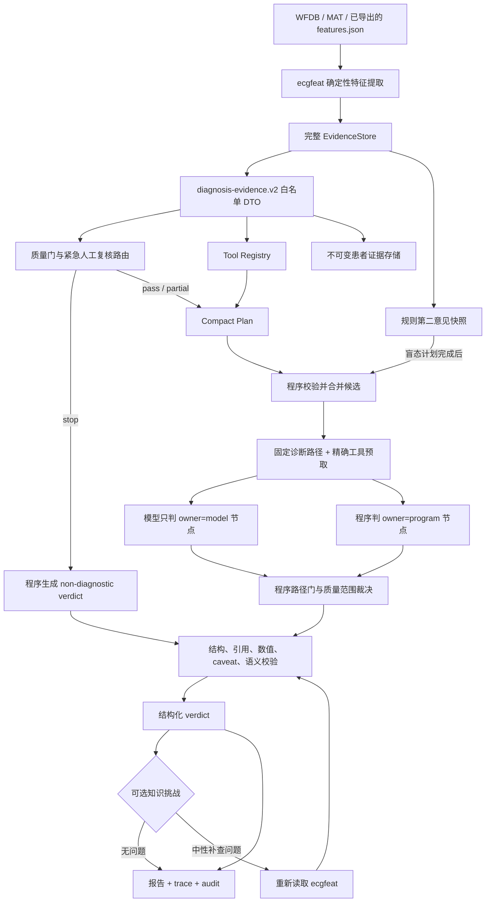
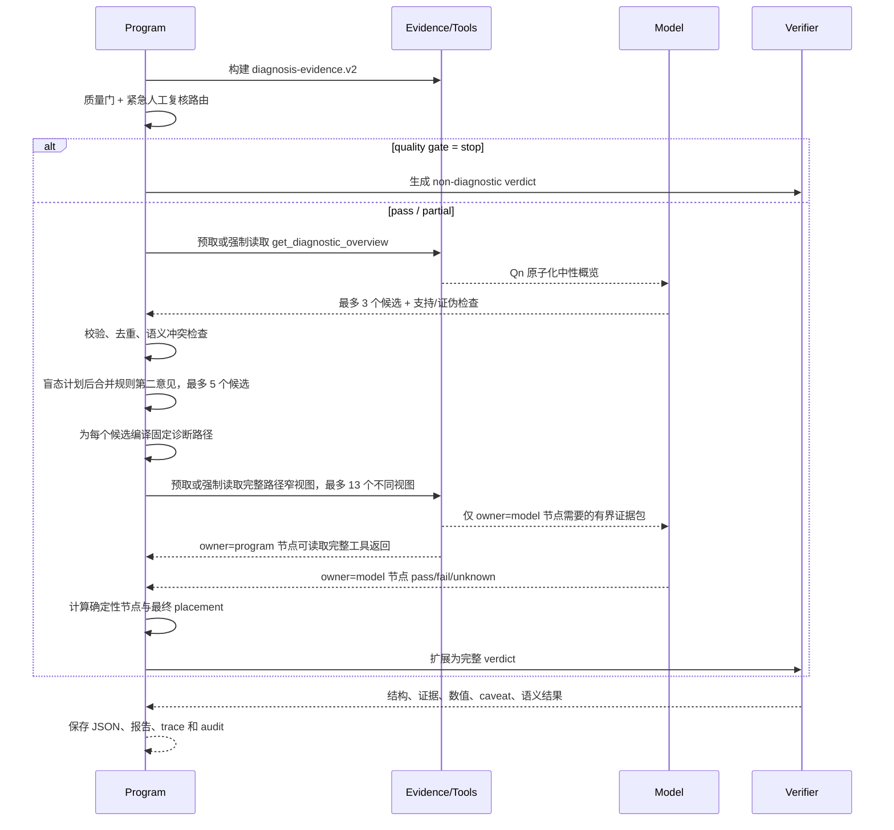

# ECGAgent 完整设计文档

> 文档状态：当前实现总览  
> 对应代码日期：2026-08-07（新增 4 个诊断码的专属路径 + 修复 3 处确定性节点缺陷，详见 §7.2/§7.5；其余内容仍对应 2026-08-03）  
> 当前诊断协议：`ecgagent.diagnostic.v38`  
> 适用范围：`ecgagent/` 下的诊断 Agent、证据工具、模型后端、校验、知识挑战、报告、批处理与评测  
> 安全声明：本系统是研究和辅助判读软件，不是医疗器械；所有输出都要求人工复核，不能直接用于临床诊断或治疗决策。

## 1. 文档定位

本文是当前 ECGAgent 的统一设计基线，回答以下问题：

- Agent 为什么存在，哪些工作由模型负责，哪些工作必须由程序负责；
- 一条 ECG 从 `features.json` 到最终结构化诊断经历哪些阶段；
- 如何隔离规则结论、数据集标签、通用知识与患者证据；
- 工具、证据引用、诊断路径、确定性节点、质量门和校验器怎样协同；
- Compact 与 Legacy 两种诊断工作流有何区别；
- 如何扩展诊断码、工具、证据字段、后端和安全策略；
- 如何保存轨迹、恢复批处理、评测和执行发布门。

仓库中已有几份较早或专题化的设计资料，本文不删除它们：

| 文档 | 定位 | 与本文的关系 |
|---|---|---|
| `docs/ecg_agent_architecture.md` | 从 v1 分层推理到早期诊断优先架构的演进设计 | 保留历史动机和早期方案；其中“当前实现 v27”已不是最新协议 |
| `docs/agent_revise_loop_analysis.md` | Legacy 修订循环的实盘失败分析 | 是修订机制的专题证据，不代表 Compact 默认行为 |
| `docs/ecgagent_determinism_refactor_plan.md` | 诊断路径确定化的测量、方案与实验记录 | 是 v38 双通道设计的重要演进依据 |
| `ecgagent/README.md` | 使用方法、命令和后端部署 | 面向操作者；本文面向设计、维护和审计 |

如果文档与代码发生冲突，以版本化协议配置和当前代码为准，主要入口见第 22 节。

## 2. 设计目标与非目标

### 2.1 目标

ECGAgent 在确定性 ECG 特征提取之上提供五项增量能力：

1. 从质量、节律、房室关系、间期、电轴、传导、异位搏动、心腔电压、Q/ST-T/U 波和起搏等域形成系统性解释；
2. 生成候选诊断，并主动请求能够支持或证伪候选的窄测量视图；
3. 在测量不完整、检测链冲突或定义条件不满足时降级、保留鉴别或弃权；
4. 让每个患者数值和关键证据都能回溯到不可变的 `features.json` 指针；
5. 保存完整、可复现、可恢复的运行审计，并支持盲法评测和发布验收。

### 2.2 非目标

当前 Agent 不承担以下工作：

- 不重新执行信号预处理、R 峰检测、波界定位或 ECG 特征提取；
- 不把 LLM 当作数值计算器、计数器、阈值比较器或状态机；
- 不允许模型直接修改患者证据或诊断账本；
- 不把 ecgfeat 规则命中、Philips DXL/Glasgow 解释或 PTB-XL 标签当作患者证据；
- 不通过通用知识片段证明某位患者满足诊断标准；
- 不承诺完整的危急 ECG 自动检出；
- 不替代医生查看原始十二导联波形和临床资料。

### 2.3 核心不变式

1. **患者事实唯一来源**：患者事实只能来自当前会话绑定的只读 `EvidenceStore`。
2. **可见性才授权**：工具触达某个指针不等于模型看见它；只有完整数值原子实际进入模型请求，或被确定性程序节点消费，才进入最终证据白名单。
3. **知识不是患者证据**：知识库、规则第二意见、规则非命中和数据集标签均不能提供患者级引用。
4. **程序拥有可重复计算**：阈值、计数、比例、序列重建、路径状态迁移、数值抄录和最终位置由程序完成。
5. **模型拥有开放判断**：模型负责候选形成、判别性检查设计和无法完全形式化的形态/机制解释。
6. **失败关闭**：缺失、不可见、无直接证据或不满足可靠性要求时保持 `unknown`、鉴别诊断、弃权或质量受限，不能自动升级为阳性诊断。
7. **最终必须人工复核**：结构化输出契约要求 `human_review.required = true`。

## 3. 模型与程序的职责边界

| 工作 | 模型 | 程序编排器/确定性层 |
|---|---:|---:|
| 形成最多三个独立候选 | 负责 | 校验诊断码、引用、重复和语义冲突 |
| 设计支持/证伪检查 | 负责 | 把工具名编译为安全参数并去重 |
| 补充规则第二意见候选 | 不可见于盲态计划 | 在计划完成后追加，且只作路由提示 |
| 工具执行 | 不直接执行 | 负责预算、参数、去重、预取和审计 |
| 阈值、计数、比例、序列判断 | 不负责 | 由版本化确定性节点计算 |
| 开放性形态/机制节点 | 给出 `pass/fail/unknown` | 校验节点身份、工具来源和新鲜引用 |
| 候选最终位置 | 只给估计 | 根据路径门计算 `confirmed/rejected/unresolved` |
| 患者数值写入报告 | 不抄写 | 从引用指针按临床显示精度物化 |
| 可靠性 caveat | 必须遵守 | 自动附加并由校验器强制检查 |
| 最终 JSON 结构、语义和证据校验 | 生成受限对象 | 负责规范化、校验、修订控制与验收 |
| 人类可读报告 | 不另行改写 | 从同一结构化 verdict 确定性渲染 |

这种分工称为**双通道工作流**：模型通道处理临床候选与开放判断，程序通道处理证据、计算、状态和发布。

## 4. 总体架构


可单独查看和复用的框图及 Mermaid 源码见
[ECGAgent v38 架构框图](ecg_agent_architecture_diagram.md)。



### 4.1 分层结构

| 层 | 组件 | 作用 |
|---|---|---|
| L0 输入层 | `feature_extraction/ecgfeat`、`features.json` | 产生测量、质量、逐导联、逐搏和模态数据 |
| L1 隔离层 | `evidence/diagnostic_contract.py` | 从宽输入构建诊断专用物理白名单 DTO |
| L2 证据层 | `EvidenceStore`、`ModelEvidenceView`、`EvidenceLedger` | 寻址、单位、caveat、原子化、可见性与来源追踪 |
| L3 工具层 | `ToolRegistry` 与 14 个诊断工具 | 提供有界的全局、逐导联、逐搏和专用模态视图 |
| L4 编排层 | `ECGDiagnosticAgent`、`ECGAgent` | 管理阶段、预算、预取、候选、上下文和恢复 |
| L5 推理层 | Compact/Legacy prompts 与 LLM backend | 形成候选、计划检查、完成开放性判断 |
| L6 决策层 | diagnostic pathways、deterministic pathways、quality/safety policies | 程序计算路径节点、放置、紧急路由和硬性否决 |
| L7 校验层 | `verify/`、`semantic_guard.py` | 强制引用、数值、可靠性、结构和诊断—测量一致性 |
| L8 输出层 | `report.py`、`trace.py`、`batch.py` | 结构化结果、中文报告、完整轨迹和批处理分析 |
| L9 评测层 | `evaluation_protocol.py`、`acceptance.py` | 三臂盲评、患者级指标和发布门 |

## 5. 输入与证据隔离

### 5.1 完整输入

Agent 的直接输入通常是一个 `*_features.json`。完整特征对象可能包含：

- 全局测量；
- 12 导联代表搏测量；
- 逐搏和逐导联逐搏测量；
- QRS 形态分组；
- P 波评估、房性事件和节律模态；
- 起搏、预激、AV 关系等检测器观察；
- 质量和采集元数据；
- 上游规则解释、参考引擎输出或数据集元数据。

完整对象不能直接交给诊断模型，原因是体积过大，并且包含会造成诊断泄漏的上游结论。

### 5.2 诊断证据 DTO

`EvidenceStore.diagnostic_view()` 使用 `ecgagent.diagnosis-evidence.v2` 构建物理隔离文档。允许的顶层字段为：

```text
fs
global_features
representative_leads
beat_features
beats
groups
p_wave_assessments
rhythm_inputs
morphology_inputs
quality
metadata
```

其中 `metadata`、`rhythm_inputs`、`morphology_inputs` 还各有二级白名单。以下高风险字段会被递归剔除：

- `clinical_interpretation`、`interpretation`、`statement_engine`；
- `reference_metadata`、Glasgow/Philips 解释镜像；
- `probable_af`、`probable_flutter`、`wpw_pattern` 等诊断型派生标签；
- 药物、临床诊断编码和其他可能泄漏答案的字段。

新字段默认不进入诊断视图。被丢弃、未分类和敏感字段写入 `ContractAudit`，因此扩展上游 schema 时必须显式审查并升级合同版本。

### 5.3 EvidenceStore

`EvidenceStore` 是单条记录的不可变、只读、可寻址证据源：

- 支持 JSON Pointer、`ev:/...`、点路径和临床别名；
- 自动推断单位；
- 自动附加质量、可靠性、来源和伴随字段 caveat；
- 单个容器内联限制为 800 字符，避免一次查询挤爆上下文；
- 提供内容指纹，绑定本次运行实际使用的输入；
- 同一会话内指针值不允许漂移。

`EvidenceValue` 的核心字段包括 `pointer`、`value`、`unit`、`caveats`、`companions` 和 `source`。工具显示值采用统一临床精度；最终报告也以模型实际看见的显示精度物化，原始全精度值只用于审计和容差校验。

### 5.4 原子化模型视图

原始工具表可能很大。`ecgagent.model-evidence.v3` 将一次成功工具返回重新解析成完整证据原子，每个原子绑定：

```text
引用 + 字段/导联身份 + 值 + 单位 + 可靠性 + caveat
```

预算只在完整原子之间截断，绝不把数值与引用或 caveat 分开。公平排序会在导联、搏动和字段之间分配空间；被省略的原子明确标记为不可见、不可引用，需要时必须请求更窄视图。

Compact 本地/兼容后端把长 `ev:/...` 指针映射为短引用 `Q1`、`Q2` 等。模型只能复制已显示的 Qn，不能构造路径。编排器在最终验证前把 Qn 还原为规范指针。

### 5.5 三种证据集合

| 集合 | 含义 | 是否可支持最终结论 |
|---|---|---:|
| touched | 工具处理过程中触达的所有指针 | 否 |
| model-visible | 完整数值原子在真实下一次模型请求中仍然可见 | 是，供模型节点使用 |
| program-authorized | 成功工具调用返回、并由确定性节点实际消费的完整输入 | 是，供程序节点使用 |

最终白名单是 `model-visible ∪ program-authorized`。主结果只保存集合大小和内容哈希，完整指针清单、原始返回和模型实际看到的压缩返回保存在独立 trace 中。

## 6. 当前默认 Compact 工作流

CLI、批处理和 `run_diagnostic_agent()` 默认选择 `workflow=compact`。它为 27B 本地模型设计；在支持编排器预取的后端上，通常只有两个主要模型决策：`plan` 和 `adjudicate`。不支持预取的 provider-native 后端仍执行同一阶段合同，但通过标准 assistant/tool-result 握手完成必需视图，因此可能增加模型回合。

### 6.1 时序



### 6.2 阶段合同

| 阶段 | 模型职责 | 工具与预算 | 最大生成 |
|---|---|---|---:|
| `plan` | 从中性概览提出至多 3 个实质性候选，每个包含支持证据、1–2 个判别检查，至少一个检查用于证伪 | 预取型后端由程序读取；其他后端强制模型调用一次 `get_diagnostic_overview`；预算 1 | 1200 tokens |
| `adjudicate` | 只填写固定路径中 `owner=model` 的节点；每个节点给 `pass/fail/unknown` 和新鲜 Qn 证据 | 预取型后端由程序读取；其他后端按精确覆盖合同调用；最多 13 个不同视图 | 2200 tokens |

`adjudicate` 的模型证据包上限为 8000 字符。仅供程序节点使用的视图不会复制进模型上下文。

### 6.3 质量门短路

当 `/metadata/diagnostic_gate/state == stop` 时，不调用诊断模型。程序直接生成：

- 无阳性诊断；
- `non_diagnostic` 质量状态；
- 明确的停止原因、重采建议和人工复核要求；
- 同样经过结构与证据校验的 verdict。

`partial` 不等于停止，但会限制可发布的诊断类别。受抑制域不能因为模型有候选就变成阳性结论。

### 6.4 盲态候选计划

模型先只看诊断中性概览，规则结论尚未进入上下文。计划有以下硬约束：

- 最多 3 个独立候选；
- 候选必须来自版本化诊断词表；
- 不能使用质量/建议型非假设代码冒充疾病候选；
- 每个候选至少有一个已授权概览 Qn；
- 每个候选有 1–2 个直接视图检查；
- 至少一个检查必须尝试证伪；
- 同一语义家族只保留一个候选；
- 无效、重复、无引用、无检查或与物理测量明显冲突的候选由程序删除。

### 6.5 规则第二意见

Compact 在盲态计划结束后，才从完整输入中读取一个隔离的 `ecgagent.rule-second-opinion.v2` 快照。

它只包含少量候选身份和路由元数据，不包含：

- 规则证据数值；
- 规则阈值；
- 诊断陈述正文；
- `not_matched` 负结果；
- 可作为最终证据的引用。

规则提示可以给已有候选添加来源，或占用合并候选的剩余空位。盲态候选加规则候选总上限为 5；盲态计划已满 3 个时最多再补 2 个，盲态候选不足时当前实现可能补入更多规则候选。规则提示必须重新通过独立测量路径，不能直接被确认。

### 6.6 视图预算与候选保留

程序把每个候选的固定路径编译成精确的 `tool + arguments` 调用签名，按参数去重。只有完整路径能装进 13 个不同视图上限的候选才进入裁决。

保留顺序优先覆盖：

1. 前两个盲态独立候选；
2. 规则第二意见补充的遗漏候选；
3. 第三个盲态候选；
4. 其他兼容候选。

这不是按工具调用次数机械截断，而是按候选完整路径的真实视图需求进行边界计算。被上限丢弃的候选会进入审计和限制说明。

## 7. 诊断词表与候选路径

### 7.1 诊断词表

`diagnosis_catalog.py` 提供与单条记录规则命中无关的稳定诊断词表。当前共有 123 个代码，分布如下：

| 类别 | 数量 |
|---|---:|
| rhythm | 17 |
| rate | 5 |
| conduction | 24 |
| ectopy | 3 |
| interval | 7 |
| axis | 3 |
| chamber | 16 |
| ischemia_repolarization | 25 |
| pacing | 5 |
| quality | 9 |
| other | 9 |

词表可以吸收记录中已有的 statement code 作为兼容扩展，但规则状态不会决定模型是否允许提出该诊断。若输入记录做过逐导联幅度归一化，纯电压诊断码会被程序移除，并改为 `uncalibrated_amplitudes`。

### 7.2 固定诊断路径

`ecgagent.diagnostic-pathways.v6` 将每个候选展开为最多 6 个节点。按当前 123 个代码静态展开，共有 310 个“诊断码 × 节点”实例、74 个不同节点标识：

- 151 个实例由程序负责；
- 159 个实例由模型负责；
- 254 个 `required`；
- 24 个 `supporting`；
- 32 个 `invalidator`。

123 个代码里 114 个有专门设计的路径（含起搏类目共用的两节点模板）；其余 9 个全部是 `NON_HYPOTHESIS_CODES` 里的质量/覆盖度元信息码或 `unclassified_ecg_abnormality`（一个刻意保持开放的兜底分类，不适合再拆专属证据链），模型要么不能把它们当疾病候选提出，要么其定义本身就是"未归类"，落到通用兜底属于设计正确而非缺口。2026-08-07 补齐了此前四个"可被模型合法提名、却仍走通用兜底"的真实缺口——`electrical_alternans`、`exclude_2_to_1_atrial_flutter`、`possible_precordial_lead_reversal`、`limb_lead_reversal_suspected`——现在各有 3–4 个专属节点；其中肢体导联反接路径复用了 `semantic_guard.py` 里 lead I/aVR 主波方向的同一判据，避免路径判断和硬门判据互相矛盾。

每个节点声明：

```json
{
  "id": "qrs_duration_support",
  "gate": "required",
  "question": "...",
  "tool": "get_morphology_groups",
  "arguments": {"include_beats": false},
  "owner": "program"
}
```

路径是工作流合同，不是患者证据。它只规定需要什么视图、谁负责判断和如何影响放置。

### 7.3 三种门语义

| gate | 语义 | 对最终位置的影响 |
|---|---|---|
| `required` | 诊断成立所必需的条件 | 任一 `fail` → rejected；任一 `unknown` → unresolved；全部 `pass` 才可能 confirmed |
| `supporting` | 有帮助但非必要的证据 | 保存状态和证据，不直接阻断或确认 |
| `invalidator` | 判据适用性的否决前提 | 只有显式 `fail` 阻断；`pass/unknown` 不降低敏感度 |

`invalidator` 用于“电压标准在起搏或宽 QRS 下是否仍适用”一类前提。若把它写成 `supporting`，结构上永远无法否决；若写成 `required`，测不出来又会无谓损失真阳性。

### 7.4 路径放置算法

程序按以下顺序决定候选位置：

1. 任一 `invalidator == fail` → `rejected`；
2. 否则任一 `required == fail` → `rejected`；
3. 否则全部 required 为 `pass`、至少有支持证据且质量范围允许 → `confirmed`；
4. 其余 → `unresolved`。

`unresolved` 有支持证据时进入 `differential_diagnoses`，并列出尚未完成的必要节点；没有支持证据时进入弃权审计。模型提交的 `overall_status` 和 urgency 只是估计，最终位置、置信度、紧急程度、摘要和人工复核文本均由程序生成。

### 7.5 确定性节点

`ecgagent.deterministic-pathway-facts.v2` 负责可重复计算，包括：

- 心率与电轴阈值；
- PR/QT 可报告性和阈值；
- P 波可靠性、1:1 房室关系、重复阻滞事件和 AV 序列；
- 规则 RR 不齐（含 2026-08-07 新增的、以中位数为锚点、容忍单个孤立异常间期的稳健背景规律性回退）、代表性比例和形态组计数；
- QRS 时限（含完全性束支阻滞/不完全 RBBB 的宽 QRS 判据、2026-08-07 起新增的双分支/三分支阻滞宽 QRS 判据、以及孤立性分支阻滞"QRS 时限不作为门槛"的判据）、早搏时序、宽 QRS 序列；
- 低电压、胸导 R 波进展和电压判据适用性；
- 起搏标志、夺获关系和重复性。

节点覆盖存在一个不依赖 `owner` 字段的调用陷阱：`_compact_deterministic_pathway_step` 对每个节点都无条件尝试确定性解析，只要 `step_id` 命中某个分支就会覆盖模型判断，而不检查 `program_owns_pathway_step()` 声明的所有权——`owner=model` 只影响 prompt 展示和审计标签，不影响实际覆盖。2026-08-07 之前，`qrs_duration_support` 分支对双分支/三分支阻滞及孤立性左前/左后分支阻滞统一返回 `unknown`，导致这些候选的 `required` 节点永久卡在 `unresolved`（对应批跑中传导阻滞整族 0/11 的直接成因）；新增分支后已按临床定义修复（双/三分支阻滞比照完全性束支阻滞的宽 QRS 判据，孤立性分支阻滞则不以 QRS 时限为门槛，与 `clinical_rules/conduction.py::_lafb` 的既有设计一致）。同一批次里，LVH `cross_lead_voltage_criterion`（`diagnostic.py`）的性别匹配从精确匹配 `"female"` 扩为 `{"female","f","woman"}`，并补上了 Peguero-Lo Presti 判据缺失的性别阈值，与 `clinical_rules/hypertrophy.py::_adult_lvh` 对齐。

所有 resolver 都返回保守三态：

- `pass`：有足够直接测量支持；
- `fail`：存在定义级直接矛盾；
- `unknown`：不完整、临界、低可靠或仅为候选检测器观察。

确定性节点不会创建诊断，只能处理已经进入候选集的路径节点。环境变量 `ECG_AGENT_DETERMINISTIC_NODES_SHADOW=1` 可切换到影子模式：模型状态决定位置，程序状态仍写入审计，用于迁移前后的分歧测量和整体回滚。

### 7.6 模型节点授权

模型节点的 `pass/fail` 只有在同时满足以下条件时才有效：

- 节点 ID 与候选固定路径完全匹配；
- 引用来自本次 `adjudicate` 阶段新读取的证据；
- 引用在模型实际看到的 Qn 包中；
- 引用来自该节点指定工具，或来自能读取同一证据 namespace 的兄弟视图；
- 至少有一个经授权证据原子。

否则状态被程序改为 `unknown`。模型不能新增节点、重命名节点、填写 `owner=program` 节点或引入计划外候选。

## 8. 工具系统

诊断模式只注册以下 14 个工具，全部返回测量、质量或检测器观察，不返回规则诊断：

| 工具 | 主要用途 | Compact 计划是否直接选择 |
|---|---|---:|
| `get_diagnostic_overview` | 中性质量、心率、节律筛查、间期、电轴和模态可用性概览 | 固定必读；支持预取时由程序读取 |
| `get_global_table` | 一次读取最多 24 个全局字段 | 是 |
| `get_measurement` | 精确读取一个指针或临床别名 | 否，作为 Legacy/修订兜底 |
| `get_lead_table` | 同一字段跨 12 导联比较 | 是 |
| `get_beat_table` | 节律级或指定导联的逐搏测量 | 是 |
| `search_measurements` | 不知道字段名时发现指针 | 否，仅发现；结果必须重新读取 |
| `get_rhythm_profile` | RR、房性残余、AV 关联、预激和差传候选观察 | 是 |
| `get_atrial_event_table` | 独立房性事件、置信度、P-QRS 关联和来源导联 | 是 |
| `get_p_assessment_table` | 逐搏 P 波边界接受/拒绝、置信度和有效导联 | 是 |
| `get_morphology_groups` | QRS 形态家族、占比、游程、模板相关性和成员 | 是 |
| `get_morphology_map` | P/QRS/ST/T-U/quality 固定跨导联观察图 | 是 |
| `get_interval_waveform_context` | PR 或 QT/QTc 受限时读取构成波和失败上下文 | 是 |
| `get_pacing_profile` | 起搏尖峰、夺获/感知可用性和 paced-beat 成员 | 是 |
| `get_native_beat_profile` | 主导非起搏形态的重复原生搏 Q/R/ST/T/QT 证据 | 是 |

### 8.1 域到工具的默认路由

| 诊断域 | 优先工具 |
|---|---|
| quality | morphology map、精确测量 |
| rhythm_rate | rhythm profile、beat table |
| p_av | rhythm profile、P assessment、atrial event table |
| intervals | global table、interval waveform context |
| axis | global table、lead table |
| conduction_preexcitation | morphology map/groups、native beat profile |
| ectopy_pauses | beat table、morphology groups、rhythm profile |
| voltage_chamber_r_progression | morphology map、lead table、native beat profile |
| q_st_t_u | morphology map、native beat profile、lead table |
| pacing_high_risk | pacing profile、native beat profile、morphology groups |

### 8.2 Registry 约束

`ToolRegistry` 负责：

- 每阶段单独预算，且只计算成功调用；
- 严格校验 required/unknown 参数；
- 同阶段按 `tool + 规范化 arguments` 去重；
- 重复调用不会消耗预算，并可能触发工具循环熔断；
- 拒绝调用超过预算的 3 倍时阻止继续猜参数；
- 所有异常转换成可审计错误，不让工具异常直接崩溃整条记录；
- 同时保存原始完整返回、压缩摘要、哈希、触达引用和可见引用。

## 9. Prompt 与输出合同

### 9.1 Compact system prompt 的职责约束

Compact prompt 明确告诉模型：

- 编排器拥有工作流、工具、引用展开、数值抄录、确定性节点、路径状态和报告渲染；
- 模型只负责候选计划和 `owner=model` 节点；
- 规则第二意见不是患者证据；
- 缺失值不证明正常或异常；
- 心率不等于节律机制，形态组不等于节律；
- 单个非主导形态或孤立事件不能自动推广为重复机制；
- 受限测量必须保留限定；
- 患者数值不由模型抄写，最终由程序回填。

### 9.2 Compact 中间 schema

Plan schema 包含：

- `candidates[]`: `id/code/domains/support/counter/checks/uncertainty`；
- `review_tools[]`；
- `quality_limitations[]`。

Adjudicate schema 包含：

- `overall_status`；
- `decisions[]`: 候选身份、模型 urgency 估计和 `pathway_steps[]`；
- `interval_contexts[]`。

程序把紧凑结果扩展成完整输出合同。Compact 默认不进行自由文本修订：`max_revisions=0`、阶段状态重试为 0；无效状态由 grammar/schema、程序规范化和失败关闭处理。

### 9.3 完整 verdict

最终结构化输出包含：

```text
summary
ranked_complete_interpretations[1..3]
diagnoses[]
differential_diagnoses[]
interval_measurement_contexts[]
abstentions[]
quality_assessment
human_review
```

阳性诊断只允许 `HIGH` 或 `MEDIUM`，鉴别诊断只允许 `MEDIUM` 或 `LOW`。PR、QT/QTc 不可用或受限时，必须单独说明区间结论、构成波残余证据、解释影响和解决方式，不能把“区间测不出”错误地等同于“波形没有信息”。

### 9.4 Prompt 指纹

每次运行把以下内容合并计算 SHA-256 指纹：

- system/phase/revision prompts；
- 诊断协议和临床安全策略；
- 阶段预算、预取和覆盖合同；
- 中间与最终 JSON schema；
- 工具 schema；
- 知识导航/挑战版本和运行时类别。

批次验收要求同一 cohort 只有一个锁定的 prompt/backend/model 执行签名。

## 10. Legacy 诊断工作流

`workflow=legacy` 保留 v31 五阶段研究流程：

```text
Survey → Hypothesize → Investigate → Challenge → Synthesize → Verify/Revise
```

| 阶段 | 作用 | 工具预算 |
|---|---|---:|
| Survey | 全局中性测量盘点 | 固定概览 1 次 |
| Hypothesize | 形成暂定诊断、鉴别和工具计划 | 0 |
| Investigate | 针对性读取患者测量 | 4–12，按复杂度调整 |
| Challenge | 主动找反证和未覆盖域 | 2–6，要求新视图 |
| Synthesize | 输出完整结构化 verdict | 0 |

Legacy 使用 `diagnostic-ledger.v3` 作为程序拥有的假设状态：模型只能提交类型化 patch，程序负责证据物化、身份、合法状态迁移和 append-only 事件历史。假设状态包括 `raised/provisional/weak/supported/weakened/unresolved/rejected/abstain`。没有经过挑战的阳性假设会失败关闭为 unresolved。

Legacy 允许最多 2 次阶段状态修复和最多 4 次最终修订；修订使用原子顶层 section patch，避免修一个段落时悄悄改坏已通过部分。专题问题和改进依据见 `docs/agent_revise_loop_analysis.md`。

Compact 仍会建立诊断账本并保存审计，但默认主决策不依赖模型维护多阶段账本状态。

## 11. 旧规则裁决模式

`ECGAgent` 的旧 `mode=adjudicate` 保留 `Orient → Test → Adjudicate → Synthesize` 规则裁决语义，能够查看上游规则发现并决定保留、撤回或降级。它用于历史兼容和显式比较，不是当前独立诊断默认路径。

早期 `medgemma_ecg_core.py` 的固定 L0–L5 分层推理属于推送式、非工具化流水线，也不等同于当前 `ecgagent`。它仍可用于基线比较，但不具有当前诊断 DTO、模型可见引用白名单、固定疾病路径和双通道确定性节点。

## 12. 质量、安全和紧急路由

### 12.1 质量门

质量门有三种状态：

- `pass`：允许完整路径评估；
- `partial`：允许有限类别，抑制不可靠域；
- `stop`：程序短路为不可诊断报告。

质量 caution 不会删除已有测量，而是把它变成明确的低权重证据。`null` 或未产出的字段才表示不可用。

### 12.2 临床安全策略

`ecgagent.clinical-safety.v2` 集中管理成人定义级硬边界，如心率、PR、短 PR、QRS、QTc、重复逆传证据和紧急路由阈值。它只能：

- 阻止与可靠测量直接矛盾的阳性结论；
- 降级不满足定义条件的候选；
- 给出人工复核路由。

它不能创建模型没有提出的诊断。策略版本和所有参数写入运行审计。

### 12.3 紧急人工复核

`ecgagent.urgent-review.v1` 在模型完成前检查保守的测量型触发：

- 极端心动过缓或过速；
- 快速且宽 QRS；
- 已导出的完全性 AV 阻滞测量标志；
- 可靠且可报告的显著 QTc 延长；
- 证据不冲突的起搏夺获失败测量标志；
- 技术质量 stop。

它只产生 `do_not_delay_human_review` 路由，不确认诊断。急性 ST 损伤和起搏感知失败仍列为未完整评估类别。

### 12.4 语义硬门

`semantic_guard.py` 检查：

- 模型写出的算术比较是否真的成立；
- 心动过缓/过速、房速、一度 AV 阻滞、束支阻滞、IVCD、短/长 QT 等是否与可靠测量直接矛盾；
- 可疑房室传导比例、逆传激动是否有独立重复证据；
- summary 是否绕过结构化 diagnoses 列表偷渡阳性结论；
- 肢体导联反接是否满足 lead I 与 aVR 的定义性主波方向条件。

这些检查是最小安全不变式，不是第二套隐藏诊断引擎。

## 13. 确定性验证

最终 verdict 需依次通过：

1. JSON/schema 与输出合同校验；
2. 诊断码、类别、置信度、互斥关系和完整解释校验；
3. 候选证据升级门和质量范围校验；
4. 引用与数值校验；
5. 可靠性限定校验；
6. 诊断—测量语义硬门。

引用校验器执行五项确定性检查：

| 检查 | 问题 |
|---|---|
| resolvable | 每个 `ev:/...` 是否能在当前 Store 解析 |
| provenance | 指针对应完整原子是否在本次会话对模型可见，或被程序节点授权 |
| consistency | 写出的数值是否与引用值在单位和临床容差内一致 |
| support | 每个患者特异性数值是否有引用 |
| qualification | 被 ecgfeat 标为受限的测量是否在同一 claim 中明确降级 |

指南阈值与患者测量分开处理，不会被误判为无引用患者数值。结构化 evidence item 缺少引用是 blocking，而不是 warning，防止模型通过删除引用来绕过数值不一致。

程序会把最终真正采用的证据物化到 `audit.tools.effective_evidence`，记录值、单位、caveat、来源、model-visible/program-authorized 状态和 supporting/opposing 角色。

## 14. 知识库与知识挑战

知识库是与患者工具完全分离的 BM25-like 本地索引，版本为 `ecg-knowledge.v1`。运行时允许的类别只有：

- `diagnostic_reference`；
- `morphology_reference`；
- `measurement_reliability_reference`；
- `failure_modes`。

clinical rules 源码、Philips DXL、Glasgow 和 capability blueprint 仅供离线开发审计，不进入患者运行时知识卡。所有知识卡进入 prompt 前会删除病例行并脱敏记录标识。

### 14.1 Survey 后导航

Legacy 可在 Survey 后启用 `ecg-knowledge-navigation.v2`：

- 最多 4 条知识卡；
- 只帮助形成暂定鉴别和下一步测量计划；
- Hypothesize 完成后知识原文从后续上下文移除；
- 最终患者结论仍必须回到 `ev:/...`。

Compact 为保持盲态、小上下文和双阶段稳定性，当前会强制关闭 Survey 后知识导航，即使构造参数 `knowledge_guidance=True`。

### 14.2 诊断后挑战

显式启用 `knowledge_challenge` 后，已通过证据校验的 verdict 会交给一个隔离、无患者工具的 `ecg-knowledge-challenge.v1` 会话：

1. 按现有诊断检索通用参考；
2. 只产生最多三个中性补查问题；
3. 知识原文和结论不回传诊断会话；
4. 诊断会话必须至少重新成功调用一次 ecgfeat 工具；
5. 修改后的 verdict 必须再次通过完整合同和患者证据校验；
6. 任一步失败时安全保留挑战前的已验证 verdict。

## 15. 模型后端抽象

编排器只依赖统一的 `LLMBackend`：`complete`、assistant turn、tool result turn 和 user turn。后端通过 `BackendCapabilities` 显式声明能力，避免编排器按供应商名称猜行为。

| 后端 | 原生工具 | 结构化输出 | 上下文压缩 | 引用别名 | 阶段记忆 | 预取 | 并行宽度 |
|---|---:|---|---:|---:|---:|---:|---:|
| Anthropic | 是 | schema | 否 | 否 | 否 | 否 | 4 |
| DeepSeek | 是 | JSON object | 否 | 是 | 否 | 是 | 4 |
| Qwen local/vLLM | 是 | schema | 是 | 是 | 是 | 是 | 3 |
| MedGemma local/vLLM | 否，JSON envelope | grammar | 是 | 是 | 是 | 是 | 4 |
| Mock | 脚本化 | none | 否 | 否 | 否 | 否 | 1 |

关键适配差异：

- Anthropic 要求原样回放 thinking/content blocks，并支持 system/tools prompt cache；
- DeepSeek 只有 JSON-object 模式，schema 在本地验证，tool arguments 可能是坏 JSON；
- Qwen 通过 vLLM native tool parser 运行，保留工具回合推理内容并压缩证据账本；
- MedGemma 没有原生 function calling，使用 grammar 约束的工具/终态 JSON envelope；
- 本地后端使用原子证据包、Qn 引用、滚动阶段记忆和上下文压缩。

新增后端必须声明真实能力，不能只靠实现几个同名可选方法。

## 16. 预算、熔断与上下文管理

### 16.1 全记录默认上限

| 项目 | 默认值 |
|---|---:|
| 模型回合 | 28 |
| 累计 token | 400,000 |
| 墙钟时间 | 1200 秒 |
| 连续非工具 `max_tokens` | 3 |
| Legacy 阶段状态重试 | 2 |
| Legacy verdict 修订 | 4 |
| Compact 阶段状态重试 | 0 |
| Compact verdict 修订 | 0 |

环境变量可覆盖：

```text
ECG_AGENT_MAX_MODEL_TURNS
ECG_AGENT_MAX_TOTAL_TOKENS
ECG_AGENT_MAX_WALL_SECONDS
ECG_AGENT_MAX_CONSECUTIVE_MAX_TOKENS
ECG_AGENT_PHASE_STATE_ATTEMPTS
```

本地 MedGemma 还支持 `ECG_GEMMA_AGENT_MAX_LEN`、`ECG_GEMMA_GPU_MEMORY_UTILIZATION`、`ECG_GEMMA_TP_SIZE`、`ECG_GEMMA_MAX_CONCURRENCY`、`ECG_GEMMA_BATCH_WAIT_MS` 等运行配置。

### 16.2 上下文策略

- 程序预取已知参数的强制视图，减少模型浪费回合猜参数；
- 同阶段精确重复调用会被抑制并触发 duplicate-loop fuse；
- 本地后端把瞬时工具转录压缩成一个有界证据账本；
- 阶段边界只保留规范化状态和选中的证据，不累计所有原始大表；
- 所有压缩前后字符数、被省略原子和最终可见引用都进入审计；
- 原始完整返回永远保留在独立 trace，不因模型上下文压缩而丢失。

## 17. 输出与审计产物

### 17.1 单条结果

`AgentResult` 包含：

- `verdict`：完整结构化诊断；
- `phases`：阶段、回合、工具、guard 和停止原因；
- `verification`：确定性校验报告；
- `knowledge_navigation/review`；
- `revisions`、`error`、`refused`；
- `audit`：协议、指纹、工具、后端、运行时、策略和路径决策。

`ok` 表示有 verdict 且没有 error/refusal；`verified` 表示存在校验报告且没有 blocking finding。两者不是同一个概念。

### 17.2 报告

`report.py` 从同一个 verdict 确定性生成：

- 简要中文 Markdown 报告；
- 完整可审计中文 Markdown 报告。

报告不调用第二个模型改写，因此机器结果和人读文本不会静默分叉。未 verified 的结果会明确标成排错候选，不能作为已确认诊断。

### 17.3 运行轨迹

`ecgagent.trace.v4` Markdown trace 保存：

- 中性初始输入和阶段间上下文；
- 每阶段模型输出；
- 每次工具的参数、原始结果、模型实际看到的压缩结果；
- touched/visible/omitted 引用统计；
- phase guard、修订和验证发现；
- 知识导航/挑战；
- 模型、prompt/input 指纹、token、耗时和熔断状态；
- 最终结果索引。

供应商隐藏的内部推理字段不会进入该轨迹。

### 17.4 批处理与恢复

`ecgagent.batch` 支持：

- `extract`、`diagnose`、`reverify`、`analyze`、`all`；
- 原子写 JSON/Markdown，避免中断后留下半文件；
- 每阶段 checkpoint/progress 文件；
- 整条记录重试；
- 复用已完成结果，并核对 workflow、协议、prompt 和输入指纹；
- 本地 vLLM 微批并发；
- 逐记录 CSV、总体 JSON、指标和分析报告。

Compact、Legacy、模型、后端或输入指纹不一致时不能把旧结果当作可复用的新结果。

## 18. 评测与发布门

### 18.1 三臂盲法消融

`ecgagent.blind-ablation.v2` 比较：

1. rules；
2. single-turn LLM；
3. multi-stage Agent。

输入按 `patient_id` 聚合，使用评测管理员私有密钥生成稳定、不可读的 HMAC arm 别名。默认报告保持盲态；临床审阅完成后才能显式解盲，并将解盲报告绑定到已审阅盲态产物的 SHA-256。

指标包括 micro precision/recall/F1、患者 exact match、严重诊断漏诊率和严重病例数。

### 18.2 发布验收

`ecgagent.acceptance.v1` 默认阈值：

| 指标 | 门槛 |
|---|---:|
| 最少记录 | 20 |
| 执行成功率 | ≥ 95% |
| verified 率 | ≥ 95% |
| P90 运行时间 | ≤ 300 秒 |
| 平均修订次数 | ≤ 1.5 |
| phase guard 失败率 | ≤ 2% |
| 最终引用可见来源覆盖 | 100% |
| Agent F1 相对最佳基线增量 | ≥ 0 |
| 严重漏诊率 | ≤ 2% |

同时要求：

- 全 cohort 使用当前协议；
- prompt/backend/model 执行签名唯一且完整；
- 不能使用 mock 后端；
- 默认必须提供已完成临床盲评、绑定审阅哈希的解盲报告；
- 至少包含一个严重阳性病例。

## 19. 测试策略

当前 Agent 相关测试覆盖：

- EvidenceStore、指针、单位、caveat 和诊断白名单；
- 工具 schema、参数、预算、去重和模态视图；
- touched/visible/program-authorized 引用分离；
- Compact 计划、规则候选合并、路径预取、确定性节点和 placement；
- Legacy 账本状态迁移、恢复和修订；
- Anthropic/DeepSeek/Qwen/MedGemma 后端消息协议；
- 引用、数值、可靠性和语义门；
- 报告、trace、batch 和知识挑战；
- 导联反接与临床显示精度合同。

截至本文生成时，相关测试文件可收集到 377 个 pytest case。建议变更 Agent 设计后至少运行：

```bash
pytest -q tests/test_ecgagent*.py tests/test_lead_reversal_and_value_contract.py
```

诊断路径或确定性阈值变更还应运行锁定 cohort 的端到端回放、测量可核验评分和盲态临床评测，不能只看单元测试。

## 20. 扩展规范

### 20.1 新增患者证据字段

1. 先判断字段是测量、质量、采集元数据、候选检测器还是诊断结论；
2. 只有诊断中性字段才能进入 `diagnostic_contract.py` 白名单；
3. 为单位、显示精度、caveat 和来源建立规则；
4. 更新工具视图和原子排序；
5. 增加“未知字段默认不进入诊断 DTO”的合同测试；
6. 如改变可见合同，升级 evidence/model-view 版本并更新 prompt 指纹。

### 20.2 新增工具

1. 工具只返回患者测量/质量/检测器观察，不返回诊断；
2. 定义严格 JSON schema、required 参数和返回引用；
3. 注册到 `DIAGNOSTIC_TOOLS`；
4. 更新域路由和 Compact direct-tool 白名单；
5. 更新 namespace 授权映射和原子视图优先级；
6. 为预算、去重、截断后可见引用和错误路径写测试；
7. 工具 schema 变化会自动影响 prompt 指纹。

### 20.3 新增诊断码

1. 加入稳定词表和正确类别；
2. 判断是否属于 `NON_HYPOTHESIS_CODES`；
3. 定义语义家族，避免同义候选挤占上限；
4. 在 `diagnostic_pathways.py` 定义 required/supporting/invalidator 节点；
5. 为每个节点指定固定工具和安全参数；
6. 将阈值/计数/布尔/序列节点迁移到确定性 resolver；
7. 更新互斥关系、质量范围、安全硬门、紧急程度和报告顺序；
8. 用正例、反例、边界值、缺失值和低可靠输入测试 placement。

### 20.4 新增确定性节点

1. resolver 必须只处理已选候选，不能自行创建诊断；
2. 输出必须是 `pass/fail/unknown`、reason code、输入指针和可审计 metrics；
3. 边界区间优先返回 `unknown`；
4. 只允许消费该节点成功工具调用触达的指针；
5. 先在 shadow mode 比较模型/程序分歧，再切换 owner；
6. 变更阈值必须升级版本化策略并做 cohort 归因分析。

### 20.5 新增后端

1. 实现统一消息和 tool-result 协议；
2. 正确回放供应商要求保留的 thinking/reasoning 内容；
3. 显式声明 `BackendCapabilities`；
4. 证明结构化输出级别、工具并行宽度和 tool-call ID 语义；
5. 若做压缩，必须返回精确模型可见引用，而不是指针清单；
6. 提供 usage、配置和 cache 审计；
7. 使用 mock 与真实最小服务分别测试坏 JSON、拒绝、截断和工具循环。

### 20.6 修改 Prompt 或预算

1. 更新版本注记与相关测试；
2. 重新生成 prompt 指纹；
3. 不能把不同指纹的结果混为一个锁定 cohort；
4. 比较成功率、verified 率、P90、token、候选召回、路径节点分歧和严重漏诊；
5. 对差异做逐病例/逐节点归因，不能只看总 F1。

## 21. 已知边界与维护风险

1. **没有原始波形工具**：当前 Agent 只看导出的结构化测量和模态，不会请求任意波形窗口或重新测量。
2. **Compact 候选仍有上限**：盲态最多 3 个、合并最多 5 个，且完整路径必须装进 13 个视图；审计应持续监控被丢候选。
3. **仍有开放性模型节点**：当前 310 个节点实例中 159 个仍由模型负责，形态类结论仍存在模型波动。
4. **记录级标签不完整**：测量定义型诊断可能正确但数据集未标注；必须结合测量核验和临床盲评。
5. **危急模式覆盖不完整**：紧急路由不是完整 STEMI、Brugada、起搏故障检测器。
6. **规则第二意见仍会影响候选召回**：虽然不提供患者证据，但它改变待评估候选集合，必须在审计和消融中单独报告。
7. **Compact 当前不启用 Survey 后知识导航**：只有可选的诊断后知识挑战仍可用。
8. **直接构造器默认值陷阱**：`ECGDiagnosticAgent(...)` 的构造签名当前默认 `workflow="legacy"`，而 CLI、batch 和 `run_diagnostic_agent()` 默认 `compact`。库调用者应显式传入 workflow；未来可考虑统一默认值。
9. **旧架构文档含历史“当前版本”描述**：维护时应以本文、`protocol.py` 和实际 audit 版本为准。
10. **人工复核是系统边界，不是失败状态**：即使 verified，也不能把输出解释为自动临床签发。

## 22. 代码索引

| 设计内容 | 主要实现 |
|---|---|
| 当前协议、域、工具、预算 | `ecgagent/agent/protocol.py` |
| Compact/Legacy 编排与候选合并 | `ecgagent/agent/diagnostic.py` |
| 通用阶段循环、预算、修订、审计 | `ecgagent/agent/loop.py` |
| Compact prompt 与 schema | `ecgagent/agent/compact_diagnostic_prompts.py` |
| Legacy prompt、状态与最终 schema | `ecgagent/agent/diagnostic_prompts.py` |
| 诊断词表 | `ecgagent/agent/diagnosis_catalog.py` |
| 固定诊断路径 | `ecgagent/agent/diagnostic_pathways.py` |
| 确定性路径节点 | `ecgagent/agent/deterministic_pathways.py` |
| 规则第二意见 | `ecgagent/agent/rule_second_opinion.py` |
| 诊断账本 | `ecgagent/agent/diagnostic_ledger.py` |
| 临床安全与紧急路由 | `ecgagent/agent/safety_policy.py`、`urgent_review.py` |
| 诊断—测量语义门 | `ecgagent/agent/semantic_guard.py` |
| 诊断证据白名单 | `ecgagent/evidence/diagnostic_contract.py` |
| 证据存储、指针、caveat | `ecgagent/evidence/store.py`、`pointer.py`、`caveats.py` |
| 原子模型视图与来源账本 | `ecgagent/evidence/model_view.py`、`ledger.py` |
| 工具实现与 Registry | `ecgagent/tools/` |
| 后端抽象与适配 | `ecgagent/backends/` |
| 引用和数值校验 | `ecgagent/verify/` |
| 知识导航与挑战 | `ecgagent/knowledge/` |
| 报告与轨迹 | `ecgagent/report.py`、`ecgagent/trace.py` |
| 批处理与恢复 | `ecgagent/batch.py` |
| 三臂盲评与发布门 | `ecgagent/evaluation_protocol.py`、`ecgagent/acceptance.py` |

## 23. 协议版本清单

| 合同 | 当前版本 |
|---|---|
| 通用 Agent loop | `ecgagent.v10` |
| 诊断 Agent | `ecgagent.diagnostic.v38` |
| 诊断证据 DTO | `ecgagent.diagnosis-evidence.v2` |
| 模型证据视图 | `ecgagent.model-evidence.v3` |
| 诊断账本 | `diagnostic-ledger.v3` |
| 固定诊断路径 | `ecgagent.diagnostic-pathways.v6` |
| 确定性路径事实 | `ecgagent.deterministic-pathway-facts.v2` |
| 规则第二意见 | `ecgagent.rule-second-opinion.v2` |
| 临床安全策略 | `ecgagent.clinical-safety.v2` |
| 紧急人工复核 | `ecgagent.urgent-review.v1` |
| 知识索引 | `ecg-knowledge.v1` |
| 知识导航 | `ecg-knowledge-navigation.v2` |
| 知识挑战 | `ecg-knowledge-challenge.v1` |
| Markdown trace | `ecgagent.trace.v4` |
| 盲法消融 | `ecgagent.blind-ablation.v2` |
| 发布验收 | `ecgagent.acceptance.v1` |

## 24. 常用入口

查看诊断中性简报、工具或 schema：

```bash
python -m ecgagent.cli --features RECORD_features.json --briefing
python -m ecgagent.cli --features RECORD_features.json --list-tools
python -m ecgagent.cli --features RECORD_features.json --schema openai
```

运行单条默认 Compact Agent：

```bash
python -m ecgagent.cli \
  --features RECORD_features.json \
  --agent \
  --backend qwen-local \
  --diagnostic-workflow compact
```

运行批处理：

```bash
python -m ecgagent.batch diagnose \
  --dataset-dir /path/to/cohort \
  --output-dir /path/to/output \
  --backend deepseek \
  --diagnostic-workflow compact
```

运行 Legacy 对照：

```bash
python -m ecgagent.cli \
  --features RECORD_features.json \
  --agent \
  --backend qwen-local \
  --diagnostic-workflow legacy
```

运行发布门：

```bash
python -m ecgagent.acceptance /path/to/run \
  --clinical-report /path/to/post_review_unblinded.json
```

---

本文描述的是可审计研究系统的工程设计。任何协议、阈值、证据白名单、路径 owner、模型后端或 prompt 的变化，都应同步更新版本、测试、锁定 cohort 回放和本设计文档。
